::: {=latex}
\listoffiguress
\listoftabless
\newpage
:::

# 1. Resumen

El constructo *autorregulación* denomina a un conjunto de procesos y habilidades que posibilitan la adaptación de los niños y las niñas a sus entornos de crianza. Durante los primeros años de escolarización, el aumento en las demandas sobre la autonomía le confiere especial interés al estudio de estos procesos, que generalmente se abordan con medidas de reporte, pruebas estandarizadas y observaciones naturalistas. Los avances técnicos de los últimos años posibilitan la creciente automatización de las técnicas observacionales y la recolección de datos a gran escala. La acumulación de información proveniente de distintos contextos, a través de métodos complementarios, podría lograr articular el conocimiento que existe acerca de procesos autorregulatorios de orden cognitivo y sus manifestaciones comportamentales cotidianas. 

&ensp;&ensp;&ensp;&ensp;&ensp;&ensp;En esta tesis se presentan dos estudios que exploran la utilidad de métodos observacionales en situaciones naturalistas, su convergencia con medidas controladas y de reporte, su asociación con el desempeño académico y con factores sociodemográficos. En el primer estudio, se codificó en vivo la conducta de 144 niños/as en aulas de jardines de infantes. En el segundo, se filmaron 127 díadas en un museo durante actividades de juego semiestructurado. 69 de estos videos fueron anotados manualmente y con la ayuda de algoritmos de reconocimiento. En ambos contextos, se administraron tareas de funciones ejecutivas, pruebas controladas de desempeño académico y los cuidadores respondieron cuestionarios sobre la conducta habitual y las características sociodemográficas de los participantes.

&ensp;&ensp;&ensp;&ensp;&ensp;&ensp;Entre los resultados se destaca que los registros ecológicos del comportamiento mejoraron los modelos de predicción del desempeño académico y convergieron moderadamente con medidas directas e indirectas del funcionamiento autorregulatorio. Específicamente, la expresividad del tono afectivo y el control del foco atencional se asociaron al desempeño en pruebas de conocimientos aritméticos, lenguaje receptivo, memoria de trabajo, control inhibitorio, flexibilidad atencional, razonamiento fluido y el reporte de rasgos temperamentales, habilidades sociales y problemas de conducta. Estas asociaciones se vieron moduladas por factores sociodemográficos como la edad de los participantes y el nivel educativo de sus cuidadores.

# 2. Agradecimientos

*A mi familia, amigos y tutores, por apoyarme a lo largo de la carrera. A la comunidad educativa, equipos de gestión cultural y asistentes de investigación, por hacer posible este trabajo.*

# 3. Introducción

Esta propuesta plantea avanzar con el análisis de las capacidades autorregulatorias a partir de la comparación e integración de información individual sobre el desempeño en tareas controladas, la observación directa de la conducta durante actividades de juego y aprendizaje, y los reportes de padres y educadores sobre la conducta habitual y las condiciones de vida en los entornos de crianza. Más allá del valor predictivo que los instrumentos de laboratorio demuestran sobre distintos aspectos del desarrollo cognitivo, socioemocional y académico, se verifica una brecha de conocimiento en cómo se estudia la expresión ecológica de estos fenómenos. Es decir, aún no existe una comprensión integral de cómo los procesos que se evalúan con tareas estandarizadas se manifiestan en el hogar y en la escuela para dar cuenta de diferencias en la adaptación de niños y niñas a estos contextos [@moffittGradientChildhoodSelfcontrol2011]. En pocas palabras, los temas centrales de este trabajo son la evaluación de procesos autorregulatorios en contextos de socialización y educación, el análisis de su validez predictiva sobre el desempeño académico y la ponderación de factores moduladores de orden individual y contextual en estas asociaciones. 

&ensp;&ensp;&ensp;&ensp;&ensp;&ensp;La escasez de abordajes que combinan y contrastan diversos métodos de medición, sumada a la necesidad de considerar cómo la variabilidad individual y cultural inciden en el desarrollo de los procesos autorregulatorios, justifica que estos sean indagados en el ámbito local. El potencial beneficio que deriva de esta tentativa es el avance en las prácticas de evaluación que resultaría de comprender cómo indicadores comportamentales que son relevados en situaciones cotidianas se asocian con medidas controladas y de reporte. Adicionalmente, el análisis de las diferencias individuales y contextuales en estas asociaciones podría derivar en nuevas preguntas y en la identificación de blancos de intervención.

&ensp;&ensp;&ensp;&ensp;&ensp;&ensp;La tesis se organiza en los siguientes apartados: un *resumen* &mdash;que anticipa el tema, los objetivos, los métodos y los resultados&mdash;, esta *introducción* a los temas centrales y a la justificación de la propuesta&mdash;, el *marco teórico* &mdash;donde se definen los constructos de interés y se detallan los antecedentes empíricos más relevantes&mdash;, un apartado donde se explicitan los *objetivos e hipótesis*, la sección de *metodología* &mdash;donde se detallan los procedimientos, instrumentos y el plan de análisis de cada uno de los estudios&mdash;, los *resultados*, la *discusión* &mdash;en la que los hallazgos se revén a la luz de objetivos, hipótesis y antecedentes&mdash;, una sección de *limitaciones y direcciones futuras*, y el apartado de *conclusiones*, donde se sintetizan y valoran los resultados. En último lugar figuran las referencias bibliográficas y una sección de *materiales suplementarios*, con enlaces a los instrumentos de evaluación, protocolos y cuestionarios, herramientas de visualización de datos, el código de los análisis estadísticos y la documentación que respalda distintos aspectos éticos y administrativos.

# 4. Marco Teórico

## 4.1 Fundamentos Conceptuales de la Autorregulación

La autorregulación (AR) es un constructo supraordinado que denota al conjunto de procesos motores, emocionales y cognitivos implicados en el control de estados internos y de acciones orientadas a fines [@blairMultipleAspectsSelfregulation2015; @mcclellandDevelopmentSelfRegulation2015; @mccoyMeasuringYoungChildrens2019]. Los actos autorregulados se apuntalan en fenómenos que ocurren a nivel genético, epigenético, neurofisiológico, cognitivo, comportamental y socio-cultural [@baileyIntegratedModelRegulation2019; @bellBiologicalSystemsDevelopment2007; @linMeasurementSelfregulationEarly2019]. En este sentido, la AR comprende una jerarquía integrada por funciones biopsicosociales que propician que las personas transformen y se adapten a las circunstancias que se les presentan en contextos como la escuela, el trabajo y las relaciones interpersonales [@bernierExternalRegulationSelfRegulation2010]. Por este motivo, la AR resulta un concepto crítico para diversas líneas de estudio sobre el desarrollo, la educación y la salud mental. En la vida cotidiana, se concibe que la AR se manifiesta en la ejecución autónoma y coordinada de rutinas y tareas domésticas (e.g., despertar, aseo, vestir, alimentación, transporte), así como durante momentos lúdicos y de aprendizaje. En la escuela, la AR se pone en juego virtualmente en todas las facetas del rol de estudiante (e.g., al escuchar atentamente, seguir instrucciones y completar tareas en periodos acotados de tiempo, comunicarse y colaborar con pares y docentes) [@morenoFunctionExecutiveFunction2017].

&ensp;&ensp;&ensp;&ensp;&ensp;&ensp;Actualmente persisten debates acerca de cuáles son precisamente los componentes de la AR, cómo se delimitan y se organizan estas jerarquías funcionales, cuáles son las fuentes de variación en su ontogénesis, cuál es el papel de las emociones en estos procesos, y qué debe entenderse por *adaptación* [@doebelFutureResearchExecutive2023; @frankenhuisStrengthsPeoplePoverty2020]. Una de las razones por las que se verifican tales debates, es que distintas disciplinas comparten este objeto de estudio y lo abordan con un gran repertorio de conceptos y métodos [@nachonConceptualMethodologicalApproaches2020; @santosSystematicReviewConcept2024]. Ejemplo de ello son los intentos por generar modelos psicobiológicos que integren los aspectos emocionales y cognitivos de las funciones ejecutivas (FFEE) con el esfuerzo de control &mdash;una de las dimensiones del temperamento formuladas por la psicología del desarrollo de la personalidad&mdash; a partir del estudio de las redes neurales que se asocian a procesos atencionales específicos [@canet-juricContribucionFuncionesEjecutivas2016; @petersenAttentionSystemHuman2012; @rothbartTemperament2006]. La atención &mdash;definida como la capacidad para enfocar la conciencia en estímulos sensoriales y seleccionar cursos de acción&mdash; es uno de los temas más estudiados por las ciencias cognitivas y ha sido propuesto como el eje central de las capacidades para regular el procesamiento de la información al servicio de la conducta orientada a fines [@burgoyneAttentionControlCornerstone2020]. 

&ensp;&ensp;&ensp;&ensp;&ensp;&ensp;Las FFEE han sido formuladas por la neuropsicología como el conjunto de procesos que subyacen a las acciones autorreguladas. En esta taxonomía se ubican &mdash;por ejemplo&mdash; el control inhibitorio, la flexibilidad atencional, la memoria de trabajo, la planificación estratégica y el razonamiento fluido, que contribuyen con la identificación y el manejo de demandas en contextos dinámicos para lograr objetivos [@bestDevelopmentalPerspectiveExecutive2010; @diamondExecutiveFunctions2013; @garonExecutiveFunctionPreschoolers2008]. Definidas de manera específica, el control inhibitorio comprende procesos para la inhibición de respuestas prepotentes frente a un evento, el manejo de la interferencia y el retraso o la interrupción de la respuesta conductual [@barkleyExecutiveFunctionsSelfRegulation2001]. Por otro lado, la flexibilidad atencional es la capacidad para desplazar el foco atencional o de alternar entre distintos conjuntos de reglas y respuestas [@kalkutDevelopmentSetShiftingAbility2009]. Con respecto a la memoria de trabajo, esta es la habilidad para retener, recuperar y operar a corto plazo sobre información relevante para una tarea [@cowanWorkingMemoryDevelopment2022]. Asimismo, la planificación es la función para establecer secuencias de actos orientados a eventos futuros [@carlsonIndividualDifferencesExecutive2004]. De igual manera, el razonamiento fluido es la capacidad para resolver problemas novedosos, independientemente del conocimiento y experiencias previas [@deckerEVIDENCECONSTRUCTSIMILARITY2007]. Adicionalmente, el esfuerzo de control se define &mdash;de manera similar al control inhibitorio&mdash; como la habilidad para inhibir respuestas dominantes durante la realización de una tarea, en favor de respuestas subdominantes [@putnamMeasurementFinegrainedAspects2006]. 

&ensp;&ensp;&ensp;&ensp;&ensp;&ensp;Por su parte, las ciencias de la educación y la psicología social aportan otros conceptos a esta amalgama, tales como las habilidades sociales, los problemas de conducta y el aprendizaje autorregulado (AAR). La idea de habilidades sociales también tiene un origen multidisciplinario y se superpone con más términos empleados por la neurociencia cognitiva (e.g., prosocialidad). Brevemente, las habilidades sociales hacen referencia a las funciones cognitivas e interpersonales que son necesarias para la conducta social adaptativa y para las interacciones interpersonales positivas [@beauchampSOCIALIntegrativeFramework2010]. Incluyen la capacidad para seleccionar información relevante en un contexto interpersonal, determinar las conductas verbales y no verbales más apropiadas para alcanzar un objetivo y ejecutar esas conductas de manera que se maximice la probabilidad de lograr la meta y mantener relaciones positivas con las personas involucradas. Por otro lado, los problemas de conducta son un conjunto de signos y síntomas clínicos provenientes de la pediatría, que representan dificultades emocionales y comportamentales antitéticas a la AR. Generalmente se las clasifica en problemas internalizantes (e.g., ansiedad, depresión, quejas somáticas, retraimiento) y externalizantes (e.g., agresión, delincuencia, antisocialidad) [@bongersNormativeDevelopmentChild2003]. En último lugar, el AAR representa un grupo de teorías sobre cómo las capacidades de AR cognitiva, emocional, motivacional y conductual se ponen en juego para lograr metas específicas del aprendizaje (e.g., adquirir conocimientos, perfeccionar habilidades) [@panaderoReviewSelfregulatedLearning2017].

&ensp;&ensp;&ensp;&ensp;&ensp;&ensp;En síntesis, la AR es un constructo multifacético que engloba procesos control atencional, cognitivo, comunicacional, socioemocional y conductual. La diversidad de teorías y métodos presentes en la literatura sobre AR ha sido señalada como muestra de que este campo de estudio adolece de un marco de referencia unificado [@karrUnityDiversityExecutive2018], pero también puede considerarse que la pluralidad de enfoques ensayados durante las últimas décadas ha enriquecido el conocimiento sobre el desarrollo autorregulatorio y lo ha consolidado como un aspecto central a ser supervisado durante la infancia y la niñez temprana.

## 4.2 Desarrollo de la AR

El cuerpo de conocimiento contemporáneo sobre el desarrollo de las FFEE y la AR sugiere que durante la primera década de vida ocurre un despliegue progresivamente más eficaz, diferenciado, integrado y flexible de los procesos de control cognitivo, donde formas pasivas de regulación exógena dan lugar a un repertorio organizado de habilidades proactivas y autónomas [@chevalierExecutiveFunctionEarly2017; @doebelRethinkingExecutiveFunction2020]. Particularmente, se concibe que el desarrollo de las FFEE no se limita sólo al incremento cuantitativo de los recursos cognitivos y neurales &mdash;como por ejemplo, en el aumento de la capacidad y de la eficacia de la memoria de trabajo, que ocurre debido a la maduración, al engrosamiento de la corteza prefrontal y a la formación de nuevas conexiones con áreas subcorticales&mdash; sino que también incluye la optimización del control cognitivo que resulta de cambios cualitativos, tales como la adquisición y coordinación de nuevas estrategias que se asientan en relación a cambios en el entorno [@ibbotsonDevelopmentExecutiveFunction2023; @zelazoDevelopmentConsciousControl2004].

&ensp;&ensp;&ensp;&ensp;&ensp;&ensp;Asimismo, desde una mirada sistémico-relacional [@bronfenbrennerEcologyHumanDevelopment2009; @lernerDevelopmentalScienceDevelopmental2006] se considera que las asociaciones entre las FFEE y el procesamiento emocional son bidireccionales, lo cual implica que los sistemas emocionales, atencionales y ejecutivos interactúan dinámicamente frente a modificaciones en las demandas del ambiente [@giulianoEffectsEarlyAdversity2018; @joelsNeurosymphonyStress2009; @roweChildNeighbourhoodLongitudinal2016]. Se ha reportado en forma reiterada [@blairOptimalBalanceIntegration2010; @ribeiroPhysiologyAssessmentLowhanging2016] que las diferencias inter e intraindividuales en las trayectorias del desarrollo de los procesos autorregulatorios son moduladas por la interdependencia de factores individuales (e.g., edad, sexo, temperamento, calidad del sueño, nutrición, actividad física, fisiología del estrés) y contextuales (e.g., condiciones de vida, recursos y estresores sociales del hogar, estilos parentales de crianza, estructura del contexto educativo, clima del aula y características de las prácticas de enseñanza).

&ensp;&ensp;&ensp;&ensp;&ensp;&ensp;Estudios previos destacan que el desarrollo cognitivo y socioemocional es resultado de una compleja red de interacciones entre factores individuales y contextuales, mediados por múltiples mecanismos que moldean las trayectorias ontogenéticas [@atalellPerinatalEarlyLife2024; @jiroutHowLifestyleFactors2019]. Existen antecedentes que sugieren que la incidencia de algunos de estos factores sobre el desarrollo es modulada por la etapa madurativa en la que se presentan, el estatus socioeconómico y el marco cultural [@rodcharoenBehavioralSelfregulationDevelopment2024]. Durante la primera infancia, la sensibilidad materna y la calidad de la estimulación en el hogar tienen un impacto directo en el desarrollo cognitivo. En etapas posteriores, las oportunidades para la escolarización formal y las experiencias en entornos comunitarios pueden ampliar o atenuar las desigualdades iniciales. Los recursos familiares &mdash;económicos, culturales y sociales&mdash; interactúan de manera diferenciada en la promoción del desarrollo infantil. Entre los factores individuales se incluyen matices genéticos y biológicos, la salud física y mental de las niñas/os, su temperamento y conducta. En cambio, los factores contextuales abarcan dimensiones interpersonales, comunitarias y sociales. A nivel interpersonal, destacan las prácticas parentales, la salud mental de los cuidadores y las dinámicas familiares. A nivel comunitario y social, se consideran el entorno escolar y barrial, las políticas públicas y las desigualdades estructurales. En particular, las condiciones de vida vinculadas a las privaciones y amenazas de la pobreza han sido asociadas negativamente con el desempeño en diferentes tareas controladas y con alteraciones en la respuesta fisiológica del estrés, desde el primer año de vida [@aran-filippettiStructuralAnalysisExecutive2012; @lawsonExecutiveFunctionMediator2017; @lipinaLinkingChildhoodPoverty2013; @lucenteAllostaticLoadChildren2023].

&ensp;&ensp;&ensp;&ensp;&ensp;&ensp;De esta forma, la pobreza emerge como un factor contextual crítico que afecta el desarrollo mediante su influencia sobre la salud física y la nutrición infantil; la calidad de las interacciones filioparentales; la salud mental y los estilos de crianza de los padres; las oportunidades de estimulación cognitiva y afectiva en el hogar; y los recursos materiales, educativos y sanitarios disponibles en la comunidad [@fracchiaMediatingRolePoverty2020]. El impacto de tales factores puede producirse de manera directa o indirecta. La manera indirecta ocurre a través de mecanismos mediadores. Los mediadores describen vías específicas mediante las cuales los factores contextuales e individuales pueden afectar el desarrollo. Por ejemplo, los ingresos familiares afectan la disponibilidad de recursos y actividades para la estimulación cognitiva, que a su vez inciden en la emergencia de las FFEE [@pratsPredictoresSocioambientalesIndividuales2012]. La salud mental parental, especialmente bajo condiciones de estrés negativo crónico, como en la pobreza o debido a la falta de acceso a servicios de cuidado infantil de buena calidad, puede afectar la sensibilidad y la capacidad de los padres para responder apropiadamente a las necesidades de sus hijos, aumentando las interacciones conflictivas y disminuyendo la provisión de experiencias enriquecedoras. A su vez, estos patrones en las prácticas de cuidado están vinculados con dificultades de AR conductual y menor desempeño cognitivo en los niños/as [@guoMechanismsMediatingEffects2000; @hackmanSocioeconomicStatusExecutive2015].

&ensp;&ensp;&ensp;&ensp;&ensp;&ensp;En términos de vías o mecanismos de influencia de la pobreza sobre el desarrollo, se identifican dos rutas principales, diferenciadas pero complementarias: la vía de *enriquecimiento-privación* y la de *apoyo-amenaza* [@hendryDimensionalModelRisk2023]. La primera refiere a la cantidad y calidad de estimulación cognitiva y social recibida o ausente durante el desarrollo. Por ejemplo, la cantidad y diversidad de palabras que los cuidadores emiten espontáneamente en el hogar componen el entorno lingüístico temprano. Dado que existe una asociación entre el ingreso, nivel educativo de los padres y el nivel de adquisición del lenguaje en los niños/as, la vía de enriquecimiento-privación articula el mecanismo mediante cual el entorno lingüístico temprano media la relación entre el nivel educativo de los cuidadores y la adquisición del lenguaje en las niñas/os. En cambio, la vía de apoyo-amenaza describe cómo el grado de exposición al estrés negativo o a la contaminación ambiental &mdash;en contraposición a la disponibilidad de apoyo socioemocional para su afrontamiento&mdash; media la asociación entre pobreza y desarrollo cognitivo. Tal es el caso de la exposición al plomo u otros metales pesados con efectos neurotóxicos que se encuentran en mayor proporción en zonas industriales. Si bien los niños/as que desafortunadamente crecen expuestos a estos agentes pueden exhibir secuelas a nivel cognitivo, los esfuerzos de saneamiento y concientización que son foco de políticas sociales pueden actuar en sentido opuesto, como factores protectores. El impacto de los factores individuales y contextuales sobre el desarrollo de la AR puede ser modulado no solo por su acumulación, sino además, por su co-ocurrencia y por el momento en el que se presentan por primera vez, su perdurabilidad en el tiempo y por la susceptibilidad individual a ellos [@beckMediatorsEffectChildhood2018; @bradleySocioeconomicStatusEffects2020; @duffordChildhoodSocioeconomicStatus2021; @eastYoungAdultOutcomes2022; @ivanovicMultifactorialApproachNutritional2019; @lipinaPobreCerebroEfectos2016; @obradovicBiologicalSensitivityContext2010]. A su vez, estos factores pueden afectar a las familias y comunidades en su capacidad de afrontar los desafíos de la inequidad social y material, de la cual la pobreza solo una de sus manifestaciones [@villaltaVastoCampoEstudios2014].

&ensp;&ensp;&ensp;&ensp;&ensp;&ensp;La transición a la escuela primaria es un proceso de múltiples adaptaciones, incluyendo el ajuste de los niños/as al sistema de educación formal, a las dinámicas de aprendizaje y a los nuevos roles que asumen en el aula, donde las demandas puestas sobre sus capacidades de funcionamiento autónomo son considerablemente mayores que en la etapa pre-escolar [@neuenschwanderHowDifferentAspects2012]. Tales demandas incluyen el poder controlar sus impulsos y emociones negativas, tolerar la frustración, y persistir en tareas con distintos grados de dificultad que requieren de motivación y atención sostenida. Se asume que tales habilidades sientan las bases para de las relaciones sociales positivas con pares y docentes, y promueven el desarrollo de capacidades individuales efectivas para el aprendizaje y la resolución de problemas [@blairOptimalBalanceIntegration2010]. Esta fase de inducción a la escolarización formal, entre los cuatro y ocho años de edad, coincide con picos en la tasa de cambios madurativos del sistema nervioso central y con la emergencia y diferenciación de funciones cognitivas íntimamente vinculadas a la AR [@korzeniowskiSummaryDevelopmentalTrajectory2021], por lo que se posiciona como un momento crucial para estudiar la expresión de estos fenómenos.

&ensp;&ensp;&ensp;&ensp;&ensp;&ensp;Diversas investigaciones apoyan la noción de que los procesos autorregulatorios juegan un rol fundamental en el desarrollo de las capacidades de aprendizaje durante la niñez, en las interacciones con pares y con adultos a cargo de su cuidado e instrucción [@hughesBetterWorsePositive2019; @morawskaPromotingSelfRegulationYoung2019; @zimmermannInfluenceTemperamentalReactivity2003]. Por otro lado, se han registrado instancias en las que las capacidades autorregulatorias median la asociación entre el nivel socioeconómico de las familias y el desempeño académico de los niños/as [@korzeniowskiSchoolPerformancePoverty2016]. Estos hallazgos sobre el valor adaptativo de la AR y la maleabilidad de su desarrollo han motivado el diseño de intervenciones orientadas a promoverlo [@berryHouseholdChaosChildrens2016; @canetjuricIntervencionSobreAutorregulacion2020; @isonAttentionalCapacityChildren2015; @lipinaPobrezaDesarrolloCognitivo2015]. Se considera que tanto las características de los contextos de crianza como las dinámicas de cuidado y enseñanza pueden modular la disponibilidad de facilitadores para el aprendizaje y fomentar las habilidades que contribuyen con el desempeño académico [@brockDelayGratificationFirst2014; @robsonSelfregulationMetacognitionYoung2016]. Se ha señalado que padres y docentes pueden adecuar sus prácticas de cuidado al nivel de competencia de las niñas/os y generar activamente las condiciones que les faciliten el ejercicio del autocontrol [@rimm-kaufmanEcologicalPerspectiveUnderstanding2012]. No obstante, aún no existe evidencia suficiente que permita comprender cómo las características individuales y las experiencias de vida de las infancias interactúan con los procesos áulicos y domésticos para moldear el desarrollo de la AR, de manera que puedan ser optimizados de manera individualizada y en diferentes entornos culturales [@bardackObservingTeachersDisplays2019; @feldmanMicroregulatoryPatternsFamily2006; @wagner-fuhsPreschoolClassroomProcesses2013]. 

## 4.3 Evaluación de la AR

En gran parte de las investigaciones que existen sobre AR, se utilizan exclusivamente instrumentos ideados en el laboratorio o derivados de la práctica clínica &mdash;es decir, que requieren condiciones controladas en su administración o que responden a modelos normativistas del comportamiento&mdash; lo cual puede afectar la sensibilidad de tales medidas a la variabilidad contextual [@mcclellandSelfRegulationIntegrationCognition2010]. Las pruebas controladas de desempeño pueden captar procesos cognitivos específicos que subyacen a, por ejemplo, los componentes de las FFEE. Permiten a los investigadores explorar diferencias entre los tiempos de reacción y los niveles de eficacia de las respuestas a estímulos con características claramente definidas. Al reducir el ruido y excluir las fuentes potenciales de confusión, se maximizan la validez interna de las mediciones. A pesar del nivel de precisión que se alcanza con estas pruebas, eso no necesariamente implica que sus resultados logren generalizarse al comportamiento cotidiano, ya que no son sensibles a los fenómenos sociales que estructuran las experiencias del hogar y la escuela. En contraposición, las observaciones directas en contextos naturalistas pueden registrar esas dinámicas sociales, pero no tienen la posibilidad &mdash;debido a la falta de control experimental&mdash; de suscitar conductas específicas de interés, o de estudiar componentes del fenómeno de manera aislada [@bronsonUsefulnessObservationalMeasure1994]. Otro punto a señalar sobre las observaciones naturalistas, es que la manera de operacionalizar los constructos a través de indicadores comportamentales (i.e., qué aspectos se proponen estudiar y cómo se definen los observables) muchas veces responde a características idiosincráticas del diseño de estos estudios (e.g., objetivos específicos, escenarios de observación, recursos disponibles), de modo que parecieran existir casi tantos procedimientos de observación como estudios publicados. En consecuencia, ello limita las posibilidades de combinar efectos y comparar las muestras de diferentes trabajos [@nachonAssessmentChildSelfregulation2025]. Las escalas de reporte, por otro lado, son instrumentos eficientes para caracterizar las habilidades autorregulatorias de las infancias desde la perspectiva de las personas que participan en las tareas de cuidado y enseñanza, y que conocen cómo el comportamiento de los niños/as se expresa en un amplio rango de situaciones. Las medidas de reporte habilitan la construcción de perfiles generales que van más allá del desempeño puntual en un grupo de tareas estandarizadas o de la conducta observada en un momento singular [@mccoyMeasuringYoungChildrens2019]. A pesar de sus ventajas, los reportes también son vulnerables a sesgos subjetivos, por lo que el nivel de acuerdo entre dos personas que reportan sobre el mismo niño/a usando la misma escala puede ser bajo [@durbinConvergentValidityBias2012].

&ensp;&ensp;&ensp;&ensp;&ensp;&ensp;Respecto a la convergencia entre los métodos de evaluación, las investigaciones en el área han verificado asociaciones inconsistentes entre las pruebas y las escalas que más frecuentemente se utilizan para medir los procesos autorregulatorios, quizás porque estas varían en cómo operacionalizan los constructos, en el tipo de demandas que presentan, en quiénes las completan y en los lugares dónde se administran [@ahmedMeasuringExecutiveFunction2019; @duckworthMetaanalysisConvergentValidity2011]. Esto promueve la idea de que la AR involucra varias dimensiones de dominio general y específico, que deben ser exploradas en escenarios relevantes para la vida de las personas (e.g., en el hogar, en la escuela), con instrumentos sensibles a cambios madurativos y a fenómenos que transcurren a lo largo del tiempo y distintos niveles de organización. Una manera ambiciosa de realizar esta exploración podría ser incorporando información de la actividad neural, hormonal, cognitiva, comportamental y socioambiental, combinándola a través de puntajes agregados, modelos de factores latentes curvas de crecimiento [@mcclellandDevelopmentSelfRegulation2015]. Algunos estudios se han propuesto explorar la estructura de la AR a partir de los puntajes de múltiples instrumentos, evaluando la superposición empírica entre constructos como las FFEE y el esfuerzo de control, y su utilidad para predecir otros aspectos de la personalidad y la conducta [@kalinSelfregulationPreschoolChildren2021; @kim-spoonCommonalityExecutiveFunctioning2019]. Si bien parece existir evidencia en favor de modelos con factores donde efectivamente convergen distintas medidas, aún no queda claro si ello depende enteramente de los instrumentos contemplados y qué tanto esas estructuras están sujetas a variación intra e inter individual. Por ejemplo, en el metaanálisis de @duckworthMetaanalysisConvergentValidity2011 se reportan efectos de convergencia agrupados en un rango medio-bajo ($\rho$ aleatorio= .27 [95% CI = .24, .30]; $\rho$ fijo = .34 [95% CI = .33, .35], *k* = 282 estudios, *N* = 33,564 participantes), pero que a su vez difieren significativamente entre medidas de reporte y pruebas de desempeño. Por otro lado, se ha señalado que el desarrollo de la AR puede ser moldeado por experiencias cotidianas que se organizan culturalmente y que, por lo tanto, las mediciones obtenidas con instrumentos que se utilizan para evaluar cambios en estos procesos son especialmente susceptibles a sesgos culturales [@gaskinsStudyingExecutiveFunction2023].

&ensp;&ensp;&ensp;&ensp;&ensp;&ensp;Actualmente se verifican relativamente pocos estudios que exploren el desenvolvimiento de los procesos autorregulatorios en contextos cotidianos donde niños/as y adultos de una comunidad interactúan; y, que a su vez, conjugen métodos de observación no participante, tareas controladas y medidas indirectas de reporte [@dahlEcologicalCommitmentsWhy2017]. Estos estudios &mdash;que mayoritariamente son de diseño longitudinal&mdash; han observado actividades de juego libre de díadas con bebés y deambuladores en el hogar, sea registrando la ocurrencia de conductas de proximidad, tacto, estimulación motriz, presentación de objetos y mirada conjunta durante intervalos regulares, o bien puntuando globalmente (i.e., calificando la totalidad de la observación en una escala Likert) el nivel de expresividad emocional negativa, responsividad mutua y seguridad en el apego de la díada. A su vez, estos estudios han evaluado problemas de conducta, dimensiones del temperamento (e.g., afectividad negativa y esfuerzo de control) y el nivel general del desarrollo cognitivo a partir del reporte materno y de la conducta de las niñas/os durante procedimientos estandarizados (e.g., la situación extraña, variantes de la prueba del malvavisco, escalas de desarrollo infantil). Los resultados señalan que patrones distintivos de interacción durante el juego predicen el desempeño en tareas estructuradas, y que la relación entre temperamento y desempeño es moderada por el estilo de interacción de las díadas [@kellerDevelopmentalConsequencesEarly2004; @kimChildTemperamentModerates2012; @troxelNegativeEmotionalityModerates2013; @vanbakelStressReactivity15monthold2004].

&ensp;&ensp;&ensp;&ensp;&ensp;&ensp;Por otro lado, los estudios en contextos escolares con participantes de edad preescolar han medido el tiempo que los niños/as ocupan con distintos tipos de actividades (e.g., periodos libres de instrucción, transiciones, juego con pares) y su nivel de involucramiento (i.e., atención sostenida, disposición para colaborar y seguir consignas) durante actividades de enseñanza-aprendizaje. Complementariamente han utilizado puntajes globales de indicadores vinculados al funcionamiento ejecutivo, a la regulación emocional y a la calidad del clima áulico, contrastando las medidas observacionales con pruebas estandarizadas de desempeño académico, FFEE y el reporte docente de habilidades de aprendizaje, habilidades sociales y problemas de conducta. Estos estudios han reportado asociaciones significativas entre las trayectorias del desempeño académico, el funcionamiento ejecutivo, el reporte docente, el clima áulico y la cantidad de tiempo que las niñas/os pasan en estados de bajo involucramiento, destacando la variabilidad intraindividual en la conducta de los niños/as según el tipo de actividad observada [@brockDelayGratificationFirst2014; @mccoyObservationalMeasureRegulationRelated2017; @moffettOfftaskBehaviorKindergarten2020; @rimm-kaufmanContributionChildrensSelfregulation2009; @slotPreschoolersCognitiveEmotional2017]. 

&ensp;&ensp;&ensp;&ensp;&ensp;&ensp;En el presente, la proliferación de algoritmos de monitoreo artificial permite imaginar que la recolección de datos observacionales a gran escala podría ofrecer una solución a la escasez de datos naturalistas objetivos, y al problema de la validez ecológica de las evaluaciones [@priceEcologicalValidityPediatric2003]. La codificación de cientas de horas de audio y video lograría articular los resultados de pruebas estandarizadas con la expresión cotidiana del funcionamiento autorregulatorio, a través de múltiples edades y contextos culturales [@ramakrishnanAutomatedClassroomObservation2019; @woolvertonExplorationCriticalExamination2021]. Estas herramientas, muchas de las cuales se han popularizado bajo licencias de acceso abierto, pueden &mdash;por ejemplo&mdash; asistir en la detección y el rastreo de varios participantes en una toma de video, diarizar y transcribir el habla, estimar la postura de la cabeza y otras partes del cuerpo en relación a un sistema de coordenadas tridimensionales, y ayudar a clasificar expresiones faciales y secuencias de movimientos. Sin embargo, aún no es claro cuáles son las limitaciones y el alcance estos modelos en el estudio del comportamiento infantil, sobre todo en ambientes donde existen menos posibilidades de ejercer un control riguroso de las condiciones bajo las cuales se obtienen los datos. Dentro de los pocos estudios sobre desarrollo infantil en los que se utilizan estos métodos, buena parte se ha enfocado en explorar la viabilidad de técnicas de clasificación de audio y video para caracterizar el ambiente y las dinámicas vocales, la semántica, los gestos, la postura y la proxemia de niños/as y adultos en el hogar o la escuela. En algunos casos, se han extendiendo hacia un análisis multimodal que incorpora medidas del ritmo cardiaco, la actividad neurofisiológica y el seguimiento de la mirada [@gamaAutomaticInfant2D2025;@michelettiValidatingModelDetect2022; @tanakaMultimodalMeasurementMusic2025; @wassAnnualResearchReview2024]. Dada la incipiencia de estas aplicaciones en el campo de estudio del desarrollo infantil, resulta relevante continuar con esfuerzos exploratorios y de validación, sobre todo en poblaciones subrepresentadas en la literatura. 

&ensp;&ensp;&ensp;&ensp;&ensp;&ensp;La interdependencia en los procesos de socialización y desarrollo motiva a explorar cómo los sistemas de normas y valores propios de las comunidades locales inciden en las capacidades autorregulatorias de sus niños/as [@lansfordAnnualResearchReview2022]. En Argentina, se han realizado estudios que principalmente describen patrones de interacción de díadas durante actividades de juego y lectura compartida, en el hogar y en la escuela, analizando su impacto sobre la adquisición del lenguaje [@mareovichInteraccionMadrebebeHogar2024; @pizarrolabordaLenguajeEducadorasLosas2019; @quirogaComposicionLexicaVocabulario2023; @rosembergActivityContextsChilddirected2023; @sartoriSecuenciasPreguntaRespuesta2021]. No obstante, estos abordajes se podrían extender a más escenas de la vida cotidiana y a la evaluación del vínculo entre la conducta que allí acontese y otros instrumentos de medición del funcionamiento autorregulatorio, profundizando así el conocimiento sobre estos fenómenos [@doebelRethinkingExecutiveFunction2020; @obradovicContextualConsiderationsPractical2024].

# 5. Objetivos

Esta propuesta plantea analizar la AR de niñas/os en proceso de transición a la escolaridad primaria, a partir de la comparación y combinación de información individual sobre el desempeño en medidas controladas del funcionamiento ejecutivo; reportes indirectos de adultos sobre las conductas habituales, los antecedentes de salud, el temperamento y las condiciones habitacionales; y la observación directa de las conductas de juego y aprendizaje tal cual estas acontecen en diferentes contextos ecológicos (e.g., escuela, hogar). Hasta el momento, existen relativamente pocos estudios que combinen estos abordajes, por lo cual se espera que el trabajo aporte nueva evidencia al área de estudio y ayude a identificar procesos en los que la intervención comunitaria pueda resultar en una mejora de la calidad del cuidado que reciben las infancias.

## 5.1 Objetivo general

Analizar las asociaciones entre distintos abordajes de evaluación del funcionamiento autorregulatorio (i.e., tareas controladas, reportes de adultos y observaciones ecológicas) y el desempeño académico durante la transición a la escolaridad primaria, explorando su modulación por factores individuales y contextuales.

## 5.2 Objetivos específicos

(A) Desarrollar y poner a prueba un sistema de observación ecológico del comportamiento autorregulado en contextos cotidianos de juego y aprendizaje.

(B) Analizar asociaciones entre el desempeño en las tareas controladas, las conductas reportadas por adultos y aquellas observadas directamente durante el registro de actividades cotidianas.

(C) Analizar asociaciones entre el funcionamiento autorregulatorio (valorado a través de tareas controladas, reportes y observaciones directas) y el desempeño académico. 

(D) Identificar y analizar moduladores individuales (e.g., edad, sexo) y contextuales (e.g., condiciones de vida, recursos y estresores sociales del hogar, y características de los procesos áulicos), sobre las asociaciones entre medidas del funcionamiento autorregulatorio y del desempeño académico.

## 5.3 Hipótesis

(1) Se encontrarán asociaciones convergentes leves entre las distintas fuentes de información del funcionamiento autorregulatorio.

(2) Las medidas del funcionamiento autorregulatorio serán predictores significativos del desempeño académico y se asociarán con condiciones socioambientales favorables.

(3) Se espera que las aspectos individuales (e.g., edad) y contextuales (e.g., nivel socioeconómico) modulen la magnitud de la asociación entre funcionamiento autorregulatorio y desempeño académico (e.g., la asociación entre estas medidas será más pronunciada con el aumento de la edad y la acumulación de factores de riesgo).

# 6. Metodología

El diseño de esta propuesta corresponde a uno cuantitativo, no experimental, sincrónico y de alcance correlacional [@hernandezsampieriMetodologiaInvestigacion1991]. El muestreo se realizó por conveniencia y no fue aleatorizado. Si bien el proyecto no fue pre-registrado en un repositorio público, se adjuntan los planes de tesis presentados ante las comisiones evaluadoras de CONICET (2019) y de la Universidad Nacional de Córdoba (2020) (ver Anexos [A1](https://github.com/juaninachon/Tesis/blob/main/anexos/A1_PlanCONICET2019.pdf) y [A2](https://github.com/juaninachon/Tesis/blob/main/anexos/A2_PlanUNC.pdf), respectivamente). Se declara que, debido a comentarios de evaluadores y a contingencias en la implementación de las actividades del proyecto, se modificaron aspectos del plan de trabajo que no estaban correctamente fundamentados o cuya factibilidad se vio afectada, tales como el muestreo, instrumentos de medición, hipótesis de trabajo y procedimientos analíticos.

&ensp;&ensp;&ensp;&ensp;&ensp;&ensp;A lo largo del desarrollo del proyecto se realizaron diferentes convocatorias a estudiantes de grado de las carreras de psicologia, psicopedagogia y afines, de aquí en más denominados como *operadores*, para efectuar actividades vinculadas a la recolección y el procesamiento de los datos (ver Anexos [B1](https://github.com/juaninachon/Tesis/blob/main/anexos/B1_Flyer2023.jpeg) y [B2](https://github.com/juaninachon/Tesis/blob/main/anexos/B2_Flyer2024.pdf)). Tales convocatorias se hicieron en el marco de prácticas de investigación e incluyeron una capacitación previa y la supervisión continua durante la realización de las tareas en campo y en el laboratorio. En total participaron 33 estudiantes entre los años 2023 y 2024.

## 6.1 Participantes

```{r}
#| label: setup & participantes

pckgs <- c(
  "car",
  "cowplot",
  "kableExtra",
  "psych",
  "tidyverse",
  "kableExtra",
  "irr",
  "Hmisc",
  "corrplot",
  "ggbeeswarm",
  "janitor",
  "performance",
  "parameters",
  "broom",
  "gvlma",
  "factoextra"
)
invisible(capture.output(lapply(pckgs, require, character.only = TRUE)))
len <- base::length

pk <- read.csv("data/submuestras.csv") |>
 filter(inc == 1)
 
mj <- filter(pk, Muestra == "Jardines") |>
  select(c(
    ID, Edad_años, Sexo_masculino
 ))
mm <- filter(pk, Muestra == "Museo") |>
  select(c(
    ID, Edad_años, Sexo_masculino
 ))

nj <- nrow(filter(mj))
epj <- round(mean(mj$Edad_años),2)
pnj <- 100 - round(mean(mj$Sexo_masculino) * 100, 2)
nm <- nrow(filter(mm))
epm <- round(mean(mm$Edad_años),2)
pnm <- 100 - round(mean(mm$Sexo_masculino) * 100, 2)

mj1 <- filter(pk, Submuestra == "Jardines 2023") |>
  select(ID)

mj2 <- filter(pk, Submuestra == "Jardines 2024") |>
  select(ID)
mjnp1 <- mj$ID[mj$ID %in% unlist(select(filter(pk, nux1vp == "p"), ID))]
mjnp2 <- mj$ID[mj$ID %in% unlist(select(filter(pk, nux2vp == "p"), ID))]

```

Dado que los primeros años previstos para la recolección de datos se vieron afectados por el aislamiento obligatorio de la pandemia de COVID-19, el plan se dividió en dos estudios complementarios, con la intención de minimizar el riesgo de no lograr reclutar una muestra de participantes lo suficientemente numerosa en instituciones educativas (ver Figuras \hyperref[fig:1]{1} y \hyperref[fig:2]{2}). En paralelo al trabajo en el contexto escolar, se accedió a un espacio provisto por las autoridades de un museo público de la Ciudad Autónoma de Buenos Aires (CABA), en el contexto de un programa de extensión comunitaria, para efectuar actividades acordes con la propuesta (ver Anexos [B3](https://github.com/juaninachon/Tesis/blob/main/anexos/B3_Introducci%C3%B3n.mp4) y [B4](https://github.com/juaninachon/Tesis/blob/main/anexos/B4_Cierre.mp4)).

&ensp;&ensp;&ensp;&ensp;&ensp;&ensp;Los criterios generales de inclusión para los participantes fueron: (1) el español como lengua materna y (2) la ausencia de trastornos del neurodesarrollo. Durante los años 2023 y 2024 se reclutaron dos cohortes provenientes de 14 salas de preescolar de cinco escuelas públicas de CABA, de entre cuatro y cinco años de edad, sumando un total de `r nj` participantes (edad promedio = `r epj` años; `r pnj`% niñas). La muestra del museo se conformó a lo largo de nueve jornadas durante los meses de abril y octubre del año 2023, la cual incluyó a `r nm` participantes de entre cuatro y ocho años (edad promedio = `r epm` años; `r pnm`% niñas).

\phantomsection
\addcontentsline{lof}{figure}{{1. Diagrama de flujo sobre la conformación de las muestras de participantes}}
\label{fig:1}

**Figura 1**  
*Diagrama de flujo sobre la conformación de las muestras de participantes.*

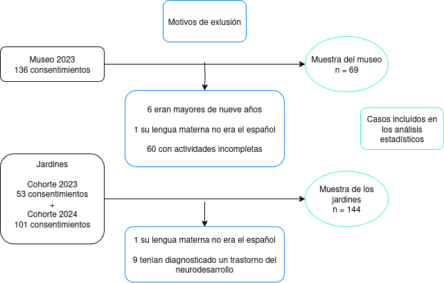{width=500 fig-align="center"}

\phantomsection
\addcontentsline{lof}{figure}{{2. Distribución etaria por contexto de muestreo y sexo}}
\label{fig:2}

**Figura 2**  
*Distribución etaria por contexto de muestreo y sexo.*

```{r}
#| label: f2 Edad y sexo por muestra
#| fig-align: 'center'
#| fig.height: 4

histo <- pk |>
  ggplot() +
  geom_histogram(
    aes(x = Edad_años, fill = Muestra),
    binwidth = .25,
    alpha = 0.65, position = "identity",
    na.rm = TRUE,
  ) +
  theme_minimal() +
  theme(
    legend.position = "top",
    legend.title = element_blank()
  ) +
  labs(x = "Años", y = "n")

caja <- pk |>
  ggplot() +
  geom_boxplot(
    aes(
      x = Edad_años,
      fill = paste(
        Muestra,
        factor(Sexo_masculino, labels = c("Femenino", "Masculino")),
        sep = " "
      )
    ),
    alpha = 0.65,
    outliers = TRUE,
    na.rm = TRUE
  ) +
  theme_minimal(base_size = 10) +
  theme(
    axis.text.x = element_blank(),
    axis.ticks.x = element_blank(),
    axis.text.y = element_blank(),
    axis.ticks.y = element_blank(),
    panel.grid.major = element_blank(),
    panel.grid.minor = element_blank()
  ) +
  labs(x = NULL, y = NULL) +
  scale_fill_manual(values = c(
    "#FB61D7", "#6486f5", "#B79F00", "#00BA38"
  )) +
  theme(
    legend.position = "bottom",
    legend.title = element_blank(),
    legend.text = element_text(size = 8),
    legend.spacing.y = unit(0.1, "cm")
  )
plot_grid(
  histo, caja,
  ncol = 1, rel_heights = c(3, 1),
  align = "hv", axis = "b"
)
```

## 6.2 Consideraciones éticas

Los procedimientos implementados fueron evaluados y aprobados por el Ministerio de Educación del Gobierno de CABA y por el Comité de Ética del CEMIC (Protocolo N° 1197, ver Anexo [C1](https://github.com/juaninachon/Tesis/blob/main/anexos/C1_Protocolo1197.pdf)). Se contemplaron las recomendaciones de la American Psychological Association [@americanpsychologicalassociationEthicalPrinciplesPsychologists2002], Ethical Research Involving Children (ERIC-UNICEF) [@grahamEthicalResearchInvolving2013], los principios establecidos por la Convención Internacional sobre los Derechos del Niño/a y lo establecido en la Ley Nacional N° 26061 de Protección Integral de los Derechos de Niñas, Niños y Adolescentes. Ninguna de las actividades de este estudio implicaron riesgos a la salud o a los derechos de los participantes. 

&ensp;&ensp;&ensp;&ensp;&ensp;&ensp;Durante la conformación de las muestras, los miembros del grupo de investigación se presentaron con las autoridades escolares, docentes y adultos responsables para informarles acerca de los objetivos y las actividades del estudio. Las niñas/os fueron invitados a participar mediante su asentimiento verbal y los adultos firmaron consentimientos que expresaban el carácter voluntario de la participación y la posibilidad de retirarse en cualquier instancia (ver Anexos [C2](https://github.com/juaninachon/Tesis/blob/main/anexos/C2_ConsentimientoJardines.pdf) y [C3](https://github.com/juaninachon/Tesis/blob/main/anexos/C3_ConsentimientoMuseo.pdf)). Respecto a las actividades en el aula, se solicitó la autorización de las autoridades escolares y docentes. Sólo se recolectaron datos de los participantes autorizados, a quienes se les asignó un código alfanumérico arbitrario para que no sean identificables, en conformidad con la Ley N° 25.326 de protección de datos personales (Habeas data). El material videográfico se almacena en la UNA y solo los investigadores abocados a este proyecto pueden acceder a los mismos.

## 6.3 Estudio 1: Jardines

### 6.3.1 Instrumentos {#sec-6.3.1}

Se seleccionaron medidas para este estudio en función de su idoneidad para abordar los objetivos. Es decir, se buscaron instrumentos que refieren a los constructos y métodos propuestos, además de haber sido diseñados, validados o adaptados para utilizarse en muestras de participantes con características similares a las de este proyecto. Si bien es posible que existan otros instrumentos tanto más completos o apropiados, las limitaciones impuestas al diseño del estudio (e.g., por los tiempos previstos para la ejecución del proyecto o el número acotado de actividades que se juzgó aceptable que los participantes completen en pocas sesiones de evaluación) justifican que no se haya optado por adoptar un conjunto más amplio y exhaustivo, que contemple múltiples medidas para operacionalizar cada constructo [@obradovicContextualConsiderationsPractical2024].

#### 6.3.1.1 Batería de FFEE y constructos vinculados a la AR

Con la intención de minimizar el tiempo de evaluación en las escuelas, se implementó una batería digital diseñada por miembros del equipo de investigación en colaboración con investigadores de la Universidad de Delft (Países Bajos) y NeuroUX (India) para su uso remoto en computadoras y dispositivos con pantalla táctil. La misma cuenta con antecedentes en el ámbito local y en una muestra dentro del mismo rango etario [@segretinOnLineAssessmentSelfRegulatory2021]. Incluye ocho pruebas estandarizadas, segmentadas en dos sesiones de cuatro pruebas cada una, con una duración aproximada de 15 minutos por sesión (ver Anexos [D1](https://neuroux-una.getneuroux.com/?prismicId=ZFip6RMAACgAaZFq&lang=es&mode=una_v2&userID=26d30a24-ac33-4e3e-99d8-5a6935e3314c&session=1&channel=mail&language=es) y [D2](https://neuroux-una.getneuroux.com/?prismicId=ZFiqRxMAAC0AaZMT&lang=es&mode=una_v2&userID=26d30a24-ac33-4e3e-99d8-5a6935e3314c&session=2&channel=mail&language=es)). 

**Toca botón**

El subtest *Toca botón* (sesión 1) evalúa procesos de control inhibitorio (ver \hyperref[fig:3]{Figura 3}). Consiste de 24 ensayos, sin criterio de corte, en los que se presenta uno de dos estímulos aleatoriamente, con la consigna de que los participantes toquen rápidamente uno de ellos (ensayos congruentes), pero que se abstengan de seleccionar al otro (ensayos incongruentes). Distribución: 70% congruentes 30% incongruentes. Tiempo de presentación de los estímulos: 2500 ms. Tiempo entre ensayos: aleatorio entre 700 y 1000 ms. Variables de interés: Cantidad de ensayos correctos y tiempo de reacción promedio en ensayos congruentes correctos e incongruentes incorrectos.

\phantomsection
\addcontentsline{lof}{figure}{{3. Captura de pantalla de la prueba Toca botón}}
\label{fig:3}
**Figura 3**  
*Captura de pantalla de la prueba Toca botón.*

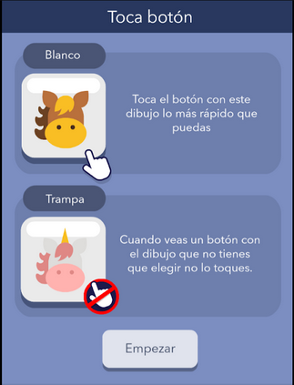{width=200 fig-align="center"}

**No encaja**

La tarea *No encaja* (sesión 1) evalúa procesos de resolución de problemas abstractos y el procesamiento fluido de la información, al estilo de una prueba de matrices [@kaufmanKaufmanAssessmentBattery1983; @ravenRavenProgressiveMatrices2003]. Consiste en 18 ensayos con estímulos geométricos que requieren que los participantes relacionen los estímulos y completen analogías (ver \hyperref[fig:4]{Figura 4}). En cada ensayo, los participantes deben comprender la relación implícita entre los estímulos y seleccionar aquel estímulo que no se relaciona con el resto de los estímulos, antes de que transcurran 20 segundos (la excepción a la regla, el que no encaja). Variables de interés: cantidad de ensayos correctos, tiempo de reacción promedio en ensayos correctos e incorrectos.

\phantomsection
\addcontentsline{lof}{figure}{{4. Captura de pantalla de la prueba No encaja}}
\label{fig:4}
**Figura 4**  
*Captura de pantalla de la prueba No encaja.*

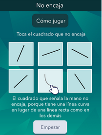{width=200 fig-align="center"}


**Juego de Memoria**

El subtest *Juego de Memoria* (sesión 1) evalúa procesos de memoria de trabajo espacial utilizando estímulos numéricos y geométricos en forma de fichas (ver \hyperref[fig:5]{Figura 5}). Los participantes deben observar la posición de las mismas en la pantalla, que luego de un periodo entre tres y cuatro segundos se voltean, ocultando sus valores. Entonces, se le solicita a los participantes que recuerden la posición de uno de los estímulos antes de que transcurran 20 segundos. Se administran un total de 24 ensayos de dificultad creciente, incorporando un mayor número de estímulos y el desplazamiento de los mismos a lo largo de la pantalla luego del volteo. Variables de interés: cantidad de ensayos correctos, tiempo de reacción promedio en ensayos correctos e incorrectos.

\phantomsection
\addcontentsline{lof}{figure}{{5. Captura de pantalla de la prueba Juego de memoria}}
\label{fig:5}
**Figura 5**  
*Captura de pantalla de la prueba Juego de memoria.*

{width=200 fig-align="center"}


**Bloques de Corsi**

La tarea de *Bloques de Corsi* (sesión 1 y 2) evalúa procesos de memoria de trabajo espacial [@pickeringDevelopmentVisuospatialWorking2001]. En esta versión (ver \hyperref[fig:6]{Figura 6}), cada ensayo comienza con la aparición en orden sucesivo de bloques. Luego, se le indica al participante que seleccione los bloques en orden directo (en el mismo orden que aparecieron) o inverso (al revés, comenzando por el último que aparece). La prueba, que inicia con dos elementos, aumenta en dificultad (cantidad de elementos presentados, 24 como máximo) a medida que los niños/as aciertan la secuencia completa. El tiempo entre la presentación de cada estímulo comienza en un segundo y aumenta con la cantidad de bloques. El criterio de corte es de tres errores acumulados. La prueba en orden directo se administra en la sesión número uno, y la inversa en la número dos. Variables de interés: cantidad de ensayos correctos, cantidad máxima de ensayos correctos consecutivos, tiempo de reacción promedio en ensayos correctos e incorrectos (latencia hasta la primera selección).

\phantomsection
\addcontentsline{lof}{figure}{{6. Captura de pantalla de la prueba Bloques de Corsi}}
\label{fig:6}
**Figura 6**  
*Captura de pantalla de la prueba Bloques de Corsi.*

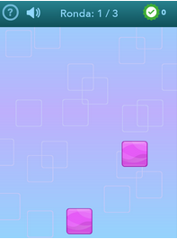{width=200 fig-align="center"}

**Simón**

La prueba *Simón* (sesión 2) también evalúa procesos de memoria de trabajo espacial (ver \hyperref[fig:7]{Figura 7}). Inspirado en el clásico juego de los ochenta, los participantes deben reproducir la secuencia de iluminaciones. La prueba, que comienza con un solo elemento, aumenta en dificultad (con secuencias más largas, 24 elementos como máximo) a medida que las niñas/os aciertan. El tiempo entre la presentación de cada estímulo comienza en un segundo y aumenta con el largo de la secuencia. El criterio de corte es de tres errores acumulados, con los dos primeros ensayos de práctica (no acumulan error). Variables de interés: cantidad de ensayos correctos, cantidad máxima de ensayos correctos consecutivos, tiempo de reacción promedio en ensayos correctos e incorrectos (latencia hasta la primera selección).

\phantomsection
\addcontentsline{lof}{figure}{{7. Captura de pantalla de la prueba Simón}}
\label{fig:7}
**Figura 7**  
*Captura de pantalla de la prueba Simón.*

{width=200 fig-align="center"}

**Cómo se siente**

El test *Cómo se siente* (sesión 2) evalúa el reconocimiento de emociones (ver \hyperref[fig:8]{Figura 8}). Cuenta con 15 ensayos en los cuales los participantes deben identificar el tipo de emoción expresada (felicidad, tristeza, enojo, miedo, neutro) en la foto de un rostro adulto (rostros aleatorios de 4 personas jóvenes, dos mujeres y dos varones).; y luego valorar la intensidad de la expresión en una escala Likert de siete niveles. Variables de interés: cantidad de ensayos correctos y tiempo de reacción promedio en ensayos correctos e incorrectos (sin contemplar la valoración de la intensidad).

\phantomsection
\addcontentsline{lof}{figure}{{8. Captura de pantalla de la prueba Cómo se siente}}
\label{fig:8}
**Figura 8**  
*Captura de pantalla de la prueba Cómo se siente.*

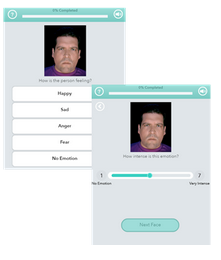{width=200 fig-align="center"}

**Juego de magia**

La prueba *Juego de magia* (sesión 2)  evalúa el nivel de reactividad/proactividad en un procedimiento de control cognitivo modelado con en el paradigma AX-Continuous Performance Task [@gonthierEvidencingDevelopmentalShift2019; @kubotaConsistentUseProactive2020] (ver \hyperref[fig:9]{Figura 9}). La misma consta de dos bloques de práctica de 18 ensayos y dos bloques de prueba de 30 ensayos, en los cuales se presentan dos de cuatro estímulos sucesivamente (espaciados por 1200 ms), y los participantes deben presionar una de dos flechas de acuerdo a la combinación de estímulos antes de que transcurran 2088 ms (la flecha izquierda si aparece la pareja varita-caldero [ensayo AX] y la flecha derecha para cualquier otra combinación). Variables de interés: cantidad de ensayos correctos, tiempo de reacción promedio en ensayos correctos e incorrectos, diferencia de tiempo de reacción promedio entre ensayos correctos AX y no AX. 

\phantomsection
\addcontentsline{lof}{figure}{{9. Captura de pantalla de la prueba Juego de magia}}
\label{fig:9}
**Figura 9**  
*Captura de pantalla de la prueba Juego de magia.*

{width=200 fig-align="center"}

#### 6.3.1.2 Pruebas de desempeño académico

Como acercamiento al nivel de conocimientos y habilidades en lengua y matemática, se utilizaron los subtests *Comprensión de oraciones* y *Problemas aplicados* de la batería *Woodcock-Muñoz III* [@munoz-sandovalBateriaIIIWoodcockMunoz2009], que es la versión en español de la batería *Woodcock-Johnson* [@woodcockTheoreticalFoundationsWjR1990]. En la prueba de Comprensión de oraciones, se administran 43 ensayos en los que se les lee a los participantes una oración incompleta y se les pide que la completen con una o dos palabras. En la prueba de Problemas aplicados, se administran 58 problemas de aritmética, con consignas verbales e imágenes, para evaluar la habilidad para analizar y resolver problemas matemáticos. Ambas pruebas estandarizadas incrementan progresivamente la complejidad de sus ensayos y tienen un criterio de corte de seis errores consecutivos (ver Anexo [D3](https://github.com/juaninachon/Tesis/blob/main/anexos/D3_WM.pdf)). La administración sucesiva de estos dos subtests lleva aproximadamente 20 minutos. Variables de interés: cantidad de ensayos correctos y puntaje compuesto por el promedio de valores Z de ambas pruebas.

#### 6.3.1.3 Reporte de familiares

**Cuestionario del Comportamiento Infantil (CBQ)**

Los adultos responsables completaron la versión en español abreviada del *Cuestionario del Comportamiento Infantil* para niños/as de tres a siete años [@putnamDevelopmentShortVery2006]. El cuestionario permite explorar la conducta habitual en la infancia según la perspectiva adulta, en tres dimensiones temperamentales: *extraversión* (altos niveles de actividad, sociabilidad e impulsividad; consistencia interna en estudios previos α = .73), *esfuerzo de control* (capacidad de AR cognitiva y emocional, altos niveles de control inhibitorio, control atencional y baja intensidad de placer; consistencia interna en estudios previos α = .72), y *afectividad negativa* (miedo, enojo, frustración, disconformidad y tristeza; consistencia interna en estudios previos α = .68). La persona entrevistada valora el grado de veracidad de 36 ítems respecto de la conducta del participante en los últimos seis meses en una escala Likert de siete niveles (“totalmente falso” = 1; “bastante falso” = 2; “poco falso” = 3; “ni falso, ni verdadero” = 4; “poco cierto” = 5; “bastante cierto” = 6; “totalmente cierto” = 7; y “no aplica” = NA), donde los puntajes más altos implican niveles más pronunciados del rasgo/dimensión temperamental (ver Anexo [D4](https://github.com/juaninachon/Tesis/blob/main/anexos/D4_cbq.pdf)). Completar este cuestionario lleva cerca de diez minutos. Variables de interés: puntaje promedio para cada dimensión temperamental.

**Cuestionario sociodemográfico y de antecedentes de vida**

Al igual que en estudios previos del grupo de investigación [@pratsDesarrolloCognitivoInfantil2018; @segretinPredictorsCognitiveEnhancement2014], los adultos responsables respondieron preguntas sobre condiciones habitacionales, sus propios niveles de educación, ocupación, edad, y sobre las experiencias de vida y los antecedentes de salud de los participantes a su cargo. En esta oportunidad, el cuestionario fue autoadministrado a través de Google forms e incluyó 41 ítems con formato de escala, opción múltiple y respuesta corta. Completarlo demoraba cerca de 15 minutos (ver Anexo [D5](https://docs.google.com/forms/d/e/1FAIpQLSc2KPR7O-kRr4zUBWWaVYH9UOrw1kc3e0AqdQWk7U_MorSolA/viewform?usp=sharing)). Variables de interés: Nivel educativo de los adultos responsables (“primario incompleto” = 0; “primario en curso” = 1; “primario completo = 2; “secundario incompleto” = 3; “secundario en curso” = 4; “secundario completo = 5; “terciario incompleto” = 6 ; “terciario en curso” = 7; “terciario completo = 8; “universitario incompleto” = 9; “universitario en curso” = 10; “universitario completo = 11; “posgrado incompleto” = 12; “posgrado en curso” = 13; “posgrado completo = 14;”), ocupación (descripción libre), si es un trabajo formal (“no” = 0; “sí” = 1; “no aplica” = NA) , si trabaja en relación de dependencia (“no” = 0; “sí” = 1; “no aplica” = NA), edad (respuesta numérica), localidad de residencia (descripción libre), estatus migratorio (si es inmigrante y hace cuánto reside en el país), cantidad de libros infantiles en el hogar (“ninguno” = 0; “menos de 10” = 1; “entre 10 y 50” = 2; “entre 51 y 100” = 3 , “Más de 100” = 4), frecuencia de lectura semanal (“menos de 1 vez por semana” = 0; “1 vez por semana” = 1; “3 veces por semana” = 2; “todos los días” = 3), cantidad de menores y adultos en el hogar (respuesta numérica), configuración habitacional (“hogar monoparental”; “biparental”; “tenencia compartida”; “al cuidado de familiares”; “otras configuraciones”), antecedentes de riesgo perinatal (“no” = 0; “si” = 1; aclaración libre: “e.g., alta presión o medicación durante el embarazo, parto prematuro, etc.”), antecedentes crónicos de salud (“no” = 0; “si” = 1; aclaración libre: “e.g., meningitis, hidrocefalia, convulsiones, etc.”), años previos de escolaridad del participante (respuesta numérica), disponibilidad de materiales didácticos en el hogar (0-3, suma de respuestas afirmativas sobre “juguetes para construcción o rompecabezas”; “elementos para la libre expresión”; “ juegos de mesa o de reglas”; ), utilización de dispositivos electrónicos (“no/no tiene” = 0; “si” = 1) , realización de actividades deportivas (“no” = 0; “si” = 1; aclaración libre), realización de salidas recreativas en los últimos 12 meses (0-7, suma de respuestas afirmativas sobre: “¿ha festejado su ultimo cumpleaños?”; “¿ha concurrido a ver una película en un cine?”; “¿ha concurrido a ver una obra de teatro/circo?”; “¿ha ido al menos a una excursión escolar?”; "¿ha realizado al menos una salida o paseo en familia?”; “ha ido a la casa de amigos o los ha recibido en su casa”?; “¿frecuentemente lo llevan a la plaza o a espacios verdes”?), duración promedio del sueño nocturno ("menos de 7 horas" = 0; "entre 7 y 8 horas" = 1; "entre 8 y 9 horas" = 2; "entre 9 y 11 horas" = 3), tiempo para la conciliación del sueño ("más de 1 hora" = 0; "entre 45 y 60 minutos" = 1; "entre 30 y 45 minutos" = 2; "entre 15 y 30 minutos" = 3; "menos de 15 minutos" = 4), acceso a la vestimenta(0-3, suma de respuestas afirmativas sobre: “¿tiene al menos una muda completa nueva?”; “¿tiene más de un par de zapatos en buen estado”; “¿tiene al menos un abrigo de invierno”), percepción de la contaminación sonora en el barrio ( "muy tranquilo" = 4; "tranquilo" = 3; "ni muy ruidoso ni muy tranquilo" = 2; "ruidoso" = 1; "muy ruidoso" = 0), percepción de ingresos y recursos para la vida dign ("malos" = 0; "insuficientes" = 1; "suficientes" = 2; "buenos" = 3; "muy buenos" = 4), y frecuencia de experiencias estresantes ("nunca" = 4; "casi nunca" = 3; "de vez en cuando" = 2; "a menudo" = 1, "muy a menudo" =0).

**Escala de Confusión, Bullicio y Orden en el Hogar (CHAOS)**

Adicionalmente, los adultos completaron la versión en español de la *escala de Confusión, Bullicio y Orden en el Hogar* [@mathenyBringingOrderOut1995; @sanchez-mondragonAdaptacionValidacionEscala2019]. La misma cuenta con 15 ítems que evalúan el nivel de caos/clima negativo en el contexto hogareño en una escala Likert de una dimensión con cuatro niveles ("nunca" = 0; "ocasionalmente" = 1; "con bastante frecuencia" = 2; "siempre" = 3), donde niveles más altos implican mayor confusión, bullicio y desorden en el hogar (consistencia interna en estudios previos α = .73). Completarlo demora menos de cinco minutos. Variables de interés: puntaje promedio.

#### 6.3.1.4 Reporte de docentes

**Escalas de Comportamiento Preescolar (ECP)**

Las docentes a cargo de las salas en los jardines participantes completaron las *escalas de Comportamiento Preescolar* [@carneyReliabilityComparabilitySpanishlanguage2002]. La misma, que cuenta con una validación realizada en Argentina que contempla el rango etario objetivo [@reynaPropiedadesPsicometricasEscala2009], se compone de 43 ítems de respuesta Likert de cuatro niveles ("nunca" = 0; "raramente" = 1; "algunas veces" = 2; "frecuentemente" = 3), divididas en dos escalas: *Habilidades Sociales* (*cooperatividad*, *independencia social* e *interacciones sociales*; consistencia interna en estudios previos α = .88) y *Problemas de Conducta* (*problemas internalizantes* y *problemas externalizantes*; consistencia interna en estudios previos α = .94). Los puntajes más altos implican mayor frecuencia de conductas en cada escala. Completar este cuestionario demora cerca de diez minutos (ver Anexo [D6](https://docs.google.com/forms/d/e/1FAIpQLSe86S0XI2hkf-rA2VGcaLphMhAjzFH68qK5kwlEmF29RFQdgQ/viewform?usp=sharing)). Variables de interés: puntaje promedio de cada subescala.

**Escala de la Vida en Programas para la Primera Infancia (LECP)**

Las docentes completaron la *escala de la Vida en Programas para la Primera Infancia* [@kontosLifeEarlyChildhood2000; @wachsPredictorsPreschoolChildrens2004]. La misma, que fue traducida para este estudio, cuenta con 16 ítems que evalúan el nivel de caos/clima negativo en el contexto áulico en una escala Likert de una dimensión con cuatro niveles ("nunca" = 0; "raramente" = 1; "algunas veces" = 2; "frecuentemente" = 3) (consistencia interna en estudios previos α = .67). Los puntajes más altos implican mayores niveles de confusión, bullicio y desorden en el aula. Completar esta escala lleva menos de cinco minutos. Variables de interés: puntaje promedio.

**Cuestionario de experiencia docente**

Las docentes también respondieron un cuestionario con nueve preguntas acerca de su trayectoria. Completarlo demoraba menos de cinco minutos (ver Anexo [D7](https://docs.google.com/forms/d/e/1FAIpQLSfMn0zBJ16s05brFhUMAB0XOTUXTHU3MvsiwP5KNb9ENvThGg/viewform?usp=sharing)). Variables de interés: edad (años), antigüedad en el cargo (años), capacitaciones realizadas en los últimos dos años (“no” =0; “sí” = 1), taza de estudiantes sobre docentes en el aula (cantidad de niñas/os matriculados y cantidad de docentes por turno), antecedentes de docencia con el mismo grupo de niños/as (“no” =0; “sí” = 1). 

#### 6.3.1.5 Observaciones en las aulas

Para el desarrollo del instrumento de observación de conductas en el aula, se comenzó realizando un relevamiento de la literatura del área, el cual permitió identificar indicadores comportamentales, métodos de codificación, procedimientos analíticos e hipótesis con los que se fue construyendo un modelo de registro de conductas autorregulatorias en contextos áulicos y domésticos [@nachonAssessmentChildSelfregulation2025]. Luego, se diseñó un primer protocolo que fue puesto a prueba con videos de acceso abierto. El modelo inicial (ver Anexos [E1](https://github.com/juaninachon/Tesis/blob/main/anexos/E1_ProtocoloPiloto.xlsx) y [E2](https://github.com/juaninachon/Tesis/blob/main/anexos/E2_ManualPiloto.pdf)) contó con 130 indicadores referidos a la expresividad emocional, al involucramiento en actividades pedagógicas y a las interacciones prosociales y disruptivas con pares y docentes, que fueron probados con seis videos de situaciones de juego y aprendizaje en contextos de educación inicial. Para esta prueba piloto fueron incorporados al proyecto cuatro estudiantes de grado, en el marco de prácticas de investigación. Luego de una capacitación inicial, se codificaron 30 minutos de un total de seis videos, de manera independiente.

&ensp;&ensp;&ensp;&ensp;&ensp;&ensp;Dado que las autoridades ministeriales desestimaron la posibilidad de filmar en las escuelas, se optó por un diseño de codificación manual en vivo, siguiendo un formato de muestreo parcial por intervalos en el que un equipo de operadores realiza observaciones sincronizadas por temporizador, registrando la ocurrencia de eventos comportamentales ligados a un individuo objetivo y puntuando ítems escalares en una planilla, a lo largo de un ciclo dividido en intervalos de igual duración [@hintzeBestPracticesSystematic2002; @volpeObservingStudentsClassroom2005]. También se redujo la cantidad de indicadores y se ajustó el número y la duración de los intervalos, de acuerdo a las limitaciones impuestas. Previo al inicio del trabajo de campo en las escuelas, se incorporó a un nuevo grupo de nueve operadores y se continuó modificando el protocolo en base a la retroalimentación provista por ellos. La capacitación se realizó a través de simulacros de codificación con el mismo cuerpo de videos de la prueba piloto y durante las primeras semanas de trabajo en los jardines. Los operadores siempre tuvieron acceso a un manual de procedimientos (ver Anexo [E3](https://github.com/juaninachon/Tesis/blob/main/anexos/E3_ManualObservaciones.pdf)) y participaban de supervisiones periódicas donde se intentaba despejar sus dudas y consensuar diferencias en la interpretación de ítems bajo condiciones ambiguas. El protocolo final incluyó 16 indicadores, que se puntuaron a lo largo de ciclos conformado por 10 intervalos de 40 segundos (ver \hyperref[fig:10]{Figura 10}). Estos indicadores se agruparon en expresiones faciales positivas, negativas y neutras; niveles altos, fluctuantes y bajos de involucramiento en las actividades pedagógicas; conductas de apaciguamiento y desplazamiento; e interacciones prosociales y disruptivas con pares y docentes.

&ensp;&ensp;&ensp;&ensp;&ensp;&ensp;Sobre el tipo de actividades observadas en las salas, se definieron categorías en función a la dinámicas y expectativas que predominaban durante los ciclos de observación. En primer lugar, se distinguió entre aquellas actividades donde los participantes ocupaban un rol pasivo y el protagonismo recaía principalmente en la docente (e.g., lectura en ronda, charla introductoria), de eventos en los que los participantes tenían un rol más activo y con mayores expectativas de autonomía (e.g., debían cumplir una tarea en un periodo acotado de tiempo, estar pendiente de las acciones de sus pares, respetar turnos, trabajar en equipo). En segundo lugar, se buscó discriminar el contenido pedagógico o las áreas temáticas de las actividades (e.g., si estaban vinculadas a conceptos matemáticos, lingüísticos, artísticos o cívicos). Indefectiblemente, al centrarse en aspectos comunes a las actividades de varios grupos de niñas/os y docentes para sacar conclusiones cuantitativas sobre la expresión del comportamiento en distintos escenarios, se pierden de vista aquellas características que hacen a las actividades sucesos únicos e irrepetibles, como por ejemplo, el contenido específico y los materiales didácticos que se utilizan en cada sala, las vicisitudes en el desarrollo de la actividad y la historia de los vínculos. Aclaradas estas salvedades, las categorías definidas fueron: *artes plásticas* (e.g., dibujo, pintura, escultura, collage, etc.), *juegos que incorporan elementos aritméticos* (e.g., ludo, generala, bingo); *actividades de lectoescritura* (e.g., escribir o identificar las letras de su propio nombre o de algún objeto); *juegos libres* (e.g., juego en estaciones, juego con bloques de encastre, juego sociodramático) y *situaciones de exposición docente* (e.g., lectura de cuento en ronda, video educativo sobre sucesos históricos, charla introductoria a las actividades de la jornada). Variables de interés: proporción de intervalos con detección de cada indicador comportamental, donde valores más altos representan una mayor frecuencia de detección.

\phantomsection
\addcontentsline{lof}{figure}{{10. Planilla de observación utilizada en los jardines}}
\label{fig:10}
**Figura 10**  
*Planilla de observación utilizada en los jardines.*

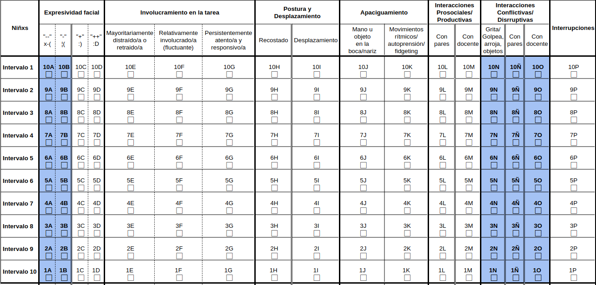{width=600 fig-align="center"}

### 6.3.2 Procedimientos

Durante la primera mitad de los ciclos lectivos 2023 y 2024 (un ciclo por cohorte), los participantes autorizados fueron observados en actividades áulicas y evaluados individualmente con las pruebas de rendimiento académico y FFEE, a lo largo de 16 semanas de trabajo de campo. Toda la comunidad educativa fue informada acerca del motivo de las visitas del equipo de investigación y se dispuso de un periodo de habituación a la presencia de los operadores &mdash;de dos semanas previo al comienzo de los registros&mdash; mientras se hacían observaciones de práctica y las evaluaciones del desempeño académico. Las observaciones ocurrieron durante la mañana dentro de las salas habituales para cada curso. No se requirió que las escuelas modificaran sus cronogramas ni el contenido de las prácticas de enseñanza. Cada participante fue observado en seis ocasiones distintas (una vez por semana en promedio). El orden de observación estaba sujeto a la asistencia de los participantes al jardín y al tipo de actividad registrada. Es decir, se comenzó en sentido aleatorio y se prosiguió así siempre que no fuera necesario priorizar a participantes que se ausentaban o que todavía no habían sido observados en un tipo de situación específica. En cada ocasión, un equipo de entre dos y cuatro operadores se posicionaba en los extremos de la sala, procurando no intervenir en las actividades. Los operadores eran asignados con participantes diferentes y, de manera simultánea y coordinada, completaban tantos ciclos de observación como era posible en la jornada. Cerca del 15% de los registros fue codificado por duplicado (i.e., dos operadores observaban al mismo niño/a) para estimar su confiabilidad.

&ensp;&ensp;&ensp;&ensp;&ensp;&ensp;Para las evaluaciones del desempeño académico &mdash;que se administraron en una única sesión de 20 minutos por participante&mdash; se dispuso de un espacio abierto fuera del aula en cada escuela (e.g., un pasillo no muy transitado). El orden de las pruebas siempre fue el mismo, Problemas Aplicados seguida de Comprensión de Oraciones.

&ensp;&ensp;&ensp;&ensp;&ensp;&ensp;Docentes y adultos responsables completaron las medidas de reporte a través de Google Forms. Las familias recibieron instrucciones y enlaces por correo electrónico (ver Anexo [F1](https://github.com/juaninachon/Tesis/blob/main/anexos/F1_ModelosCorreosElectronicos.pdf)) para que los participantes completasen las dos sesiones de la batería de FFEE desde el hogar. Dada la baja adhesión a este pedido, se administraron en la escuela via tablet todas aquellas evaluaciones que no habían podido ser completadas en los hogares en las últimas semanas del campo, previo al receso invernal, en el mismo espacio y de la misma manera que se realizaron las evaluaciones del desempeño académico.

&ensp;&ensp;&ensp;&ensp;&ensp;&ensp;Los datos de la conducta obtenidos de las observaciones naturalistas se procesaron desde su estado inicial &mdash;como planillas de papel con series temporales anotadas a mano&mdash; en información digitalizada que pudiera abastecer los análisis estadísticos. De esta tarea participaron otros nueve pasantes de investigación, estudiantes universitarios que fueron capacitados y supervisados para realizar tareas de tabulación, en sesiones semanales de 3 horas, a lo largo de ocho meses. De estos archivos luego calcularon puntajes individuales, conjugando y promediando la cantidad de intervalos en los que se detectaron indicadores, a lo largo de todos los ciclos de observación y según el tipo de actividad observada (i.e., juego libre; dibujo/pintura; cuento en ronda/ponencia docente; juego con números; lectoescritura).

### 6.3.3 Análisis estadístico {#sec-6.3.3}

Todos los estadísticos se computaron en R (versión 4.4.1, ver \hyperref[fig:11]{Figura 11} y Anexo [G1](https://github.com/juaninachon/Tesis/blob/main/Tesis.qmd)). Se efectuó la descripción univariada de las variables mediante el cálculo del tamaño muestral, media, mediana, desvío, rango y proporción de casos perdidos. Complementariamente, se visualizaron las distribuciones con histogramas de frecuencia. Los análisis bivariados consistieron en correlaciones de orden cero con los métodos de Pearson y Spearman &mdash;visualizadas en gráficos de dispersión&mdash; con el fin de explorar la asociación entre las distintas medidas e informar la construcción de modelos multivariados. En ningún caso se imputaron datos perdidos, ya que en gran parte de las variables problemáticas los casos faltantes exceden el 40% y ello limita la aplicabilidad de los métodos de imputación, dificulta evaluar si los patrones de datos perdidos son aleatorios y aumenta considerablemente el riesgo de sesgo en los resultados [@dettoriSinMissingData2018; @rothMISSINGDATACONCEPTUAL1994; @woodsBestPracticesAddressing2024].

&ensp;&ensp;&ensp;&ensp;&ensp;&ensp;La consistencia interna de las escalas de reporte se estimó con el coeficiente $\alpha$ de Cronbach y, para calcular la confiabilidad de las medidas observacionales, se usaron los coeficientes $\kappa$ de Cohen y $\alpha$ de Krippendorf. Adicionalmente, se verificó la homogeneidad de las cohortes y de los grupos que completaron las pruebas de manera presencial y remota con la prueba \\textit{U} de Mann-Whitney y el método de Levene.

&ensp;&ensp;&ensp;&ensp;&ensp;&ensp;Buscando constatar la convergencia entre las distintas fuentes de información, condensar la gran extensión de la matriz de datos y poner a prueba las hipótesis de asociación con el desempeño académico y moderación por factores sociodemográficos, se ajustaron modelos de regresión lineal multivariada. El proceso de formulación de los modelos siguió una lógica de decantación, a partir de la cual se seleccionaron covariables para cada tipo de instrumento (i.e., predictores candidatos) que hubieran mostrado resultados estadísticamente significativos en los análisis bivariados con las medidas de desempeño académico (*p* < 0.01). En caso de encontrar predictores que estuvieran altamente correlacionados entre sí ($\rho$ > 0.5), se filtraron las variables con menor valor predictivo y cantidad de observaciones, para evitar multicolinealidad y baja potencia estadística en los modelos. Como regla general, se evitó incluir un número excesivo de variables independientes de modo que los modelos tuvieran al menos 10 casos por cada parámetro estimado. Los supuestos de linealidad de los predictores, homocedasticidad y normalidad de los residuos se pusieron a prueba individualmente para cada modelo y, en caso de hallar contravenciones, se abandonó el modelo si estas no podían corregirse manipulando la escala de las variables independientes (i.e., estandarizándolas o aplicándoles transformaciones logarítmicas).

&ensp;&ensp;&ensp;&ensp;&ensp;&ensp;En el caso particular de los puntajes de la batería de FFEE, se exploró el análisis de componentes principales (PCA) para extraer una medida compuesta, siguiendo el criterio de Kaiser-Meyer-Olkin (KMO), el  test de esfericidad de Bartlett y el método de scree para determinar el número de variables y componentes apropiados. Se retuvieron conjuntos de variables significativamente asociadas con un KMO mayor a 0.5 y componentes con eigenvalues mayores a 1, que en total expliquen al menos el 40% de la varianza de cada variable (comunalidad). Debido a la proporción de casos perdidos en las pruebas de la sesión 2, solo las pruebas de la sesión 1 fueron tenidas en cuenta para este procedimiento.

&ensp;&ensp;&ensp;&ensp;&ensp;&ensp;En segunda instancia, se compararon modelos anidados con el método de análisis de varianza para determinar el conjunto de predictores más robusto en los datos disponibles. En cada caso, los modelos anidados tuvieron como variable dependiente al puntaje compuesto de desempeño académico y las variables independientes fueron agrupadas en tres niveles con la misma cantidad de predictores, en la medida que el tamaño muestral permitiera acomodar el número de parámetros deseado. Los niveles de anidamiento corresponden a las categorías *abordajes de laboratorio* (i.e., pruebas computarizadas de FFEE), *potenciales moderadores socioambientales* (e.g., edad, nivel educativo de los padres) y *abordajes ecológicos* (i.e., medidas de reporte e indicadores de las observaciones no participantes). El orden aditivo de los niveles reflejó la intención de verificar si la introducción del los  moduladores socioambientales, seguidos de las medidas ecológicas, producen mejoras significativas en los índices de ajuste y en el porcentaje de la varianza explicado por un modelo de base cuyos únicos predictores son las variables de los abordajes de laboratorio. 

&ensp;&ensp;&ensp;&ensp;&ensp;&ensp;Por último, para poner a prueba efectos de moderación, se especificaron modelos de regresión lineal con interacciones simples entre los potenciales moderadores socioambientales y los indicadores vinculados a la AR (i.e., se mantuvo como variable dependiente al puntaje compuesto de desempeño académico y se incluyeron dos variables independientes con su respectiva interacción, una vinculada a la AR y la otra a factores socioambientales). Se seleccionaron los mismos predictores que atravesaron el filtro de los análisis previos. En esta instancia, las escalas de las variables independientes fueron centradas por su media.

\phantomsection
\addcontentsline{lof}{figure}{{11. Vinculación entre los instrumentos, procedimientos analíticos y objetivos del proyecto}}
\label{fig:11}
**Figura 11**  
*Vinculación entre los instrumentos, procedimientos analíticos y objetivos del proyecto.*

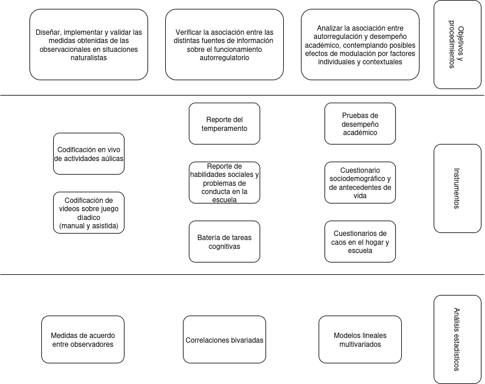{width=600 fig-align="center"}

## 6.4 Estudio 2: Museo

### 6.4.1 Instrumentos

Se utilizaron los mismos cuestionarios para padres y pruebas del estudio 1 (ver [Apartado 6.3.1](#sec-6.3.1)). No se administraron los cuestionarios para docentes y el instrumento de observación se adaptó al contexto de interacciones diádicas semiestructuradas.

#### 6.4.1.1 Observaciones en el museo

Se empleó un sistema con dos cámaras Go-Pro Hero 7 Black, montadas sobre una mesa a dos metros de distancia de los participantes para registrar situaciones de juego colaborativo (ver \hyperref[fig:12]{Figura 12}) en las cuales se les pidió a las díadas que interactuasen simulando estar en sus hogares, primero jugando al *piedra, papel o tijera* y luego armando dos figuras de papel, con la ayuda de un instructivo (ver Anexo [H1](https://github.com/juaninachon/Tesis/blob/main/anexos/H1_InstruccionesVideos.pdf 
)). Cada díada estuvo conformada por un niño/a y un adulto que lo acompañaba (si más de uno estaba disponible, quedaba a elección de la niña/o con quién participar). La grabación se realizó en una resolución de imagen de 1920x1080 píxeles a 59.94 fps, con audio estéreo muestreado a 48000 Hz. Esta actividad &mdash;con un rango de duración de entre 7 y 17 minutos y un orden creciente de complejidad en los juegos propuestos&mdash; se diseñó con la intención de obtener una muestra continua y contrastable del comportamiento de los participantes, a partir de la cual fuera posible observar diferencias en la expresión del funcionamiento autorregulatorio. Se exploró la posibilidad de que los participantes de la muestra de los jardines también pudieran filmar estas actividades desde sus hogares, usando una sola cámara, pero la baja adhesión durante el primer año a esta actividad (i.e., menos del 2% de la cohoerte) ocasionó que no se le diera continuidad.

Variables de interés: Proporción de fotogramas de las actividades con detección de indicadores de expresividad facial de valencias neutras, positivas y negativas; orientación de la mirada congruente con un alto o bajo grado de involucramiento en la situación de juego (i.e., en dirección de su pareja o de los elementos relevantes para la actividad); sincronía emocional y atencional de la díada (emparejamiento de los estados comportamentales); cantidad de enunciados, palabras y turnos conversacionales; diversidad léxica (ver [Apartado de Procedimientos 6.4.2](#sec-6.4.2)).

\phantomsection
\addcontentsline{lof}{figure}{{12. Captura de una situación de juego semiestructurada en el museo}}
\label{fig:12}
**Figura 12**  
*Captura de una situación de juego semiestructurada en el museo (los rostros fueron alterados para resguardar la identidad de los participantes).*

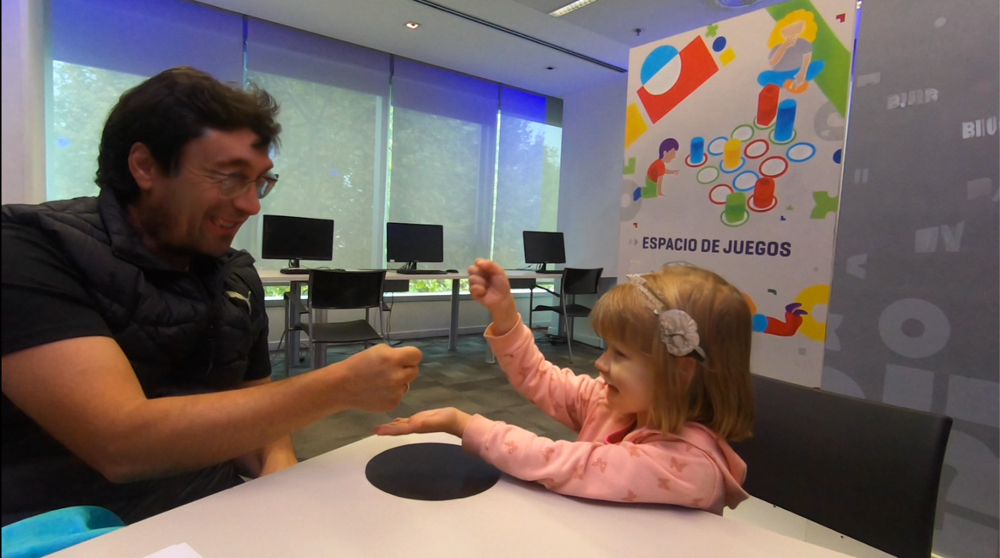{width=500 fig-align="center"}

### 6.4.2 Procedimientos {#sec-6.4.2}

Durante el 2023, se llevaron a cabo nueve jornadas de evaluaciones en el museo. El mismo, que era de entrada gratuita y abierta, funcionaba de 12:00 a 18:00 hs los fines de semana. La difusión de la actividad se hizo a través de redes sociales y presencialmente, con los medios audiovisuales del museo. El equipo de investigación recibía a los potenciales participantes que transitaban libremente por el museo, los informaban acerca de los procedimientos y fines de la actividad, invitándolos a participar mediante la firma de un consentimiento. Se acondicionó una sala con mesas, sillas y biombos, quedando dividida en zonas de filmación, evaluación y espera, donde distintos grupos de 2 a 3 operadores estaban a cargo de recibir a los participantes, dar las instrucciones y supervisar el desarrollo de cada actividad. Primero, se obtuvieron filmaciones de las díadas. Luego, los participantes completaron las pruebas de desempeño académico y la primera de las sesiones de la batería de FFEE en computadoras con pantalla táctil, mientras los adultos respondían los cuestionarios. Por último, se invitó a que los niños/as completasen la segunda sesión de la batería de FFEE remotamente desde sus hogares y luego se los despedía con la posibilidad de que observasen un video corto con un mensaje de agradecimiento. En total, el circuito demoraba entre 30 y 60 minutos por participante, y se permitía que hasta 6 díadas lo transiten en simultáneo, pero de manera escalonada.

&ensp;&ensp;&ensp;&ensp;&ensp;&ensp;Los videos obtenidos en el museo fueron anotados manualmente con BORIS [@friardBORISFreeVersatile2016], un programa donde se define un diccionario de conductas a examinar (etograma, ver Anexo [H2](https://github.com/juaninachon/Tesis/blob/main/anexos/H2_etograma.boris)) que luego se utiliza para identificar el orden, cantidad y la duración de eventos comportamentales en un video. También se utilizó ELAN [@wittenburgELANProfessionalFramework2006] para generar diarizaciones (identificación de hablantes en el archivo de audio, ver Anexos [H3](https://github.com/juaninachon/Tesis/blob/main/anexos/H3_TutorialELAN.pdf) y [H4](https://github.com/juaninachon/Tesis/blob/main/anexos/H4_template_ELAN.etf)), segmentando los actos de habla para cada uno de los miembros de la díada, a partir de picos claramente distinguibles en el gráfico de onda (ver \hyperref[fig:13]{Figura 13}). Se separaron todas las instancias que incluyeran silencios mayores a 400 ms.

\phantomsection
\addcontentsline{lof}{figure}{{13. Diagrama del proceso de diarización y segmentación del habla}}
\label{fig:13}
**Figura 13**  
*Diagrama del proceso de diarización y segmentación del habla.*

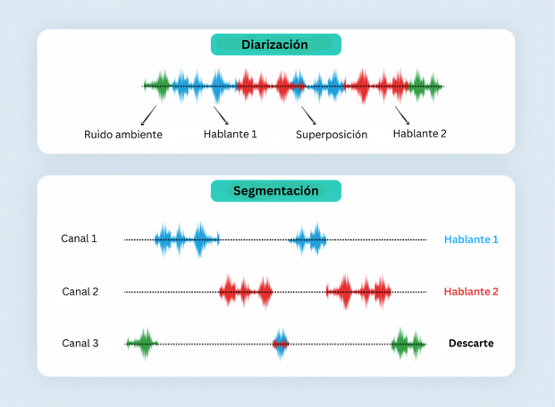{width=500 fig-align="center"}

&ensp;&ensp;&ensp;&ensp;&ensp;&ensp;A partir de las anotaciones manuales se generaron puntajes que reflejan la cantidad de instancias y la proporción del tiempo (expresado en fotogramas) en el que se identificó un evento comportamental, a lo largo de toda la filmación y según las fases específicas del registro (piedra, papel o tijera; avioncito; paloma) (ver \hyperref[fig:14]{Figura 14}).

\phantomsection
\addcontentsline{lof}{figure}{{14. Gráfico de series temporales generado a partir de la codificación manual con etograma en BORIS}}
\label{fig:14}
**Figura 14**  
*Gráfico de series temporales generado a partir de la codificación manual con etograma en BORIS.*

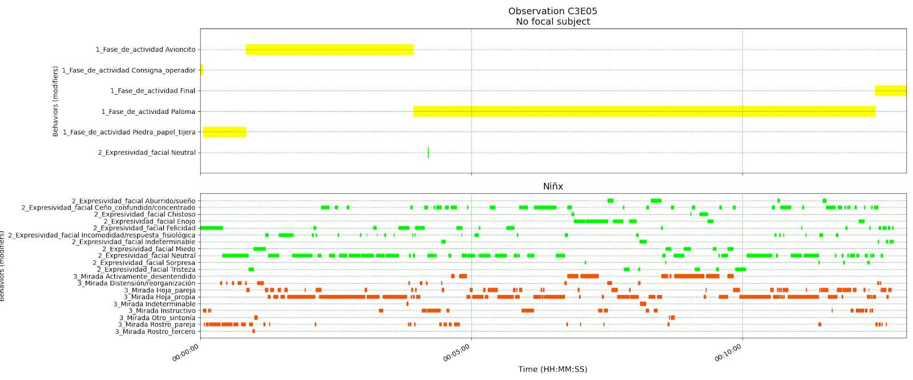{width=600 fig-align="center"}

&ensp;&ensp;&ensp;&ensp;&ensp;&ensp;En paralelo, se ensayó la anotación asistida por distintos modelos de inteligencia artificial de acceso abierto (ver \hyperref[fig:15]{Figura 15} y Anexos [I1 a I5](#sec-I)). El audio fue diarizado con Pyannoter [@bredinPyannoteaudio21Speaker2023] y transcrito con Whisper [@radfordRobustSpeechRecognition2023]. Las transcripciones se tokenizaron (división de frases en palabras o unidades de significado) con el paquete koRpus [@michalkePackageKoRpus2021] para obtener índices de diversidad léxica. El procesamiento de los videos, acotado mediante el ajuste de la resolución a tres fotogramas de 1280x720 píxeles por segundo, consistió en la segmentación (distinción de los cuerpos de los participantes) con Segment Anything 2 [@raviSAM2Segment2024], y la estimación de poses corporales con MediaPipe para brazos, manos y cabeza [@lugaresiMediapipeFrameworkPerceiving2019]. La identificación de rasgos faciales, estimación de unidades de acción y la clasificación de expresiones emocionales en base al sistema FACS [@ekmanFacialActionCoding1978] usando los modelos Retinaface, Mobilefacenet, Xgb y Resmasknet, disponibles a través de PyFeat [@cheongPyFeatPythonFacial2023]. Se empleó Gaze-LLE [@ryanGazeLLEGazeTarget2024] para estimar la dirección de las miradas de los participantes en dos dimensiones, con lo cual se elaboró una medida de la sincronía atencional de la díada, definida como la intersección simultánea entre las coordenadas de las miradas de los participantes con un margen no mayor a 25 píxeles, o bien, como la superposición de los puntos de fijación de cada participante y los segmentos del rostro de su pareja. Se optó por descartar los videos en los que el reconocimiento facial fallara en más de un 25% de los fotogramas. Se descartaron todas aquellas detecciones que tuvieran un riesgo de alucinación (error) mayor a 0.5, o que en el transcurso del análisis exploratorio se identificaran claramente como errores. Se adoptaron estas soluciones de  compromiso para circunscribir algunas fuentes de error previsibles en el procesamiento del material, pero no se contó con parámetros de referencia al respecto.

\phantomsection
\addcontentsline{lof}{figure}{{15. Cuadros anotados con los outputs de los modelos de reconocimiento}}
\label{fig:15}
**Figura 15**  
*Cuadros anotados con los outputs de los modelos de reconocimiento, ilustrando instancias de sincronía atencional.*

::: {layout-nrow=3}
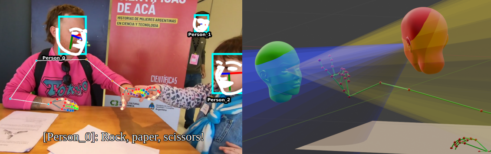{width=400 fig-align="center"}

{width=400 fig-align="center"}

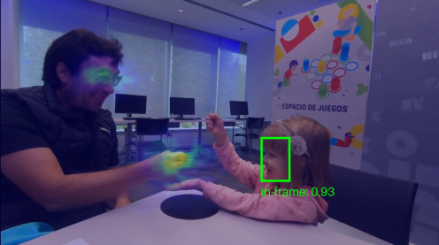{width=400 fig-align="center"}
:::

### 6.4.3 Análisis estadístico

Se emplearon los mismos procedimientos estadísticos que en el estudio 1 (ver [Apartado 6.3.3](#sec-6.3.3)).

# 7. Resultados
```{r}
#| label: ema
ema <- read.csv("data/socdemo.csv")
colnames(ema) <- gsub("_", " ", colnames(ema))
emaj  <- left_join(mj, ema, by = "ID")
emam  <- left_join(mm, ema, by = "ID")

```

## 7.1 Estudio 1: Jardines

### 7.1.1 Análisis descriptivo

#### 7.1.1.1 Características sociodemográficas de los participantes

```{r}
#| label: t1 desc socdemo j

madres <- round(sum(emaj$Informante == "Madre", na.rm=T)/nrow(emaj)*100, digits = 1)

v1 <- colnames(emaj)[c(2, 14, 15)]
v2 <- colnames(emaj)[c(3, 5:13, 16, 17, 19:30)]

t1_1 <- psych::describe(
  emaj |> select(all_of(v1)),
  na.rm = TRUE,
  fast = TRUE
) |>
  as.data.frame() |>
  select(-c(vars, se, , range, kurtosis, skew))
t1_1$missing =  round((nrow(emaj) - t1_1$n) / nrow(emaj) *100, 2)
  
rownames(t1_1) <- gsub("_", " ", rownames(t1_1))
rownames(t1_1)[1] <- "Edad del niño/a"

rnms <- rownames(t1_1)

numeric_cols <- sapply(t1_1, is.numeric)
t1_1[numeric_cols] <- lapply(t1_1[numeric_cols], function(x) formatC(x, digits = 2, format = "f"))

t1_1 <- data.frame(lapply(t1_1, function(x) {
  if(is.character(x)) {
    Encoding(x) <- "UTF-8"
    return(x)
  } else return(x)
}))

colnames(t1_1) <- c(
  "n", "Media", "Desvío", "Mediana", "Mínimo",
  "Máximo", "perdidos (%)"
)

t1_1$n<- formatC(as.numeric(unlist(t1_1$n)), digits = 0, format = "f")

rownames(t1_1) <- rnms

t1_2l <- lapply(select(emaj, all_of(v2)), questionr::freq, digits = 2, cum = TRUE, total = FALSE, valid = TRUE, na.last = TRUE)

# Combine all into one long data frame
t1_2 <- bind_rows(
  lapply(names(t1_2l), function(var) {
    df <- as.data.frame(t1_2l[[var]])
    df <- rownames_to_column(df, "Level")
    df$Variable <- var
    df
  }),
  .id = NULL
) |>
  relocate(Variable, Level) |>
   group_by(Variable) |>
  mutate(Variable = if_else(row_number() == 1, Variable, "")) |>
  ungroup() |>
  select(-c(5,6))

colnames(t1_2) <- c(
  "Variable", "Nivel", "Frecuencia", "Porcentaje", "Porcentaje acumulado válido"
)

t1_2$Variable[1] <- "Sexo"
t1_2$Nivel <- c(
  "Femenino", "Masculino",
  0:5, "Perdidos",
  "No", "Sí", "Perdidos",
  "Ninguno", "Menos de 10", "Entre 10 y 50", "Entre 51 y 100", "Perdidos",
  "Menos de 1 vez por semana","1 vez por semana","3 veces porsemana", "Todos los días", "Perdidos",
  "Muy pocos", "Pocos", "Varios", "Muchos", "Perdidos",
  "Bajo", "Medio", "Alto", "Perdidos",
  "No", "Sí", "Perdidos",
  2:7, "Perdidos", 
  "Bajo", "Medio", "Alto", "Perdidos",
  "Primario incompleto", "Secundario incompleto", "Secundario en curso", "Secundario completo","Terciario incompleto", "Terciario completo", "Universitario incompleto", "Universitario en curso", "Universitario completo",  "Posgrado en curso", "Posgrado completo", "Perdidos",
  "Primario incompleto", "Primario completo", "Secundario incompleto", "Secundario en curso", "Secundario completo","Terciario incompleto", "Terciario en curso","Terciario completo","Universitario incompleto", "Universitario en curso", "Universitario completo", "Posgrado en curso", "Posgrado completo", "Perdidos",
  "No", "Sí", "Perdidos",
  2:7, "Perdidos",
  "No", "Sí", "Perdidos",
  0:6, 10 , "Perdidos",
  "No", "Sí", "Perdidos",
  "No", "Sí", "Perdidos",
  "No", "Sí", "Perdidos",
  "No", "Sí", "Perdidos",
  "Muy ruidoso", "Ruidoso", "Ni muy ruidoso ni muy tranquilo",
  "Tranquilo", "Muy tranquilo", "Perdidos",
  "Malos", "Insuficientes", "Suficientes", "Buenos", "Muy buenos", "Perdidos",
  "Insuficientes", "Suficientes", "Buenos", "Muy buenos", "Perdidos",
  "Nunca", "Casi nunca", "De vez en cuando", "A menudo", "Muy a menudo", "Perdidos"
)

numeric_cols <- sapply(t1_2, is.numeric)
t1_2[numeric_cols] <- lapply(t1_2[numeric_cols], function(x) formatC(x, digits = 2, format = "f"))

t1_2$Frecuencia <- formatC(as.numeric(unlist(t1_2$Frecuencia)), digits = 0, format = "f")

t1_2 <- data.frame(lapply(t1_2, function(x) {
  if(is.character(x)) {
    Encoding(x) <- "UTF-8"
    return(x)
  } else return(x)
}))

colnames(t1_2) <- c(
  "Variable", "Nivel", "Frecuencia", "Porcentaje", "Porcentaje acumulado válido"
)
```

En base a los los cuestionarios respondidos por los adultos responsables de los participantes, en su mayoría madres (`r madres`%), se discierne que, al momento de la recolección de los datos, el participante promedio de los jardines contaba con tres años previos de escolarización y vivía en un hogar biparental de cuatro integrantes (ver \hyperref[tab:1]{Tabla 1}). Sus padres, ambos nacidos en el país, tenían entre 35 y 40 años, y habían llegado a cursar algún estudio terciario o universitario. Ambos mantenían un trabajo formal estable, habiendo cambiado de vivienda al menos una vez desde el nacimiento del participante y se percibían como una familia de ingresos medios con acceso a una calidad de vida digna. Estas familias reportaron vivir en hogares relativamente libres de contaminación sonora, pero donde ocasionalmente experimentaban sensaciones estresantes. El participante promedio no carecía de acceso a la vestimenta ni a materiales de juego didáctico. Compartía momentos de lectura con sus padres al menos una vez por semana y frecuentemente tenía la posibilidad de practicar un deporte, utilizar dispositivos electrónicos o de hacer salidas sociales (e.g, ir al parque, al cine o a casa de amigos). Por último, sus padres reportaron que no todas las noches el participante dormía más de ocho horas, o que le costaba más de 30 minutos conciliar el sueño.

\phantomsection
\addcontentsline{lot}{table}{{1. Características sociodemográficas - muestra  jardines}}
\label{tab:1}
**Tabla 1**  
*Características sociodemográficas - muestra  jardines.*

```{r}
#| label: t1_1
#| results: 'asis'
cat("\\scriptsize\n")
Hmisc::latex(
  t1_1,
  file = "", 
  longtable = TRUE,
  rowlabel = "Variable",
  booktabs = TRUE,
  col.just = c("r", "r", "r", "r", "r", "r", "r"),
  lines.page = 4000
)
cat("\\normalsize\n")
```

```{r}
#| label: t1_2
#| results: 'asis'
cat("\\scriptsize\n")
Hmisc::latex(
  t1_2,
  file = "", 
  longtable = TRUE,
  rowlabel = "",
  rowname = NULL,
  booktabs = TRUE,
  col.just = c("l", "l", "r", "r", "r"),
  lines.page = 4000
)
cat("\\normalsize\n")

```

&ensp;&ensp;&ensp;&ensp;&ensp;&ensp;Sobre las instituciones educativas y las docentes que colaboraron con la investigación (todas eran mujeres), se verifica que el rango etario de las docentes a cargo de las salas iba entre los 25 y 50 años, que llevaban una trayectoria de trabajo en escuelas de 13 años en promedio, que todas asistían regularmente a capacitaciones y que la mitad contaba con alguna formación de posgrado (ver \hyperref[tab:2]{Tabla 2}). Las salas eran de jornada completa y cada una tenía aproximadamente 25 niñas/os matriculados, bajo la tutela de al menos dos docentes por turno.

\phantomsection
\addcontentsline{lot}{table}{{2. Características de los jardines}}
\label{tab:2}
**Tabla 2**  
*Características de las salas y las docentes a cargo.*

```{r}
#| label: t2 desc j
#| results: 'asis'

docentes <- read.csv(
  "data/docentes_demografía.csv",
  check.names = FALSE
) |> select(-c(1:3))

docentes <- add_row(add_row(docentes))

v1 <- colnames(docentes)[c(1, 2, 5, 8)]
v2 <- colnames(docentes)[c(3, 4, 6)]
t2_1 <- psych::describe(
  docentes |> select(all_of(v1)),
  na.rm = TRUE,
  fast = TRUE
) |>
  select(-c(vars, se, range, kurtosis, skew)) |>
  mutate(across(c(2, 3), round, 3)) |>
  mutate(across(4:6, round, 1)) |>
  as.data.frame()

t2_1$missing =  round((nrow(docentes) - t2_1$n) / nrow(docentes) *100, 2)
  
rnms <- rownames(t2_1)

numeric_cols <- sapply(t2_1, is.numeric)
t2_1[numeric_cols] <- lapply(t2_1[numeric_cols], function(x) formatC(x, digits = 2, format = "f"))

t2_1 <- data.frame(lapply(t2_1, function(x) {
  if(is.character(x)) {
    Encoding(x) <- "UTF-8"
    return(x)
  } else return(x)
}))

colnames(t2_1) <- c(
  "n", "Media", "Desvío", "Mediana", "Mínimo",
  "Máximo", "perdidos (%)"
)

t2_1$n<- formatC(as.numeric(unlist(t2_1$n)), digits = 0, format = "f")

rownames(t2_1) <- rnms

t2_2l <- lapply(select(docentes, all_of(v2)), questionr::freq, digits = 2, cum = TRUE, total = FALSE, valid = TRUE, na.last = TRUE)

t2_2 <- bind_rows(
  lapply(names(t2_2l), function(var) {
    df <- as.data.frame(t2_2l[[var]])
    df <- rownames_to_column(df, "Level")
    df$Variable <- var
    df
  }),
  .id = NULL
) |>
  relocate(Variable, Level) |>
   group_by(Variable) |>
  mutate(Variable = if_else(row_number() == 1, Variable, "")) |>
  ungroup() |>
  select(-c(5,6))

colnames(t2_2) <- c(
  "Variable", "Nivel", "Frecuencia", "Porcentaje", "Porcentaje acumulado válido"
)

t2_2$Nivel <- c(
  "No", "Sí", "Perdidos",
  "Sí", "Perdidos",
  "No", "Sí", "Perdidos"
)

numeric_cols <- sapply(t2_2, is.numeric)
t2_2[numeric_cols] <- lapply(t2_2[numeric_cols], function(x) formatC(x, digits = 2, format = "f"))

t2_2$Frecuencia <- formatC(as.numeric(unlist(t2_2$Frecuencia)), digits = 0, format = "f")

t2_2 <- data.frame(lapply(t2_2, function(x) {
  if(is.character(x)) {
    Encoding(x) <- "UTF-8"
    return(x)
  } else return(x)
}))

colnames(t2_2) <- c(
  "Variable", "Nivel", "Frecuencia", "Porcentaje", "Porcentaje acumulado válido"
)
```

```{r}
#| label: t2_1
#| results: 'asis'
cat("\\scriptsize\n")
Hmisc::latex(
  t2_1,
  file = "", 
  longtable = TRUE,
  rowlabel = "Variable",
  booktabs = TRUE,
  col.just = c("r", "r", "r", "r", "r", "r", "r"),
  lines.page = 4000
)
cat("\\normalsize\n")
```

```{r}
#| label: t2_2
#| results: 'asis'
cat("\\scriptsize\n")
Hmisc::latex(
  t2_2,
  file = "", 
  longtable = TRUE,
  rowlabel = "",
  rowname = NULL,
  booktabs = TRUE,
  col.just = c("l", "l", "r", "r", "r"),
  lines.page = 4000
)
cat("\\normalsize\n")
```


#### 7.1.1.2 Distribución de los indicadores observacionales

```{r}
#| label: desc obs j

obsj <- left_join(
  mj,
  read.csv("data/obsj/obs_keys_jardines.csv"),
  by = "ID"
)
ciclos <- len(unique(obsj$Ciclo))
horas <- round((ciclos * 400) / 3600, 2)
protocolos <- nrow(obsj)
mdnn <- obsj |>
  group_by(ID) |>
  dplyr::summarize(n_unique = n_distinct(Ciclo)) |>
  dplyr::summarize(median_n_unique = median(n_unique)) |>
  as.numeric()
dups <- left_join(
  mj,
  bind_rows(
    (read.csv("data/obsj/nrioa24.csv") |>
      mutate(ID = str_split_i(IDNA, "_", i=3))),
    (read.csv("data/obsj/nrioa23.csv") |>
      mutate(ID = str_split_i(IDNA, "_", i=4)))
  ),
  by = "ID"
) |> nrow()
```

En los jardines se condujeron `r ciclos` ciclos (`r horas` horas) de observación de los que se obtuvieron `r protocolos` protocolos (Mdn por niña/o = `r mdnn`), `r dups` de los cuales fueron puntuados por duplicado. Las actividades más frecuentemente observadas fueron las de exposición docente, seguidas por juegos libres y producciones de artes plásticas. La mayoría de los participantes fue observado en al menos una actividad de cada tipo (ver \hyperref[tab:3]{Tabla 3}).

\phantomsection
\addcontentsline{lot}{table}{{3. Distribución del tipo de actividades observadas en los jardines}}
\label{tab:3}
**Tabla 3**  
*Distribución del tipo de actividades observadas en los jardines.*

```{r}
#| label: t3
#| results: 'asis'

t3 <- obsj |>
  group_by(Tipo.de.actividad, Ciclo) |>
    tally(name = "count") |>
    group_by(Tipo.de.actividad) |>
    tally(name = "Ciclos") |>
    merge(
      obsj |>
        group_by(ID, Tipo.de.actividad) |>
          tally(name = "count") |>
          group_by(Tipo.de.actividad) |>
          dplyr::summarize(
            `Media y desvío por caso` = paste0(round(mean(count), 2), " (", round(sd(count), 2), ")")
          )
    ) |>
    merge(
      obsj |>
        group_by(Tipo.de.actividad) |>
        dplyr::summarize(
          `Porcentaje de casos observados` = round(n_distinct(ID)/n_distinct(mj$ID)*100,2)
        )
    ) |>
    rename(`Tipo de actividad` = Tipo.de.actividad)
t3[] <- lapply(t3, as.character)
cat("\\scriptsize\n")  
Hmisc::latex(
  t3,
  file = "", 
  longtable = TRUE,
  rowlabel = "",
  rowname = NULL,
  booktabs = TRUE,
  col.just = c("c", "r", "r", "r"),
  lines.page = 4000
)
cat("\\normalsize\n")
```

&ensp;&ensp;&ensp;&ensp;&ensp;&ensp;Sobre la distribución de los indicadores comportamentales (ver \hyperref[tab:4]{Tabla 4}), se encontró que, siguiendo la lógica de un modelo de valencia e intensidad, las expresiones faciales vinculadas a emociones neutras o positivas (i.e., sonrisas) se observaron con más frecuencia que las negativas (i.e., enojo, llanto, cansancio). La actividad con más expresiones afectivas salientes e interacciones prosociales con docentes fue el juego con números. Por otro lado, los momentos de exposición docente fueron aquellos en los que se registraron los niveles más bajos de involucramiento (i.e., mayor distractibilidad) y más instancias en las que los niños/as abandonaban la postura erguida, exhibían conductas de apaciguamiento (e.g., llevarse cosas a la boca, autoprensión) o mantenían interacciones disruptivas con las docentes (e.g., recibían llamados de atención). Los niveles más altos de involucramiento se registraron durante las actividades de artes plásticas. Durante el juego libre se observó la mayor cantidad de desplazamientos e interacciones con pares, tanto prosociales como disruptivas.

\phantomsection
\addcontentsline{lot}{table}{{4. Distribución de indicadores observacionales - muestra jardines}}
\label{tab:4}
**Tabla 4**  
*Distribución de indicadores observacionales - muestra jardines.*

```{r}
#| label: t4 dist obs x act j
#| results: 'asis'

nrat23 <- read.csv("data/obsj/nrat23.csv") |> slice(1:394)
nrat24 <- read.csv("data/obsj/nrat24.csv") |> slice(1:653)
nrat <- rbind(nrat23, nrat24) |>
 select(
  IDN, 
  `Obs - Afectividad negativa` = NEFNCR,
  `Obs - Afectividad positiva` = NEFPCR,
  `Obs - Afectividad neutra` = NEFNENR,
  `Obs - Involucramiento en actividades` = NITCFAIR,
  `Obs - Recostado` = NPDRR,
  `Obs - Desplazamiento` = NPDDR,
  `Obs - Mano en boca` = NAMBR,
  `Obs - Fidgeting` = NAFR,
  `Obs - Prosocial con pares` = NIPPR,
  `Obs - Prosocial con docentes` = NIPDR,
  `Obs - Disruptivo en solitario` = NIDGR,
  `Obs - Disruptivo con pares` = NIDPR,
  `Obs - Disruptivo con docentes` = NIDDR
 )

nrat <- obsj |>
  select(ID, NXLSX, Tipo.de.actividad) |>
  left_join(nrat, by = c("NXLSX" = "IDN")) |>
  filter(ID %in% mj$ID)

oxsj <- nrat |>
  select(-c(NXLSX, Tipo.de.actividad)) |>
  group_by(ID) |>
  summarize_all(mean, na.rm = TRUE)

oxsaj <- nrat |>
  select(-c(NXLSX)) |>
  group_by(ID, Tipo.de.actividad) |>
  summarize_all(mean, na.rm = TRUE)

oxsajw <- pivot_wider(oxsaj, names_from = Tipo.de.actividad, values_from = 3:15)

t4_1 <- map_dfr(colnames(oxsj)[-1], function(v) {
  df <- oxsaj |>
  select(ID, Tipo.de.actividad, all_of(v)) |>
  rename(value = all_of(v))

  out <- describeBy(df$value, group = df$Tipo.de.actividad, mat = TRUE, fast = TRUE)
  out$variable <- v
  out
})

t4_2 <- map_dfr(colnames(oxsj)[-1], function(v) {
  df <- oxsj |>
    select(ID, all_of(v)) |>
    rename(value = all_of(v))

  out <- psych::describe(df$value, fast = TRUE) |> as.data.frame()
  out$group1 <- "Total"
  out$variable <- v
  out
})

t4 <- bind_rows(t4_1, t4_2) |>
  select(
    variable, actividad=group1, n, mean, sd, median,
    min, max
  ) |>
  mutate(
    variable = factor(variable, levels = colnames(oxsj)[-1]),
    actividad = ifelse(actividad == "Total", " 0_Total", actividad)
  ) |>
  arrange(variable, actividad) |>
  mutate(actividad = sub("^ 0_", "", actividad)) |>
  group_by(variable) |>
  mutate(variable = if_else(row_number() == 1, variable, "")) |>
  ungroup()

t4$missing =  round((144 - t4$n) / 144 *100, 2)

colnames(t4) <- c(
  "Variable", "Actividad", "n", "Media", "Desvío", "Mediana", "Mínimo",
  "Máximo", "perdidos (%)"
)

numeric_cols <- sapply(t4, is.numeric)
t4[numeric_cols] <- lapply(t4[numeric_cols], function(x) formatC(x, digits = 2, format = "f"))

t4$n <- as.character(as.integer(t4$n))
cat("\\scriptsize\n")
Hmisc::latex(
  t4,
  file = "", 
  longtable = TRUE,
  rowlabel = "",
  rowname = NULL,
  booktabs = TRUE,
  col.just = c("l", "l", "r", "r", "r", "r", "r", "r", "r"),
  lines.page = 4000
)
cat("\\normalsize\n")
```

#### 7.1.1.3 Distribución de las escalas de reporte y del desempeño en pruebas estandarizadas

A continuación se presentan en formato de tabla las medidas de tendencia central del resto de los datos relevados en esta muestra (ver \hyperref[tab:5]{Tabla 5}). Para explorar gráficamente las distribuciones, refiérase al material suplementario (ver Anexo [G3](https://juaninachon.shinyapps.io/Tesis)).

\phantomsection
\addcontentsline{lot}{table}{{5. Distribución de escalas de reporte y desempeño - muestra jardines}}
\label{tab:5}
**Tabla 5**  
*Distribución de escalas de reporte y desempeño - muestra jardines.*

```{r}
#| label: t5 desc reporte desempeño j
#| results: 'asis'

repj <- read.csv("data/reportesywm.csv") |>
  filter(ID  %in% mj$ID)
wmj <- repj |> select(1:3)
wmj$DA <- scale((scale(wmj$PA) + scale(wmj$CO)) / 2)
colnames(wmj)[2:4] <- c("Problemas Aplicados", "Comprensión de Oraciones", "Compuesto Woodcock")
repj <- repj |> select(-c(2:3))
colnames(repj)[2:13] <- c(
  "CBQ - Extraversion", "CBQ - Esfuerzo de control", "CBQ - Afectividad negativa", "Caos",
  "ECP - Habilidades Sociales", "ECP - Cooperatividad", "ECP - Interacciones sociales", "ECP - Independencia social",
  "ECP - Problemas de Conducta", "ECP - Problemas externalizantes", "ECP - Problemas internalizantes", "LECP"
)

nuxj <- read.csv("data/nux.csv") |>
  filter(ID %in% mj$ID) |>
  select(-c(
    tb_errors, ne_errors, mt_errors, jm_tot_test_trials, 
    jm_errors, jm_complete, jm_tot_ax_trial, jm_ax_score, jm_ax_errors, jm_tot_else_trial, jm_else_score, jm_else_errors, jm_ax_meanrt_correct, jm_ax_meanrt_incorrect, jm_else_meanrt_correct, jm_else_meanrt_incorrect
  ))
colnames(nuxj)[2:29] <- c(
  "Toca botón - Puntaje", "Toca botón - TR correctos", "Toca botón - TR incorrectos",
  "No encaja - Puntaje", "No encaja - TR correctos", "No encaja - TR incorrectos", 
  "Juego de memoria - Puntaje", "Juego de memoria - TR correctos", "Juego de memoria - TR incorrectos",
  "Bloques de Corsi (D) - Puntaje", "Bloques de Corsi (D) - Aciertos consecutivos", "Bloques de Corsi (D) - TR correctos", "Bloques de Corsi (D) - TR incorrectos",
  "Bloques de Corsi (I) - Puntaje", "Bloques de Corsi (I) - Aciertos consecutivos", "Bloques de Corsi (I) - TR correctos", "Bloques de Corsi (I) - TR incorrectos",
  "Simón - Puntaje", "Simón - Aciertos consecutivos", "Simón - TR correctos", "Simón - TR incorrectos",
  "Cómo se siente - Puntaje", "Cómo se siente - TR correctos", "Cómo se siente - TR incorrectos",
  "Juego de magia - Puntaje", "Juego de magia - TR correctos", "Juego de magia - TR incorrectos", "Juego de magia - Proactividad (Distancia TR AX)"
)

t5 <- reduce(list(repj, wmj, nuxj), full_join) |>
  select(-c(ID)) |>
  psych::describe(na.rm = TRUE, fast = TRUE) |>
  select(-c(vars, se, range, kurtosis, skew)) |>
  rownames_to_column("variable") |>
  group_by(variable) |>
  mutate(variable = if_else(row_number() == 1, variable, "")) |>
  ungroup()

t5$missing =  round((144 - t5$n) / 144 *100, 2)

colnames(t5) <- c(
  "Variable", "n", "Media", "Desvío", "Mediana", "Mínimo",
  "Máximo", "perdidos (%)"
)

numeric_cols <- sapply(t5, is.numeric)
t5[numeric_cols] <- lapply(t5[numeric_cols], function(x) formatC(x, digits = 2, format = "f"))

t5$n <- as.character(as.integer(t5$n))
cat("\\scriptsize\n")
Hmisc::latex(
  t5,
  file = "", 
  longtable = TRUE,
  rowlabel = "",
  rowname = NULL,
  booktabs = TRUE,
  col.just = c("l", "r", "r", "r", "r", "r", "r", "r"),
  lines.page = 4000
)
cat("\\normalsize\n")
```


#### 7.1.1.4 Confiabilidad de los datos relevados
##### 7.1.1.4.1 Acuerdo entre observadores

Se calcularon coeficientes de confiabilidad entre dos observadores (ver \hyperref[tab:6]{Tabla 6}), considerando unidades de análisis tanto a la cantidad de intervalos promediados (usando el Alfa de Krippendorf) como a las series temporales sin promediar (usando el Kappa de Cohen). Aunque estas últimas suelen exhibir niveles significativos de autocorrelación, en discordancia con el supuesto de independencia de las unidades de análisis para este tipo de estimadores, ofrecen una perspectiva más sensible a las fluctuaciones temporales en el grado de acuerdo que los promedios o puntajes globales [@bakemanSequentialAnalysisObservational2011]. En general, los resultados señalan que los niveles de acuerdo en la codificación en vivo fueron bajos ($\kappa$/$\alpha$ < .666) [@krippendorffComputingKrippendorffsAlphaReliability2011], quizás por la cantidad de conductas complejas que debían ser monitoreadas en simultáneo, en un contexto que no siempre estaba libre de distracciones. Las excepciones se vieron en la proporción de intervalos con niveles medios a altos de involucramiento (i.e., cuando se juzgó que la niña/o objetivo estaba prestando atención, siguiendo instrucciones, participando del juego), la cantidad de intervalos donde se pudo apreciar que los niños/as se desplazaban de un lugar a otro y en los que se los observó en intercambios positivos con pares y docentes. 

\phantomsection
\addcontentsline{lot}{table}{{6. Acuerdo entre observadores - muestra jardines}}
\label{tab:6}
**Tabla 6**  
*Acuerdo entre observadores - muestra jardines.*

```{r}
#| label: t6 kappas j
#| results: 'asis'

nioa23 <- read.csv("data/obsj/nioa23.csv")
nrioa23 <- read.csv("data/obsj/nrioa23.csv")
nioa24 <- read.csv("data/obsj/nioa24.csv")
nrioa24 <- read.csv("data/obsj/nrioa24.csv")
nioa <- rbind(nioa23, nioa24)
nrioa <- rbind(nrioa23, nrioa24)
varname <- c()
kappa_pride <- c()
alfa <- c()
for (i in 4:length(nioa)) {
  if ((i %% 2) == 0) {
    varname <- c(varname,
                 substr(colnames(nioa[i]),
                        1,
                        (nchar(colnames(nioa[i])) - 1)))
    if (class(nioa[, i]) == "character") {
      kappa_pride <- c(kappa_pride,
                       cohen.kappa(cbind(as.logical(nioa[, i]),
                                         as.logical(nioa[, (i + 1)]))
                       )$kappa)
      alfa <- c(alfa, kripp.alpha(t(cbind(as.logical(nioa[, i]),
                                          as.logical(nioa[, (i + 1)]))),
                                  "nominal")$value)
      
    } else {
      kappa_pride <- c(kappa_pride,
                       cohen.kappa(cbind(nioa[, i],
                                         nioa[, (i + 1)]))$kappa)
      alfa <- c(alfa, kripp.alpha(t(cbind(nioa[, i],
                                          nioa[, (i + 1)])),
                                  "ordinal")$value)
    }
  } else {
    next
  }
}
rnioa <- data.frame(varname, kappa_pride, alfa) |>
  filter(varname %in% c(
    "NEFNC",
    "NEFPC",
    "NEFNEN",
    "NITCFAI",
    "NPDR",
    "NPDD",
    "NAMB",
    "NAF",
    "NIPP",
    "NIPD",
    "NIDG",
    "NIDP",
    "NIDD"
  ))
colnames(rnioa)[2] <- "kappa"
varname <- c()
kappa_pride <- c()
alfa <- c()
for (i in 3:length(nrioa)) {
  if ((i %% 2) == 1) {
    varname <- c(varname,
                 substr(colnames(nrioa[i]),
                        1, (nchar(colnames(nrioa[i])) - 1)))
    kappa_pride <- c(kappa_pride, NA)
    alfa <- c(alfa, kripp.alpha(t(cbind(nrioa[, i],
                                        nrioa[, (i + 1)])), "ratio")$value)
  } else {
    next
  }
}
rnrioa <- data.frame(varname, kappa_pride, alfa) |>
  filter(varname %in% c(
    "NEFNCR",
    "NEFPCR",
    "NEFNENR",
    "NITCFAIR",
    "NPDRR",
    "NPDDR",
    "NAMBR",
    "NAFR",
    "NIPPR",
    "NIPDR",
    "NIDGR",
    "NIDPR",
    "NIDDR"
  ))
colnames(rnrioa)[2] <- "kappa"
t6 <- cbind(rnioa, rnrioa)[, c(1,2,6)] |>
  remove_rownames() |>
  column_to_rownames(var="varname") 
colnames(t6) <- c("\\textit{Kappa} de Cohen", "\\textit{Alfa} de Krippendorf")
rownames(t6) <- c(
  "Obs - Afectividad neutra",
  "Obs - Afectividad negativa",
  "Obs - Afectividad positiva",
  "Obs - Involucramiento en actividades",
  "Obs - Recostado",
  "Obs - Desplazamiento",
  "Obs - Mano en boca",
  "Obs - Fidgeting",
  "Obs - Prosocial con pares",
  "Obs - Prosocial con docentes",
  "Obs - Disruptivo en solitario",
  "Obs - Disruptivo con pares",
  "Obs - Disruptivo con docentes"
)

numeric_cols <- sapply(t6, is.numeric)
t6[numeric_cols] <- lapply(t6[numeric_cols], function(x) formatC(x, digits = 2, format = "f"))
cat("\\scriptsize\n")
Hmisc::latex(
  t6,
  file = "", 
  longtable = TRUE,
  rowlabel = "Variable",
  booktabs = TRUE,
  col.just = c("r", "r"),
  insert.bottom = "\\textit{Nota}: el \\textit{Kappa} se calculó tomando los intervalos como unidad de análisis, mientras que para el \\textit{Alfa} se utilizaron las proporciones para cada ciclo de observación.",
  lines.page = 4000
)
cat("\\normalsize\n")
```

##### 7.1.1.4.2 Consistencia interna de las escalas

Con la excepción de dos de las subescalas del CBQ, todos los instrumentos alcanzaron niveles de validez interna satisfactorios (ver \hyperref[tab:7]{Tabla 7}), con $\alpha$ 's de Cronbach por encima de 0.7 [@blandStatisticsNotesCronbachs1997]. En todas las escalas se registraron valores de consistencia similares a los reportados por estudios previos [@putnamDevelopmentShortVery2006; @sanchez-mondragonAdaptacionValidacionEscala2019; @reynaPropiedadesPsicometricasEscala2009]. 

\phantomsection
\addcontentsline{lot}{table}{{7. Consistencia interna de las escalas de reporte - muestra jardines}}
\label{tab:7}
**Tabla 7**  
*Consistencia interna de las escalas de reporte - muestra jardines.*

```{r}
#| label: t7 consistencia interna j 
#| results: 'asis'

cbq3 <- read.csv("data/cbqe23.csv")
cbq4 <- read.csv("data/cbqe24.csv")
cbqj <- rbind(cbq3, cbq4) |>
  select(1:37) |>
  filter(ID %in% mj$ID) |>
  arrange(ID) |>
  filter(!duplicated(ID)) 
  
chaosj <- read.csv("data/chaosh.csv") |>
  filter(ID %in% mj$ID) |>
  arrange(ID) |>
  filter(!duplicated(ID)) |>
  select(-CHAOSC)

lecp3 <- read.csv("data/chaosd23.csv") |>
  select(-c(X, Check, ID_x, CHAOSD))
lecp4 <- read.csv("data/chaosd24.csv") |>
  select(-c(X, ID, CHAOSE))
colnames(lecp4) <- colnames(lecp3)
lecp <- rbind(lecp3, lecp4) |>
  filter(!duplicated(ID_y)) 

keys <- rbind(
  read.csv("data/keysd23.csv"),
  read.csv("data/keysd24.csv")
)
ecp <- rbind(
  read.csv("data/ecp_raw23.csv"),
  read.csv("data/ecp_raw24.csv")
)
ecp <- left_join(
  keys,
  ecp,
  by = join_by("Código" == "Código.del.niño.o.de.la.niña.")
) |>
  filter(ID %in% mj$ID) |>
  arrange(ID) |>
  filter(!duplicated(ID)) |>
  select(-c(2, 3)) |> 
  mutate(
    across(
      2:44,
      ~ as.numeric(recode(
      .x, "Nunca" = "0",
      "Raramente" = "1",
      "Algunas veces" = "2",
      "Frecuentemente" = "3"
      ))
    )
  )

rr <- list(cbqj, chaosj, ecp)
rj <- reduce(
  c(list(select(mj,ID)), rr),
  left_join, by = "ID"
) |>
  mutate(across(2:95, as.numeric)) |>
  select(-1)
  
t7 <- rj |>
  dplyr::summarize(
    sur_a = list(
      psych::alpha(
        pick(
          c(1, 4, 7, 10, 13, 16, 19, 22, 25, 28, 31, 34)
        ), check.keys = FALSE, warnings = FALSE
      )$total$raw_alpha
    ),
    sur_n = list(
      psych::alpha(
        pick(
          c(1, 4, 7, 10, 13, 16, 19, 22, 25, 28, 31, 34)
        ), check.keys = FALSE, warnings = FALSE
      )$item.stats$n |> min(na.rm = TRUE)
    ),
    ec_a = list(
      psych::alpha(
        pick(
          c(1, 4, 7, 10, 13, 16, 19, 22, 25, 28, 31, 34) + 1
        ), check.keys = FALSE, warnings = FALSE
      )$total$raw_alpha
    ),
    ec_n = list(
      psych::alpha(
        pick(
          c(1, 4, 7, 10, 13, 16, 19, 22, 25, 28, 31, 34) + 1
        ), check.keys = FALSE, warnings = FALSE
      )$item.stats$n |> min(na.rm = TRUE)
    ),
    naf_a = list(
      psych::alpha(
        pick(
          c(1, 4, 7, 10, 13, 16, 19, 22, 25, 28, 31, 34) + 2
        ), check.keys = FALSE, warnings = FALSE
      )$total$raw_alpha
    ),
    naf_n = list(
      psych::alpha(
        pick(
          c(1, 4, 7, 10, 13, 16, 19, 22, 25, 28, 31, 34) + 2
        ), check.keys = FALSE, warnings = FALSE
      )$item.stats$n |> min(na.rm = TRUE)
    ),
    chaos_a = list(
      psych::alpha(
        pick(36:51), check.keys = FALSE, warnings = FALSE
      )$total$raw_alpha
    ),
    chaos_n = list(
      psych::alpha(
        pick(36:51), check.keys = FALSE, warnings = FALSE
      )$item.stats$n |> min(na.rm = TRUE)
    ),
    ehs_a = list(
      psych::alpha(
        pick(52:(52+18)), check.keys = FALSE, warnings = FALSE
      )$total$raw_alpha
    ),
    ehs_n = list(
      psych::alpha(
        pick(52:(52+18)), check.keys = FALSE, warnings = FALSE
      )$item.stats$n |> min(na.rm = TRUE)
    ),
    coop_a = list(
      psych::alpha(
        pick(c(1, 4, 7, 9, 12, 15, 17) + 51), check.keys = FALSE, warnings = FALSE
      )$total$raw_alpha
    ),
    coop_n = list(
      psych::alpha(
        pick(c(1, 4, 7, 9, 12, 15, 17) + 51), check.keys = FALSE, warnings = FALSE
      )$item.stats$n |> min(na.rm = TRUE)
    ),
    indsoc_a = list(
      psych::alpha(
        pick(c(2, 5, 10, 13) + 51), check.keys = FALSE, warnings = FALSE
      )$total$raw_alpha
    ),
    indsoc_n = list(
      psych::alpha(
        pick(c(2, 5, 10, 13) + 51), check.keys = FALSE, warnings = FALSE
      )$item.stats$n |> min(na.rm = TRUE)
    ),
    intsoc_a = list(
      psych::alpha(
        pick(c(3, 6, 8, 11, 14, 16, 18, 19) + 51), check.keys = FALSE, warnings = FALSE
      )$total$raw_alpha
    ),
    intsoc_n = list(
      psych::alpha(
        pick(c(3, 6, 8, 11, 14, 16, 18, 19) + 51), check.keys = FALSE, warnings = FALSE
      )$item.stats$n |> min(na.rm = TRUE)
    ),
    epc_a = list(
      psych::alpha(
        pick(71:(71+23)), check.keys = FALSE, warnings = FALSE
      )$total$raw_alpha
    ),
    epc_n = list(
      psych::alpha(
        pick(71:(71+23)), check.keys = FALSE, warnings = FALSE
      )$item.stats$n |> min(na.rm = TRUE)
    ),
    pext_a = list(
      psych::alpha(
        pick(c(1, 3, 5, 7, 9, 11, 13, 15, 17, 19, 21, 23, 24) + 70), check.keys = FALSE, warnings = FALSE
      )$total$raw_alpha
    ),
    pext_n = list(
      psych::alpha(
        pick(c(1, 3, 5, 7, 9, 11, 13, 15, 17, 19, 21, 23, 24) + 70), check.keys = FALSE, warnings = FALSE
      )$item.stats$n |> min(na.rm = TRUE)
    ),
    pint_a = list(
      psych::alpha(
        pick(c(2, 4, 6, 8, 10, 12, 14, 16, 18, 20, 22) + 70), check.keys = FALSE, warnings = FALSE
      )$total$raw_alpha
    ),
    pint_n = list(
      psych::alpha(
        pick(c(2, 4, 6, 8, 10, 12, 14, 16, 18, 20, 22) + 70), check.keys = FALSE, warnings = FALSE
      )$item.stats$n |> min(na.rm = TRUE)
    )
  )
t7 <- t7 |>
  pivot_longer(everything(), names_to = "var", values_to = "value") |>
  mutate(group = (row_number() - 1) %/% 2 + 1) |>
  group_by(group) |>
  dplyr::summarize(
    `Alfa de Cronbach` = first(value),
    `n` = last(value),
    .groups = "drop"
  )
t7$group <- c(
  "CBQ - Extraversión", "CBQ - Esfuerzo de control", "CBQ - Afectividad negativa", "Caos",
  "ECP - Habilidades Sociales (comp)", "ECP - Cooperatividad", "ECP - Interacciones sociales", "ECP - Independencia social",
  "ECP - Problemas de Conducta (comp)", "ECP - Problemas externalizantes", "ECP - Problemas internalizantes"
)

alecp <- psych::alpha(select(lecp,-ID_y), check.keys = FALSE, warnings = FALSE)
alecp <- c("LECP", alecp$total$raw_alpha, alecp$item.stats$n |> min(na.rm = TRUE))
t7 <- rbind(t7, alecp) |>
  mutate_at(2:3, as.numeric)

numeric_cols <- sapply(t7, is.numeric)
t7[numeric_cols] <- lapply(t7[numeric_cols], function(x) formatC(x, digits = 2, format = "f"))

t7$n <- as.character(as.integer(t7$n))
colnames(t7)[1] <- "Variable"
cat("\\scriptsize\n")
Hmisc::latex(
  t7,
  file = "", 
  longtable = TRUE,
  rowlabel = "",
  rowname = NULL,
  booktabs = TRUE,
  col.just = c("l", "r", "r"),
  lines.page = 4000
)
cat("\\normalsize\n")
```

##### 7.1.1.4.3 Homogeneidad de las submuestras

Debido a que se combinan datos de dos cohortes de participantes (*n* c1 = 53; *n* c2 = 91) y a que algunos de la segunda completaron las pruebas de la batería de FFEE de manera presencial (46 en la sesión 1 y 54 la sesión 2), mientras que el resto lo hizo de manera remota, se analizó la homogeneidad de estos grupos con los tests \\textit{Nota} de Mann-Whitney y Levene. Al contrastar las distribuciones de las cohortes, se encontraron diferencias significativas (*p* <0.05) en 31 de las 148 variables sociodemográficas, de reporte de padres y docentes, del desempeño académico y autorregulatorio infantil y de las conductas observadas (ver \hyperref[tab:8]{Tabla 8}); mientras que de las 28 variables de la batería de FFEE, 18 mostraron diferencias al comparar las modalidades virtuales y presenciales de administración de las sesiones (ver \hyperref[tab:9]{Tabla 9}). 

\newpage

\phantomsection
\addcontentsline{lot}{table}{{8. Distribuciones heterogéneas según cohorte - muestra jardines}}
\label{tab:8}

**Tabla 8**  
*Distribuciones heterogéneas según cohorte - muestra jardines.*

```{r}
#| label: t8 homogeneidad j cohortes
#| results: 'asis'

ahc <- reduce(list(wmj, 
  nuxj,
  repj,
  oxsj,
  oxsajw,
  select(
    emaj, 
    -c(Informante, "Composición del hogar")
    )
  ), full_join) |>
  filter(!duplicated(ID))
t8 <- data.frame(matrix(ncol = 5, nrow = 0))

rgroup <- if_else(
  ahc$ID  %in% mj1$ID,
  "Cohorte 1", 
  "Cohorte 2"
)

for (i in colnames(select(ahc, -ID))){
 try({
    values <- unlist(select(ahc, all_of(i)))
    
    w <- wilcox.test(values ~ rgroup)
    ww <- w$statistic |> round(3)
    wp <-  w$p.val |> round(3)

    l <- leveneTest(values ~ rgroup)
    lf <- l[[2]][1] |> round(3)
    lp <- l[[3]][1] |> round(3)

  }, silent = TRUE)
  if ((wp < 0.05) && (!is.na(lp)) | (wp < 0.05) && (!is.na(wp))) {
    t8 <- rbind(t8, data.frame(i, ww, wp, lf, lp))
  }
}
colnames(t8) <- c(
  "Variable", 
  "\\textit{U} de Mann-Whitney", "\\textit{p}",
  "\\textit{F} de Levene", "\\textit{p}"
)

t8$Variable[17:29] <- make_clean_names(t8$Variable[17:29], case = "title")
cat("\\scriptsize\n")
Hmisc::latex(
  t8,
  file = "", 
  longtable = TRUE,
  rowlabel = "",
  rowname = NULL,
  booktabs = TRUE,
  col.just = c("l", "r", "r", "r", "r"),
  lines.page = 4000,
  numeric.dollar=FALSE, sanitize=TRUE
)
cat("\\normalsize\n")
```

\newpage

\phantomsection
\addcontentsline{lot}{table}{{9. Distribuciones heterogéneas según modalidad de administración - batería FFEE muestra jardines}}
\label{tab:9}

**Tabla 9**  
*Distribuciones heterogéneas según modalidad de administración - batería FFEE muestra jardines.*

```{r}
#| label: t9 homogeneidad nuxj administración
#| results: 'asis'

n1j <- nuxj |> select(1:18)
n2j <- nuxj |> select(c(1,19:29))

t9 <- data.frame(matrix(ncol = 5, nrow = 0))

rgn1 <- if_else(
  n1j$ID  %in% mjnp1,
  "Presencial", 
  "Virtual"
)

rgn2 <- if_else(
  n2j$ID  %in% mjnp2,
  "Presencial", 
  "Virtual"
)

for (i in colnames(select(n1j, -ID))){
 try({
    values <- unlist(select(n1j, all_of(i)))
    
    w <- wilcox.test(values ~ rgn1)
    ww <- w$statistic |> round(3)
    wp <-  w$p.val |> round(3)

    l <- leveneTest(values ~ rgn1)
    lf <- l[[2]][1] |> round(3)
    lp <- l[[3]][1] |> round(3)

  }, silent = TRUE)
  if ((wp < 0.05) && (!is.na(lp)) | (wp < 0.05) && (!is.na(wp))) {
    t9 <- rbind(t9, data.frame(i, ww, wp, lf, lp))
  }
}

for (i in colnames(select(n2j, -ID))){
 try({
    values <- unlist(select(n2j, all_of(i)))
    
    w <- wilcox.test(values ~ rgn2)
    ww <- w$statistic |> round(3)
    wp <-  w$p.val |> round(3)

    l <- leveneTest(values ~ rgn2)
    lf <- l[[2]][1] |> round(3)
    lp <- l[[3]][1] |> round(3)

  }, silent = TRUE)
  if ((wp < 0.05) && (!is.na(lp)) | (wp < 0.05) && (!is.na(wp))) {
    t9 <- rbind(t9, data.frame(i, ww, wp, lf, lp))
  }
}

colnames(t9) <- colnames(t8)
cat("\\scriptsize\n")
Hmisc::latex(
  t9,
  file = "", 
  longtable = TRUE,
  rowlabel = "",
  rowname = NULL,
  booktabs = TRUE,
  col.just = c("l", "r", "r", "r", "r"),
  lines.page = 4000,
  numeric.dollar=FALSE, sanitize=TRUE
)
cat("\\normalsize\n")
```

### 7.1.2 Análisis inferencial

#### 7.1.2.1 Asociaciones entre las distintas fuentes de información del funcionamiento autorregulatorio

```{r}
#| label: merge j + pca

mergej <- reduce(list(
  wmj, 
  nuxj,
  repj,
  oxsj,
  oxsajw,
  select(
    emaj, 
    -c(Informante, "Composición del hogar")
    )
  ), full_join) |>
  filter(!duplicated(ID)) |>
  select(-ID)

scols <- c(4, 7, 10, 13) # c(10, 13, 17, 21) #
srows <- mergej |>
  select(all_of(scols)) |>
  complete.cases()
x <- mergej |>
  select(all_of(scols)) %>%
  filter(complete.cases(.))

bart <- cortest.bartlett(cor(x), n = nrow(x))$p.value
kmo <- psych::KMO(x)$MSA |> round(3)
x_scaled <- scale(x)
x_mat <- as.matrix(x_scaled)
pca <- prcomp(x_scaled, center = TRUE, scale. = TRUE)
sfac <- which(pca$sdev^2>1) #eigenvalues > 1
loadings <- pca$rotation[, sfac] %*% diag(pca$sdev[sfac])
communalities <- rowSums(loadings^2)
t10 <- as.data.frame(loadings)
t10$Comunalidades <- as.data.frame(communalities)[,1]
colnames(t10)[1:2] <- c("PC1", "PC2")
t10 <- t10 |> 
  mutate(across(where(is.numeric), ~round(.x, digits = 3))) %>%
  mutate(across(everything(), as.character))


pvar <- round(sum((pca$sdev^2/len(pca$sdev))[sfac])*100, 0)

for (i in rev(sfac)) {
  vlab <- paste0("NUX_PC", i)
    mergej <- add_column(
      mergej,
      !!vlab := ifelse(srows, pca$x[, i], NA),
      .after = 3
    )
}

res <- rcorr(as.matrix(mergej), type = "spearman")

rr <- res$r
pp <- res$P
nn <- res$n

corr_fullj <- matrix(NA_character_, nrow = nrow(rr), ncol = ncol(rr),
                         dimnames = dimnames(rr))

for (i in seq_len(nrow(rr))) {
  for (j in seq_len(ncol(rr))) {
    corr_fullj[i, j] <- paste0(round(rr[i, j],4), " (", round(pp[i, j],4), "), ", nn[i, j])
  }
}

#write.csv(corr_fullj, "corrj.csv")  

```

En primer lugar, se realizó un PCA con los puntajes de las pruebas Toca botón, No encaja, Juego de memoria y Bloques de corsi (orden directo), del cual se obtuvieron dos componentes (*KMO* = `r kmo`; Bartlett~*p*~ < 0.001) que de manera combinada explican el `r pvar`% de la varianza en los puntajes de estas pruebas (37% y 26%, respectivamente) (ver \hyperref[tab:10]{Tabla 10} y Figuras \hyperref[fig:16]{16} y \hyperref[fig:17]{17}).

\phantomsection
\addcontentsline{lot}{table}{{10. Análisis de componentes principales (cargas y comunalidades) -  muestra jardines}}
\label{tab:10}
**Tabla 10**  
*Análisis de componentes principales (cargas y comunalidades) -  muestra jardines.*

```{r}
#| label: t10 pca j
#| results: 'asis'

cat("\\scriptsize\n")
Hmisc::latex(
  t10,
  file = "", 
  longtable = TRUE,
  rowlabel = "",
  booktabs = TRUE,col.just = c("r","r", "r"),
  lines.page = 4000
)  
cat("\\normalsize\n")
```

\phantomsection
\addcontentsline{lof}{figure}{{16.Gráfico de scree del PCA - muestra jardines}}
\label{fig:16}

**Figura 16**  
*Gráfico de scree del PCA - muestra jardines.*
```{r}
#| label: scree j
#| fig-align: 'center'
#| fig.height: 4
#| results: 'asis'

sp <- fviz_eig(pca, choice = "eigenvalue", addlabels=TRUE)

sp +
  geom_hline(yintercept = 1, linetype = "dashed", color = "black") +
  labs(x="Dimensiones") + 
  theme_bw(base_size = 11) +
  ggtitle(NULL) 
```

\phantomsection
\addcontentsline{lof}{figure}{{17. Gráfico de dispersión (biplot) de los componentes principales - muestra jardines}}
\label{fig:17}

**Figura 17**  
*Gráfico de dispersión (biplot) de los componentes principales - muestra jardines.*

```{r}
#| label: biplot j
#| fig-align: 'center'
#| fig.height: 4
#| results: 'asis'

bp <- fviz_pca_biplot(pca, label = "var", repel = TRUE, labelsize = 3)
bp + 
  ggtitle(NULL)
```

&ensp;&ensp;&ensp;&ensp;&ensp;&ensp;


Los análisis de correlación mostraron que las asociaciones más significativas entre las distintas fuentes de información (*p* < 0.001) fueron aquellas entre las escalas de reporte docente y las medidas observacionales de involucramiento, prosocialidad y disruptividad (ver \hyperref[tab:11]{Tabla 11}). El tamaño de estos efectos fue moderado (0.30 ≤ |$\rho$| ≤ 0.50) y variado según el tipo de actividad observada. En segundo plano, se identificó un grupo de asociaciones menos pronunciadas (0.001 ≤ *p* < 0.01, 0.20 ≤ |$\rho$| ≤ 0.35) entre los puntajes y los tiempos medios de reacción de algunas de las pruebas de FFEE y las escalas de reporte materno y docente. Los valores de las dos dimensiones obtenidas del PCA no se asociaron significativamente con ninguna de las variables de interés, de modo que no se tuvieron en cuenta en los análisis posteriores. Debido a la gran extensión de las matrices, se optó por acotar el reporte narrativo a una recopilación de asociaciones con valores de significancia menores a 0.01. Si bien este ajuste reduce el riesgo de error de tipo I, no se pretende invisibilizar al conjunto de asociaciones no significativas. Por este motivo, se anexan las matrices completas y una herramienta para la exploración libre de todos los datos de este trabajo (ver Anexos [G2](https://github.com/juaninachon/Tesis/blob/main/anexos/G2_MatricesCorrelaci%C3%B3n.xlsx) y [G3](https://juaninachon.shinyapps.io/Tesis), respectivamente).

\phantomsection
\addcontentsline{lot}{table}{{11. Matriz de correlaciones reducida sobre indicadores del funcionamiento autorregulatorio -  muestra jardines}}
\label{tab:11}
**Tabla 11**  
*Matriz de correlaciones reducida sobre indicadores del funcionamiento autorregulatorio - muestra\
jardines.*

\begin{landscape}

```{r}
#| label: t11_1 correlograma instrumentos ar j
#| results: 'asis'

mergej <- reduce(list(
  wmj, 
  nuxj,
  repj,
  oxsj,
  select(
    emaj, 
    -c(Informante, "Composición del hogar")
    )
  ), full_join) |>
  filter(!duplicated(ID)) |>
  add_column(
    mergej[, 4:5]
  ) |>
  select(-ID)

res <- rcorr(as.matrix(select(mergej, -c(1:3, 35, 43, 57:85))), type = "spearman")

rr <- res$r
pp <- res$P
nn <- res$n

sig_rows <- apply(pp, 1, function(x) any(!is.na(x) & x < 0.001))
sig_cols <- apply(pp, 2, function(x) any(!is.na(x) & x < 0.001))

rr <- round(rr[sig_rows, sig_cols, drop = FALSE], 2)
pp <- round(pp[sig_rows, sig_cols, drop = FALSE], 3)
nn <- nn[sig_rows, sig_cols, drop = FALSE]

corr_formatted <- matrix(NA_character_, nrow = nrow(rr), ncol = ncol(rr),
                         dimnames = dimnames(rr))                   

for (i in seq_len(nrow(rr))) {
  for (j in seq_len(ncol(rr))) {
    if (is.na(pp[i, j]) | pp[i, j] >= 0.05) {
      corr_formatted[i, j] <- NA
    } else {
      corr_formatted[i, j] <- paste0(rr[i, j], " (", pp[i, j], "), ", nn[i, j])
    }
  }
}

lower_tri <- corr_formatted
lower_tri[upper.tri(lower_tri, diag = FALSE)] <- NA

colnames(lower_tri) <- seq_len(ncol(lower_tri))
lower_tri <- add_column(as.data.frame(lower_tri), rownames(lower_tri), .before = 1) 

rownames(lower_tri) <- 1:nrow(lower_tri)
colnames(lower_tri)[1] <- "."

Hmisc::latex(
  select(lower_tri, 1:6),
  file = "",
  caption = NULL,
  rowlabel = "",
  label = NULL,
  na.blank = TRUE,
  booktabs = TRUE,
  size = "small",
  ctable = FALSE,
  lines.page = 4000,
  numeric.dollar=FALSE,
  insert.bottom = "\\textit{Nota}: solo se incluyen correlaciones significativas (p < 0.05) de variables con al menos una correlación altamente significativa (p < 0.001). \\\\  Formato: [Rho de Spearman, (p), n].",
  sanitize = FALSE    
)

```

\newpage

```{r}
#| label: t11_2
#| results: 'asis'

Hmisc::latex(
  select(lower_tri, c(1, 7:12)),
  file = "",
  caption = NULL,
  rowlabel = "",
  label = NULL,
  na.blank = TRUE,
  booktabs = TRUE,
  size = "small",
  ctable = FALSE,
  lines.page = 4000,
  numeric.dollar=FALSE,
  sanitize = FALSE
)

```

\newpage

```{r}
#| label: t11_3
#| results: 'asis'
Hmisc::latex(
  select(lower_tri, c(1, 13:18)),
  file = "",
  caption = NULL,
  rowlabel = "",
  label = NULL,
  na.blank = TRUE,
  booktabs = TRUE,
  size = "small",
  ctable = FALSE,
  lines.page = 4000,
  numeric.dollar=FALSE,
  sanitize = FALSE    
)
```

\newpage

```{r}
#| label: t11_4
#| results: 'asis'
Hmisc::latex(
  select(lower_tri, c(1, 19:25)),
  file = "",
  caption = NULL,
  rowlabel = "",
  label = NULL,
  na.blank = TRUE,
  booktabs = TRUE,
  size = "small",
  ctable = FALSE,
  lines.page = 4000,
  numeric.dollar=FALSE,
  bottomrule = "\\bottomrule",
  sanitize = FALSE
)
```

\newpage

```{r}
#| label: t11_5
#| results: 'asis'
Hmisc::latex(
  select(lower_tri, c(1, 26:31)),
  file = "",
  caption = NULL,
  rowlabel = "",
  label = NULL,
  na.blank = TRUE,
  booktabs = TRUE,
  size = "small",
  ctable = FALSE,
  lines.page = 4000,
  numeric.dollar=FALSE,
  bottomrule = "\\bottomrule",
  sanitize = FALSE
)
```

\newpage

```{r}
#| label: t11_6
#| results: 'asis'
Hmisc::latex(
  select(lower_tri, c(1, 32:38)),
  file = "",
  caption = NULL,
  rowlabel = "",
  label = NULL,
  na.blank = TRUE,
  booktabs = TRUE,
  size = "small",
  ctable = FALSE,
  lines.page = 4000,
  numeric.dollar=FALSE,
  bottomrule = "\\bottomrule",
  sanitize = FALSE
)
```

\newpage

```{r}
#| label: t11_7
#| results: 'asis'
Hmisc::latex(
  select(lower_tri, c(1, 39:42)),
  file = "",
  caption = NULL,
  rowlabel = "",
  label = NULL,
  na.blank = TRUE,
  booktabs = TRUE,
  size = "small",
  ctable = FALSE,
  lines.page = 4000,
  numeric.dollar=FALSE,
  bottomrule = "\\bottomrule",
  sanitize = FALSE
)
```

\end{landscape}

\newpage

#### 7.1.2.2 Asociaciones entre el funcionamiento autorregulatorio y el desempeño académico

También como parte de los análisis de correlación, se destaca que las asociaciones más salientes (*p* < 0.001, 0.30 ≤ |$\rho$| ≤ 0.50) de los puntajes del Woodcock-Muñoz fueron con la eficacia en las pruebas de inteligencia fluida, memoria de trabajo visoespacial y control inhibitorio, seguidos por el reporte docente de cooperatividad y habilidades sociales y con los niveles de involucramiento observados en clase (ver \hyperref[tab:12]{Tabla 12}). Ninguna de las dimensiones retenidas del PCA mostró asociaciones significativas con las variables de desempeño académico.

\phantomsection
\addcontentsline{lot}{table}{{12. Asociaciones significativas entre indicadores del funcionamiento autorregulatorio y del desempeño académico - muestra jardines}}
\label{tab:12}
**Tabla 12**  
*Asociaciones significativas entre indicadores del funcionamiento autorregulatorio y del desempeño\
académico - muestra jardines.*

```{r}
#| label: t12 correlograma da j
#| results: 'asis'

res <- rcorr(as.matrix(select(mergej, -c(35, 43, 57:85))), type = "spearman")

rr <- res$r[,1:3]
pp <- res$P[,1:3]
nn <- res$n[,1:3]

sig_rows <- apply(pp, 1, function(x) any(!is.na(x) & x < 0.05))
sig_cols <- 1:3

rr <- round(rr[sig_rows, , drop = FALSE], 2)
pp <- round(pp[sig_rows, sig_cols, drop = FALSE], 3)
nn <- nn[sig_rows, sig_cols, drop = FALSE]

corr_formatted <- matrix(NA_character_, nrow = nrow(rr), ncol = ncol(rr),
                         dimnames = dimnames(rr))

for (i in seq_len(nrow(rr))) {
  for (j in seq_len(ncol(rr))) {
    if (is.na(pp[i, j]) | pp[i, j] >= 0.05) {
      corr_formatted[i, j] <- NA
    } else {
      corr_formatted[i, j] <- paste0(rr[i, j], " (", pp[i, j], "), ", nn[i, j])
    }
  }
}

lower_tri <- corr_formatted
lower_tri[upper.tri(lower_tri, diag = FALSE)] <- NA

colnames(lower_tri) <- seq_len(ncol(lower_tri))
lower_tri <- add_column(as.data.frame(lower_tri), rownames(lower_tri), .before = 1)

rownames(lower_tri) <- 1:nrow(lower_tri)
colnames(lower_tri)[1] <- "."
cat("\\scriptsize\n")
Hmisc::latex(
  corr_formatted,
  file = "",
  caption = NULL,
  rowlabel = "",
  label = NULL,
  na.blank = TRUE,
  longtable = TRUE,
  booktabs = TRUE,
  ctable = FALSE,
  lines.page = 4000,
  numeric.dollar=FALSE,
  sanitize = FALSE
)
cat("\\normalsize\n")
```

\newpage

&ensp;&ensp;&ensp;&ensp;&ensp;&ensp;Cuando un predictor candidato de cada tipo de instrumento (i.e., variables de pruebas de la batería de FFEE, reporte y observación directa con el mayor tamaño de efecto en su correlación con el compuesto de desempeño académico, ver Apartado [6.3.3](#sec-6.3.3) y Anexo [G2](https://github.com/juaninachon/Tesis/blob/main/anexos/G2_MatricesCorrelaci%C3%B3n.xlsx)) se incluyen aditivamente en un modelo de regresión lineal multivariado, se encuentra que la eficacia en las tareas de la batería de FFEE resultan ser el predictor más fuerte de la medida compuesta de desempeño académico (β = .441, *p* <.001 ; ver \hyperref[tab:13]{Tabla 13}).

\phantomsection
\addcontentsline{lot}{table}{{13. Modelo lineal multivariado 1 - muestra jardines}}
\label{tab:13}
**Tabla 13**  
*Modelo lineal multivariado 1 - muestra jardines. Variable dependiente: Compuesto Woodcock-Muñoz.*

```{r}
#| label: t13 modelo lineal 1 j
#| results: 'asis'

lmtable <- function(lmobj) {
  parames <- model_parameters(lmobj, digits = 3)
  stdparames <- model_parameters(lmobj, standardize = "refit", digits = 4)
  stats <- model_performance(lmobj)
  
  coef_table <- left_join(parames, stdparames, by = "Parameter") |>
    mutate(`95% CI` = paste0("[", round(CI_low.y, 3), ", ", round(CI_high.y, 3), "]"),) |>
    select(Predictor = Parameter,
           `B` = Coefficient.x, 
           `β` = Coefficient.y,
           `SE` = SE.y,
           `95% CI`,
           `p` = p.y) |>
    mutate(
      across(where(is.numeric), round, 3),
      `p` = ifelse(
        as.numeric(`p`) < 0.001,
        paste0("\\textbf{<0.001}"),
        ifelse(
          as.numeric(`p`) < 0.05,
          paste0("\\textbf{", `p`, "}"),
          `p`
        )
      )
    ) |>
    mutate(across(everything(), as.character))

  r2 <- round(stats$R2, 3)
  r2_adj <- round(stats$R2_adjusted, 3)
  n_obs <- length(lmobj$residuals)

  sep_row <- tibble(
    Predictor = "",
    `B` = "",
    `β` = "",
    `SE` = "",
    `95% CI` = "",
    `p` = "",
  )

  fit_row <- tibble(
    Predictor = c("\\emph{R²}", "\\emph{R²} ajustado", "\\emph{n}"),
    `B` = c(r2, r2_adj, n_obs),
    `β` = as.character(rep("", 3)),
    `SE` = as.character(rep("", 3)),
    `95% CI` = as.character(rep("", 3)),
    `p` = as.character(rep("", 3))
  ) |>
    mutate(across(everything(), as.character))
  coef_table$Predictor[1] <- "(Ordenada al origen)"
  final_table <- bind_rows(coef_table, sep_row, fit_row) |>
    mutate(Predictor = gsub("_", " ", Predictor))

  colnames(final_table) <- c(
    "Predictor",
    "B",
    "β",
    "\\emph{SE} β",
    "95% CI",
    "\\emph{p}"
  )
  cat("\\scriptsize\n")
  Hmisc::latex(
    final_table,
    file = "",
    caption = NULL,
    rowlabel = "",
    rowname = NULL,
    label = NULL,
    na.blank = TRUE,
    longtable = TRUE,
    booktabs = TRUE,
    ctable = FALSE,
    lines.page = 4000,
    numeric.dollar = FALSE,
    col.just = c("l", "r", "r", "r", "r", "r"),
    sanitize = FALSE
  )
  cat("\\normalsize\n")
}

m1j <- lm(data = clean_names(mergej), compuesto_woodcock ~ no_encaja_puntaje + ecp_cooperatividad + obs_involucramiento_en_actividades)
lmtable(m1j)
#gvlma(m1j)

```

#### 7.1.2.3 Modulación de las asociaciones entre medidas del funcionamiento autorregulatorio y del desempeño académico por aspectos individuales y contextuales {#sec-7.1.3.3}

Los análisis de correlación también señalan que la edad de los niños/as, la disponibilidad de recursos de juego y lectura, junto con los niveles de educación alcanzados por sus padres se asocian significativamente al desempeño académico y a los puntajes de funcionamiento autorregulatorio (ver Anexo [G2](https://github.com/juaninachon/Tesis/blob/main/anexos/G2_MatricesCorrelaci%C3%B3n.xlsx)). Consecuentemente, se los incluyó en modelos lineales para evaluar posibles efectos de modulación. Para contrastar el ajuste de los diferentes modelos, se especificaron tres modelos anidados tomando como base las dos variables de desempeño cognitivo con el mayor efecto de correlación sobre el desempeño académico (ver \hyperref[tab:14]{Tabla 14}):

```{=latex}
\begin{center}
```
**Nivel 1**: *Desempeño Académico ~ Puntaje No Encaja + Puntaje Corsi*
```{=latex}
\end{center}
```
&ensp;&ensp;&ensp;&ensp;&ensp;&ensp;Luego se incluyeron sucesivamente otros dos términos, de igual manera, seleccionando para cada uno las dos variables con mayor efecto de correlación sobre la medida compuesta de desempeño académico. El segundo término se vincula a factores sociodemográficos(ver \hyperref[tab:15]{Tabla 15}) y el tercero (ver \hyperref[tab:16]{Tabla 16}), a la conducta en contexto áulico, valorada a través del reporte indirecto y la observación directa.

```{=latex}
\begin{center}
```
**Nivel 2**: *Desempeño Académico ~ (Puntaje No Encaja + Puntaje  Corsi) + (Edad del niño/a + Nivel educativo de la madre)*
```{=latex}
\end{center}
```

```{=latex}
\begin{center}
```
**Nivel 3**: *Desempeño Académico ~ (Puntaje No Encaja + Puntaje  Corsi) + (Edad del niño/a + Nivel educativo de la madre) + (Reporte de cooperatividad + Involucramiento en clase)*
```{=latex}
\end{center}
```

&ensp;&ensp;&ensp;&ensp;&ensp;&ensp;En este último modelo, que controla los efectos aditivos de todos los predictores en simultáneo, las variables independientes que resultaron significativas fueron, en orden decreciente, el nivel educativo materno (β = .342, *p* <.001), el puntaje en la prueba de Corsi (β = .325, *p* <.001), el puntaje en la prueba No encaja y el involucramiento observado en clase (β = .197, *p* = .037).

\phantomsection
\addcontentsline{lot}{table}{{14. Modelo lineal anidado (nivel 1) - muestra jardines}}
\label{tab:14}
**Tabla 14**  
*Modelo lineal anidado (nivel 1) - muestra jardines. Variable dependiente: Compuesto Woodcock-Muñoz.*

```{r}
#| label: t14 modelo lineal a1j 
#| results: 'asis'

baj <- clean_names(mergej) |>
  select(
    compuesto_woodcock, no_encaja_puntaje, bloques_de_corsi_d_puntaje, obs_involucramiento_en_actividades, ecp_cooperatividad,
    edad_anos, educacion_de_la_madre
  )
baj <- filter(baj, complete.cases(baj))

m2j <- lm(
  data = baj,
  compuesto_woodcock ~ no_encaja_puntaje + bloques_de_corsi_d_puntaje
)

m3j <- lm(
  data = baj,
  compuesto_woodcock ~ no_encaja_puntaje + bloques_de_corsi_d_puntaje + edad_anos + educacion_de_la_madre
)

m4j <- lm(
  data = baj,
  compuesto_woodcock ~ no_encaja_puntaje + bloques_de_corsi_d_puntaje + edad_anos + educacion_de_la_madre + ecp_cooperatividad + obs_involucramiento_en_actividades
)

lmtable(m2j)

```

\phantomsection
\addcontentsline{lot}{table}{{15. Modelo lineal anidado (nivel 2) - muestra jardines}}
\label{tab:15}
**Tabla 15**  
*Modelo lineal anidado (nivel 2) - muestra jardines. Variable dependiente: Compuesto Woodcock-Muñoz.*

```{r}
#| label: t15 modelo lineal a2j 
#| results: 'asis'
lmtable(m3j)
```

\phantomsection
\addcontentsline{lot}{table}{{16. Modelo lineal anidado (nivel 3) - muestra jardines}}
\label{tab:16}
**Tabla 16**  
*Modelo lineal anidado (nivel 3) - muestra jardines. Variable dependiente: Compuesto Woodcock-Muñoz.*

```{r}
#| label: t16 modelo lineal a3j 
#| results: 'asis'
lmtable(m4j)
```

&ensp;&ensp;&ensp;&ensp;&ensp;&ensp;Por otro lado, la comparación entre los modelos anidados apunta a que este último modelo presenta un ajuste significativamente mejor que los dos más simples, y que tanto la consideración de factores sociodemográficos como del comportamiento en el contexto áulico mejoran la predicción del desempeño académico, por encima del porcentaje de la varianza explicado sólo por los puntajes de las pruebas de FFEE (R² = .501, Chi²(74) = 4.356 , p = .016) (ver \hyperref[tab:17]{Tabla 17}).

\phantomsection
\addcontentsline{lot}{table}{{17. Ajuste y comparación de modelos anidados - muestra jardines.}}
\label{tab:17}
**Tabla 17**  
*Ajuste y comparación de modelos anidados - muestra jardines.*

```{r}
#| label: t17_1 modelos anidados performance
#| results: 'asis'

t17_1 <- compare_performance(m2j, m3j, m4j, rank = FALSE, metrics = "common") |>
  mutate(across(where(is.numeric), ~ round(.x, 3))) |>
  mutate(across(where(is.character), ~ gsub("_", " ", .))) |>
  select(-c(Model, AIC_wt, BIC_wt)) |>
  rename("Modelo" = Name, "R2 ajustado" = R2_adjusted)

for (i in seq_along(colnames(t17_1))){
  colnames(t17_1)[i] <- gsub("_", " ", colnames(t17_1)[i])
}

t17_1$Modelo <- c("Nivel 1", "Nivel 2", "Nivel 3")
colnames(t17_1)[2:6] <- c("\\emph{AIC}", "\\emph{BIC}", "\\emph{R²}", "\\emph{R²} ajustado", "\\emph{RMSE}")
cat("\\scriptsize\n")
Hmisc::latex(
  t17_1,
  file = "",
  caption = NULL,
  rowlabel = "",
  rowname = NULL,
  label = NULL,
  na.blank = TRUE,
  longtable = TRUE,
  booktabs = TRUE,
  ctable = FALSE,
  lines.page = 4000,
  numeric.dollar = FALSE,
  sanitize = FALSE
)
cat("\\normalsize\n")
```

\scriptsize 
\textit{Nota}: AIC = Criterio de información de Akaike; BIC = Criterio de información de Bayes; RMSE = Raíz del Error Cuadrático Medio.
\normalsize

```{r}
#| label: t17_2 modelos anidados anova
#| results: 'asis'

t17_2 <- anova(m2j, m3j, m4j) |>
  broom::tidy() |>
  mutate(across(where(is.character), ~ gsub("_", "\\\\_", .))) |>
  mutate(across(where(is.numeric), ~ round(., 3))) |>
  select(-c(4,5))

colnames(t17_2) <- c("Modelo", "Grados de libertad", "\\emph{RSS}", "χ²", "\\emph{p}")

t17_2[1] <- t17_1$Modelo
cat("\\scriptsize\n")
Hmisc::latex(
  t17_2,
  file = "",
  caption = NULL,
  rowlabel = "",
  rowname = NULL,
  label = NULL,
  na.blank = TRUE,
  longtable = TRUE,
  booktabs = TRUE,
  ctable = FALSE,
  lines.page = 4000,
  numeric.dollar = FALSE,
  sanitize = FALSE
)
cat("\\normalsize\n")
```

\scriptsize
\textit{Nota}: RSS = Suma Residual de Cuadrados.
\normalsize

&ensp;&ensp;&ensp;&ensp;&ensp;&ensp;En último lugar, se ajustaron modelos con interacciones simples para poner a prueba las hipótesis de moderación de aspectos socioambientales sobre la asociación entre AR y desempeño académico. Debido a la cantidad de combinaciones posibles, aquí también se seleccionó una variable por tipo de instrumento y dos moderadores (i.e., edad del niño/a y nivel de educación de la madre), para un total de seis modelos. Para explorar modelos aquí no reportados, referirse a la herramienta de visualización de datos (Anexo [G3](https://juaninachon.shinyapps.io/Tesis)). De estos seis modelos (ver tablas 18 a 23), el único efecto de moderación significativo se encontró entre el reporte docente de cooperatividad y el nivel educativo materno (β = .298, *p* = .009).

```{r}
#| label: Modelos de interacciones simples j
#| results: 'asis'

bji <- sapply(
  clean_names(mergej) |>
    select(
      compuesto_woodcock, no_encaja_puntaje, obs_involucramiento_en_actividades, ecp_cooperatividad,  edad_anos, educacion_de_la_madre
    ),
  function(x) scale(x, scale = FALSE)
) |>
  as.data.frame()

m5j <- lm(
  formula = compuesto_woodcock ~ no_encaja_puntaje + edad_anos + no_encaja_puntaje * edad_anos,
  data = bji
)

m6j <- lm(
  formula = compuesto_woodcock ~ no_encaja_puntaje + educacion_de_la_madre + no_encaja_puntaje * educacion_de_la_madre,
  data = bji
)

m7j <- lm(
  formula = compuesto_woodcock ~ ecp_cooperatividad + edad_anos + ecp_cooperatividad * edad_anos,
  data = bji
)

m8j <- lm(
  formula = compuesto_woodcock ~ ecp_cooperatividad + educacion_de_la_madre + ecp_cooperatividad * educacion_de_la_madre,
  data = bji
) # saci

m9j <- lm(
  formula = compuesto_woodcock ~ obs_involucramiento_en_actividades + edad_anos + obs_involucramiento_en_actividades * edad_anos,
  data = bji
)

m10j <- lm(
  formula = compuesto_woodcock ~ obs_involucramiento_en_actividades + educacion_de_la_madre + obs_involucramiento_en_actividades * educacion_de_la_madre,
  data = bji
)
```

\phantomsection
\addcontentsline{lot}{table}{{18. Modelo de moderación 1 - muestra jardines.}}
\label{tab:18}
**Tabla 18**  
*Modelo de moderación 1 - muestra jardines. Variable dependiente: Compuesto Woodcock-Muñoz.*

```{r}
#| label: t18 modelos de interacciones simples
#| results: 'asis'
lmtable(m5j)
```

\phantomsection
\addcontentsline{lot}{table}{{19. Modelo de moderación 2 - muestra jardines.}}
\label{tab:19}
**Tabla 19**  
*Modelo de moderación 2 - muestra jardines. Variable dependiente: Compuesto Woodcock-Muñoz.*

```{r}
#| label: t19 modelos de interacciones simples
#| results: 'asis'
lmtable(m6j)
```

\phantomsection
\addcontentsline{lot}{table}{{20. Modelo de moderación 3 - muestra jardines.}}
\label{tab:20}
**Tabla 20**  
*Modelo de moderación 3 - muestra jardines. Variable dependiente: Compuesto Woodcock-Muñoz.*

```{r}
#| label: t20 modelos de interacciones simples
#| results: 'asis'
lmtable(m7j)
```

\phantomsection
\addcontentsline{lot}{table}{{21. Modelo de moderación 4 - muestra jardines.}}
\label{tab:21}
**Tabla 21**  
*Modelo de moderación 4 - muestra jardines. Variable dependiente: Compuesto Woodcock-Muñoz.*

```{r}
#| label: t21 modelos de interacciones simples
#| results: 'asis'
lmtable(m8j)
```

\phantomsection
\addcontentsline{lot}{table}{{22. Modelo de moderación 5 - muestra jardines.}}
\label{tab:22}
**Tabla 22**  
*Modelo de moderación 5 - muestra jardines. Variable dependiente: Compuesto Woodcock-Muñoz.*

```{r}
#| label: t22 modelos de interacciones simples
#| results: 'asis'
lmtable(m9j)
```

\phantomsection
\addcontentsline{lot}{table}{{23. Modelo de moderación 6 - muestra jardines.}}
\label{tab:23}
**Tabla 23**  
*Modelo de moderación 6 - muestra jardines. Variable dependiente: Compuesto Woodcock-Muñoz.*

```{r}
#| label: t23 modelos de interacciones simples
#| results: 'asis'
lmtable(m10j)
```

## 7.2 Estudio 2: Museo

### 7.2.1 Análisis descriptivo

#### 7.2.1.1 Características sociodemográficas de los participantes

Sobre los participantes de la muestra del museo, cabe destacar que, en contraste con la muestra de los jardines, estos y sus madres eran de mayor edad, con una menor proporción de ellos provenientes de hogares biparentales o migrantes de primera generación. Además, sus padres se autopercibían como de mayores ingresos y con trabajos más formales o estables. Además, estas familias tendieron a reportar tener vidas sociales más activas y mejor calidad de sueño (ver \hyperref[tab:24]{Tabla 24}).

\phantomsection
\addcontentsline{lot}{table}{{24. Características sociodemográficas - muestra museo}}
\label{tab:24}
**Tabla 24**  
*Características sociodemográficas - muestra museo.*

```{r}
#| label: t24 desc socdemo m 

v1 <- colnames(emam)[c(2, 14, 15)]
v2 <- colnames(emam)[c(3, 5:13, 16, 17, 19:30)]

t24_1 <- psych::describe(
  emam |> select(all_of(v1)),
  na.rm = TRUE,
  fast = TRUE
) |>
  as.data.frame() |>
  select(-c(vars, se, range, kurtosis, skew))
t24_1$missing =  round((nrow(emam) - t24_1$n) / nrow(emam) *100, 2)
  
rownames(t24_1) <- gsub("_", " ", rownames(t24_1))
rownames(t24_1)[1] <- "Edad del niño/a"

rnms <- rownames(t24_1)

numeric_cols <- sapply(t24_1, is.numeric)
t24_1[numeric_cols] <- lapply(t24_1[numeric_cols], function(x) formatC(x, digits = 2, format = "f"))

t24_1 <- data.frame(lapply(t24_1, function(x) {
  if(is.character(x)) {
    Encoding(x) <- "UTF-8"
    return(x)
  } else return(x)
}))

colnames(t24_1) <- c(
  "n", "Media", "Desvío", "Mediana", "Mínimo",
  "Máximo", "perdidos (%)"
)

t24_1$n<- formatC(as.numeric(unlist(t24_1$n)), digits = 0, format = "f")

rownames(t24_1) <- rnms

t24_2l <- lapply(select(emam, all_of(v2)), questionr::freq, digits = 2, cum = TRUE, total = FALSE, valid = TRUE, na.last = TRUE)

# Combine all into one long data frame
t24_2 <- bind_rows(
  lapply(names(t24_2l), function(var) {
    df <- as.data.frame(t24_2l[[var]])
    df <- rownames_to_column(df, "Level")
    df$Variable <- var
    df
  }),
  .id = NULL
) |>
  relocate(Variable, Level) |>
   group_by(Variable) |>
  mutate(Variable = if_else(row_number() == 1, Variable, "")) |>
  ungroup() |>
  select(-c(5,6))

colnames(t24_2) <- c(
  "Variable", "Nivel", "Frecuencia", "Porcentaje", "Porcentaje acumulado válido"
)

t24_2$Variable[1] <- "Sexo"
t24_2$Nivel <- c(
  "Femenino", "Masculino",
  0:7, "Perdidos",
  "No", "Sí",
  "Entre 10 y 50", "Entre 51 y 100", "Más de 100", "Perdidos",
  "Menos de 1 vez por semana","1 vez por semana","3 veces porsemana", "Todos los días", "Perdidos",
  "Varios", "Muchos",
  "Medio", "Alto", "Perdidos",
  "No", "Sí",
  3:7, "Perdidos", 
  "Bajo", "Medio", "Alto", "Perdidos",
  "Secundario incompleto", "Secundario completo","Terciario incompleto", "Terciario completo", "Universitario incompleto", "Universitario en curso", "Universitario completo",  "Posgrado incompleto", "Posgrado en curso", "Posgrado completo", "Perdidos",
  "Secundario incompleto", "Secundario completo","Terciario incompleto", "Terciario completo","Universitario incompleto", "Universitario en curso", "Universitario completo", "Posgrado incompleto", "Posgrado en curso", "Posgrado completo", "Perdidos",
  "No", "Sí", "Perdidos",
  2:6, 9:10,
  "No", "Sí", "Perdidos",
  0:4, "Perdidos",
  "No", "Sí", "Perdidos",
  "No", "Sí", "Perdidos",
  "No", "Sí", "Perdidos",
  "No", "Sí", "Perdidos",
  "Muy ruidoso", "Ruidoso", "Ni muy ruidoso ni muy tranquilo",
  "Tranquilo", "Muy tranquilo",
  "Insuficientes", "Suficientes", "Buenos", "Muy buenos", "Perdidos",
  "Malos", "Insuficientes", "Suficientes", "Buenos", "Muy buenos", "Perdidos",
  "Nunca", "Casi nunca", "De vez en cuando", "A menudo"
)

numeric_cols <- sapply(t24_2, is.numeric)
t24_2[numeric_cols] <- lapply(t24_2[numeric_cols], function(x) formatC(x, digits = 2, format = "f"))

t24_2$Frecuencia <- formatC(as.numeric(unlist(t24_2$Frecuencia)), digits = 0, format = "f")

t24_2 <- data.frame(lapply(t24_2, function(x) {
  if(is.character(x)) {
    Encoding(x) <- "UTF-8"
    return(x)
  } else return(x)
}))

colnames(t24_2) <- c(
  "Variable", "Nivel", "Frecuencia", "Porcentaje", "Porcentaje acumulado válido"
)

```

```{r}
#| label: t24_1
#| results: 'asis'
cat("\\scriptsize\n")
Hmisc::latex(
  t24_1,
  file = "", 
  longtable = TRUE,
  rowlabel = "Variable",
  booktabs = TRUE,
  col.just = c("r", "r", "r", "r", "r", "r", "r"),
  lines.page = 4000
)
cat("\\normalsize\n")
```

```{r}
#| label: t24_2
#| results: 'asis'
cat("\\scriptsize\n")
Hmisc::latex(
  t24_2,
  file = "", 
  longtable = TRUE,
  rowlabel = "",
  rowname = NULL,
  booktabs = TRUE,
  col.just = c("l", "l", "r", "r", "r"),
  lines.page = 4000
)
cat("\\normalsize\n")
```

#### 7.2.2.2 Distribución de los indicadores comportamentales

##### 7.2.2.2.1 Codificación manual

```{r}
#| label: desc obs m 
obsm <- read.csv("data/obsm/museo_props.csv")  |>
  filter(ID %in% mm$ID)

minutos <- round(sum(obsm$nframes_tot)/1800, 0)
mminutos <- round(mean(obsm$nframes_tot)/1800, 2)
mmppt <- round(mean(obsm$nframes_ppt)/1800, 2)
mmav <- round(mean(obsm$nframes_av)/1800, 2)
mmpal <- round(mean(obsm$nframes_pal)/1800, 2)

```

De los videos obtenidos en el museo, se codificaron manualmente `r minutos` minutos de 69 díadas (M = `r mminutos` minutos), un 13% (9) por duplicado. Habiéndoles pedido a los participantes que completaran tres actividades a lo largo de la sesión, la duración de cada una en promedio fue: *piedra, papel o tijera*, `r mmppt` minutos; *avioncito*, `r mmav` minutos; y *paloma* `r mmpal` minutos. La distribución de los emparejamientos niña/o-adulto según el sexo reportado fue: 36.23% femenino-femenino; 33.33% masculino-femenino; 13.04% femenino-masculino y; 17.4% masculino-masculino. En términos generales, los códigos para la valencia de las expresiones faciales positivas tanto de adultos como de niños/as primaron en la situación de piedra, papel o tijera. Las expresiones neutras se observaron en mayor proporción durante el armado de las figuras de papel. Las expresiones de valencia negativa tuvieron mayor presencia durante el armado de la paloma de papel, actividad en la que también se registraron menos instancias de involucramiento en las niñas/os (i.e., más miradas en direcciones no relevantes para la tarea). La sincronía atencional entre los miembros de la díada (i.e., superposición del foco atencional) se observó, en promedio, durante el 86% de la sesión, en mayor proporción durante el piedra, papel o tijera (ver \hyperref[tab:25]{Tabla 25}). La sincronía en la valencia afectiva rondó el 78%, con diferencias según el tipo de actividad. En el piedra papel o tijera predominó la sincronía de valencia positiva (58%) y en las figuras, la neutra (avioncito = 81% paloma = 69%). No se registraron instancias de sincronía negativa.

\phantomsection
\addcontentsline{lot}{table}{{25. Distribución de indicadores observacionales - muestra museo}}
\label{tab:25}
**Tabla 25**  
*Distribución de indicadores observacionales - muestra museo.*

```{r}
#| label: t25 obsm
#| results: 'asis'
t25 <- obsm |>
  select(
    -c(1)
  ) |>
  mutate(
    nframes_tot = nframes_tot/30,
    nframes_ppt = nframes_ppt/30,
    nframes_av = nframes_av/30,
    nframes_pal = nframes_pal/30
  ) |>
  psych::describe(na.rm = TRUE,  fast = TRUE) |>
  select(-c(vars, se, range, kurtosis, skew)) |>
  as.data.frame()

t25 <- t25 |>
  rownames_to_column("Vars") |>
  mutate(
    Variable = sub("^(.*)_.*$", "\\1", Vars),
    Actividad   = sub("^.*_([^_]*)$", "\\1", Vars)
  ) |>
  mutate(
    Variable = gsub("^prop_", "", Variable),
    Foco = if_else(
      grepl("^nframe", Variable),
      "",
      if_else(
        grepl("^n", Variable),
        "Niño/a",
        if_else(
          grepl("^a", Variable),
          "Adulto",
          "Díada"
        )
      )
    )
  ) |>
  select(Variable, Foco, Actividad, everything(), -c(Vars))
  

colnames(t25) <- c(
  "Variable", "Foco", "Actividad", "n", "Media",
  "Desvío", "Mediana", "Mínimo", "Máximo"
)

t25$Variable <- recode(
  t25$Variable,
  nframes = "Duración (segundos)",
  nenjoy = "Afectividad positiva",
  nfuzz = "Afectividad negativa",
  nneut = "Afectividad neutra",
  nemo = "Afectividad (escalar)",
  nengaged = "Involucramiento",
  ndisengaged = "Desinvolucramiento",
  ngazes = "Involucramiento (escalar)",
  aenjoy = "Afectividad positiva",
  afuzz = "Afectividad negativa",
  aneut = "Afectividad neutra",
  aemo = "Afectividad (escalar)",
  aengaged = "Involucramiento",
  adisengaged = "Desinvolucramiento",
  agazes = "Involucramiento (escalar)",
  shared_paf = "Sincronía afectiva (positiva)",
  shared_val = "Sincronía afectiva (total)",
  shared_neu = "Sincronía afectiva (neutra)",
  sync_gaze = "Sincronía atencional",
  sync_eng = "Sincronía atencional (Involucramiento)"
)

t25$Actividad <- recode(
  t25$Actividad,
  av = "Avioncito",
  figs = "Figuras",
  pal = "Paloma",
  ppt = "Piedra papel tijera",
  tot = "Total"
)

latex_escape <- function(x) {
  x |>
    str_replace_all("\\\\", "\\\\textbackslash{}") |>
    str_replace_all("([#$%&_{}])", "\\\\\\1") |>
    str_replace_all("~", "\\\\textasciitilde{}") |>
    str_replace_all("\\^", "\\\\textasciicircum{}")
}

t25[] <- lapply(t25, function(col) {
  if (is.character(col)) latex_escape(col) else col
})

t25 <- arrange(t25, factor(
  Variable, levels = c(
    "Duración (segundos)",
    "Afectividad positiva",
    "Afectividad negativa",
    "Afectividad neutra",
    "Afectividad (escalar)",
    "Involucramiento",
    "Desinvolucramiento",
    "Involucramiento (escalar)",
    "Sincronía afectiva (positiva)",
    "Sincronía afectiva (total)",
    "Sincronía afectiva (neutra)",
    "Sincronía atencional",
    "Sincronía atencional (Involucramiento)"
  )
), desc(Foco), Actividad) |>
  filter(Actividad != "Figuras")
  
t25$Foco <- ifelse(
  duplicated(data.frame(t25$Variable, t25$Foco)), 
  "", 
  t25$Foco
)

t25$Variable <- ifelse(duplicated(t25$Variable), "", t25$Variable)

numeric_cols <- sapply(t25, is.numeric)
t25[numeric_cols] <- lapply(t25[numeric_cols], function(x) formatC(x, digits = 2, format = "f"))

t25$n <- as.integer(t25$n)
t25$missing =  round((nrow(emam) - t25$n) / nrow(emam) *100, 2)

colnames(t25)[10] <- "perdidos (%)"

t25[] <- lapply(t25, as.character)
cat("\\scriptsize\n")
Hmisc::latex(
  slice(t25, -c(29:36, 45:60, 77:80)),
  file = "", 
  longtable = TRUE,
  rowlabel = "",
  rowname = NULL,
  booktabs = TRUE,
  col.just = c("l", "l", "l", rep("r",7)),
  lines.page = 4000
)
cat("\\normalsize\n")
```

&ensp;&ensp;&ensp;&ensp;&ensp;&ensp;Se diarizaron manualmente 30 videos (271 minutos de audio). Se encontró que en todos los casos, los adultos hablaron más que los niños/as a lo largo de los registros, con una diferencia promedio de 86 emisiones o 161 segundos de habla (ver \hyperref[tab:26]{Tabla 26}). Las emisiones de las niñas/os tuvieron una duración media de 1407 ms y, considerando el tiempo que se le dedicó a cada actividad, la probabilidad de escucharlos hablar fue mayor durante el piedra, papel o tijera que durante el armado de cualquiera de las figuras. Las emisiones de los adultos fueron, también en promedio, 257 ms más largas y casi 3 veces más frecuentes que las de los niños/as. La cantidad de turnos conversacionales (i.e., emisiones de ambos participantes distanciadas por no más de 5 segundos, independientemente de quién las iniciara) fue de alrededor de 10 turnos por minuto por díada.

\phantomsection
\addcontentsline{lot}{table}{{26. Instancias y duración del habla por actividad - muestra museo}}
\label{tab:26}
**Tabla 26**  
*Instancias y duración del habla por actividad - muestra museo.*

```{r}
#| label: t26 diarización
#| results: 'asis'

mdiar <- left_join(
  mm,
  read.csv("data/obsm/elan.csv"),
  by = "ID"
) |> 
  left_join(
    select(obsm, 1:5)
  ) |>
  mutate(
    da_Piedra_Adultx = tot_Piedra_papel_tijera_Adultx/(nframes_ppt/0.03)*100,
    da_Piedra_Niñx = tot_Piedra_papel_tijera_Niñx/(nframes_ppt/0.03)*100,
    da_Piedra_diff = tot_Piedra_papel_tijera_diff/(nframes_ppt/0.03)*100,

    da_Avioncito_Adultx = tot_Avioncito_Adultx/(nframes_av/0.03)*100,
    da_Avioncito_Niñx = tot_Avioncito_Niñx/(nframes_av/0.03)*100,
    da_Avioncito_diff = tot_Avioncito_diff/(nframes_av/0.03)*100,

    da_Paloma_Adultx = tot_Paloma_Adultx/(nframes_pal/0.03)*100,
    da_Paloma_Niñx = tot_Paloma_Niñx/(nframes_pal/0.03)*100,
    da_Paloma_diff = tot_Paloma_diff/(nframes_pal/0.03)*100,

    da_Total_Adultx = tot_Total_Adultx/(nframes_tot/0.03)*100,
    da_Total_Niñx = tot_Total_Niñx/(nframes_tot/0.03)*100,
    da_Total_diff = tot_Total_diff/(nframes_tot/0.03)*100
  ) |>
  select(-c(
    nframes_tot,
    nframes_ppt,
    nframes_av,
    nframes_pal
  ))

#sum((mdiar$tot_Total_Adultx-mdiar$tot_Total_Niñx)>0, na.rm=T)/30

mturnos <- read.csv("data/obsm/turnos_conv.csv") |>
filter(ID %in% mm$ID)

turnosm <- mturnos |>
  filter(ID %in% unlist(select(
    read.csv("data/obsm/elan.csv"),
    ID
  ))) |>
  left_join(
    select(obsm, 1:5)
  ) |>
  mutate(
    tc_total = tc_total/(nframes_tot/1800),
    tc_ppt = tc_ppt/(nframes_ppt/1800),
    tc_av = tc_av/(nframes_av/1800),
    tc_pal = tc_pal/(nframes_pal/1800),
  ) |>
  select(-c(
    ID,
    nframes_tot,
    nframes_ppt,
    nframes_av,
    nframes_pal
  )) |>
  psych::describe(na.rm = TRUE,  fast = TRUE) |>
  select(-c(vars, se, range, kurtosis, skew)) |>
  as.data.frame()|>
  rownames_to_column("Vars") |>
  mutate(
    Variable = rep("Turnos conv. por minuto", 4),
    Actividad = if_else(
      grepl("pal", Vars),
      "Paloma",
      if_else(
        grepl("av", Vars),
        "Avioncito",
        if_else(
          grepl("ppt", Vars),
          "Piedra papel tijera",
          "Total"
        )
      )
    ),
    Foco = c("", "","Díada", "")
  ) |>
  select(Variable, Foco, Actividad, everything(), -c(Vars)) |>
  arrange(factor(Actividad, levels = c("Avioncito", "Paloma", "Piedra papel tijera", "Total")))

colnames(turnosm) <- c(
  "Variable", "Foco", "Actividad", "n", "Media",
  "Desvío", "Mediana", "Mínimo", "Máximo"
)

t26 <- mdiar |>
  select(-c(
    1:4
  )) |>
  psych::describe(na.rm = TRUE,  fast = TRUE) |>
  select(-c(vars, se, range, kurtosis, skew)) |>
  as.data.frame()|>
  rownames_to_column("Vars") |>
  mutate(
    Variable = if_else(
      grepl("^n_", Vars),
      "Instancias de habla",
      if_else(
        grepl("^mean_", Vars),
        "Duración promedio (ms)",
        if_else(
          grepl("^da_", Vars),
          "Proporción hablada (%)",
          "Duración total (ms)"
        )
      )
    ),
    Actividad = if_else(
      grepl("Paloma", Vars),
      "Paloma",
      if_else(
        grepl("Avioncito", Vars),
        "Avioncito",
        if_else(
          grepl("Piedra", Vars),
          "Piedra papel tijera",
          "Total"
        )
      )
    ),
    Foco = if_else(
      grepl("diff", Vars),
      "Diferencia A-N",
      if_else(
        grepl("Adultx", Vars),
        "Adulto",
        "Niño/a"
      )
    )
  ) |>
  select(Variable, Foco, Actividad, everything(), -c(Vars)) |>
  filter(Foco != "Diferencia A-N")

colnames(t26) <- c(
  "Variable", "Foco", "Actividad", "n", "Media",
  "Desvío", "Mediana", "Mínimo", "Máximo"
)

t26 <- arrange(
  t26, 
  factor(Variable, levels = c("Instancias de habla", "Duración promedio (ms)", "Duración total (ms)")),
  factor(Foco, levels = c("Niño/a", "Adulto", "Diferencia A-N")),
  Actividad
) |>
  filter(Foco != "Diferencia A-N")

t26$Foco <- ifelse(
  duplicated(data.frame(t26$Variable, t26$Foco)), 
  "", 
  t26$Foco
)

t26 <- rbind(t26, turnosm)

t26$Variable <- ifelse(duplicated(t26$Variable), "", t26$Variable)

numeric_cols <- sapply(t26, is.numeric)
t26[numeric_cols] <- lapply(t26[numeric_cols], function(x) formatC(x, digits = 1, format = "f"))

t26$n <- as.integer(t26$n)
t26$missing =  round((nrow(emam) - t26$n) / nrow(emam) *100, 2)

colnames(t26)[10] <- "perdidos (%)"

t26[] <- lapply(t26, as.character)
t26[] <- lapply(t26, function(col) {
  if (is.character(col)) latex_escape(col) else col
})
cat("\\scriptsize\n")
Hmisc::latex(
  t26,
  file = "",
  caption = NULL,
  rowlabel = "",
  rowname = NULL,
  label = NULL,
  na.blank = TRUE,
  longtable = TRUE,
  booktabs = TRUE,
  ctable = FALSE,
  lines.page = 4000,
  numeric.dollar = FALSE,
  sanitize = TRUE,
  col.just = c("l", "l", "l", rep("r",7))
)
cat("\\normalsize\n")
```

##### 7.2.2.2.2 Codificación asistida por IA

Se volvieron a diarizarar los mismos 30 videos con el modelo speaker-diarization-3.1 de Pyannote [@bredinPyannoteaudio21Speaker2023], que identifica los actos de habla a lo largo del audio y los clasifica a partir de un análisis de clusters. Sin embargo, dado que esta clasificación no supervisada ignora la identidad de los miembros de la díada (uno le indica la cantidad de hablantes y el modelo devuelve etiquetas según su orden de aparición), se ensayó la distinción de los perfiles por su frecuencia media (Hz), bajo el supuesto de que las voces de las niñas/os suelen tener un tono más agudo que las de los adultos [@glazeAcousticCharacteristicsChildrens1988]. Sin embargo, los análisis de confiabilidad demostraron que esta heurística es insuficiente para clasificar las voces en los audios obtenidos (ver [Apartado de confiabilidad 7.2.2.4.2](#sec-7.2.2.4.2)). Informados por los resultados de la diarización manual, se registró una mejora en los índices de confiabilidad al identificar las voces de los adultos como aquellas que registraban más emisiones. Las medidas de acuerdo resultantes señalan que el habla de los adultos es detectada con mayor precisión que la de los niños/as ($\kappa$=0.61 vs $\kappa$=.31), posiblemente por sesgos del modelo (se presume que fue entrenado con un corpus con baja representación de voces de niñas/os), y o por diferencias de amplitud (i.e., volumen) en las grabaciones donde se usó un solo micrófono equidistante a ambos participantes, lo que dificulta la detección del habla de niños/as pequeños. 

&ensp;&ensp;&ensp;&ensp;&ensp;&ensp;La distribución del habla de la muestra completa (conservando los datos diarizados manualmente por considerarlos más fiables) mostró, en términos prácticos, los mismos patrones que la muestra parcial (ver \hyperref[tab:27]{Tabla 27}).

\phantomsection
\addcontentsline{lot}{table}{{27. Instancias y duración del habla por actividad, diarización asistida - muestra museo}}
\label{tab:27}
**Tabla 27**  
*Instancias y duración del habla por actividad, diarización asistida - muestra museo.*

```{r}
#| label: t27 pyannote
#| results: 'asis'

mpyannote <- left_join(
  mm,
  read.csv("data/obsm/diarización.csv"),
  by = "ID"
) |> select(-c(2,3)) |>
  left_join(
    select(obsm, 1:5)
  ) |>
  mutate(
    da_Piedra_Adultx = tot_Piedra_papel_tijera_Adultx/(nframes_ppt/0.03)*100,
    da_Piedra_Niñx = tot_Piedra_papel_tijera_Niñx/(nframes_ppt/0.03)*100,
    da_Piedra_diff = tot_Piedra_papel_tijera_diff/(nframes_ppt/0.03)*100,

    da_Avioncito_Adultx = tot_Avioncito_Adultx/(nframes_av/0.03)*100,
    da_Avioncito_Niñx = tot_Avioncito_Niñx/(nframes_av/0.03)*100,
    da_Avioncito_diff = tot_Avioncito_diff/(nframes_av/0.03)*100,

    da_Paloma_Adultx = tot_Paloma_Adultx/(nframes_pal/0.03)*100,
    da_Paloma_Niñx = tot_Paloma_Niñx/(nframes_pal/0.03)*100,
    da_Paloma_diff = tot_Paloma_diff/(nframes_pal/0.03)*100,

    da_Total_Adultx = tot_Total_Adultx/(nframes_tot/0.03)*100,
    da_Total_Niñx = tot_Total_Niñx/(nframes_tot/0.03)*100,
    da_Total_diff = tot_Total_diff/(nframes_tot/0.03)*100
  ) |>
  select(-c(
    nframes_tot,
    nframes_ppt,
    nframes_av,
    nframes_pal
  ))

turnosmm <- mturnos |>
  filter(ID %in% unlist(select(
    mpyannote,
    ID
  ))) |>
  left_join(
    select(obsm, 1:5)
  ) |>
  mutate(
    tc_total = tc_total/(nframes_tot/2000),
    tc_ppt = tc_ppt/(nframes_ppt/2000),
    tc_av = tc_av/(nframes_av/2000),
    tc_pal = tc_pal/(nframes_pal/2000),
  ) |>
  select(-c(
    ID,
    nframes_tot,
    nframes_ppt,
    nframes_av,
    nframes_pal
  )) |>
  psych::describe(na.rm = TRUE,  fast = TRUE) |>
  select(-c(vars, se, range, kurtosis, skew)) |>
  as.data.frame()|>
  rownames_to_column("Vars") |>
  mutate(
    Variable = rep("Turnos conv. por minuto", 4),
    Actividad = if_else(
      grepl("pal", Vars),
      "Paloma",
      if_else(
        grepl("av", Vars),
        "Avioncito",
        if_else(
          grepl("ppt", Vars),
          "Piedra papel tijera",
          "Total"
        )
      )
    ),
    Foco = c("", "","Díada", "")
  ) |>
  select(Variable, Foco, Actividad, everything(), -c(Vars)) |>
  arrange(factor(Actividad, levels = c("Avioncito", "Paloma", "Piedra papel tijera", "Total")))

colnames(turnosmm) <- c(
  "Variable", "Foco", "Actividad", "n", "Media",
  "Desvío", "Mediana", "Mínimo", "Máximo"
)

t27 <- mpyannote |>
  select(-1) |>
  psych::describe(na.rm = TRUE,  fast = TRUE) |>
  select(-c(vars, se, range, kurtosis, skew)) |>
  as.data.frame()|>
  rownames_to_column("Vars") |>
  mutate(
    Variable = if_else(
      grepl("^n_", Vars),
      "Instancias de habla",
      if_else(
        grepl("^mean_", Vars),
        "Duración promedio (ms)",
        if_else(
          grepl("^da_", Vars),
          "Proporción hablada (%)",
          "Duración total (ms)"
        )
      )
    ),
    Actividad = if_else(
      grepl("Paloma", Vars),
      "Paloma",
      if_else(
        grepl("Avioncito", Vars),
        "Avioncito",
        if_else(
          grepl("Piedra", Vars),
          "Piedra papel tijera",
          "Total"
        )
      )
    ),
    Foco = if_else(
      grepl("diff", Vars),
      "Diferencia A-N",
      if_else(
        grepl("Adultx", Vars),
        "Adulto",
        "Niño/a"
      )
    )
  ) |>
  select(Variable, Foco, Actividad, everything(), -c(Vars))

colnames(t27) <- c(
  "Variable", "Foco", "Actividad", "n", "Media",
  "Desvío", "Mediana", "Mínimo", "Máximo"
)

t27 <- arrange(
  t27, 
  factor(Variable, levels = c("Instancias de habla", "Duración promedio (ms)", "Duración total (ms)", "Proporción hablada (%)")),
  factor(Foco, levels = c("Niño/a", "Adulto", "Diferencia A-N")),
  Actividad
)|>
  filter(Foco != "Diferencia A-N")
t27$Foco <- ifelse(
  duplicated(data.frame(t27$Variable, t27$Foco)), 
  "", 
  t27$Foco
)

t27 <- rbind(t27, turnosmm)

t27$Variable <- ifelse(duplicated(t27$Variable), "", t27$Variable)

numeric_cols <- sapply(t27, is.numeric)
t27[numeric_cols] <- lapply(t27[numeric_cols], function(x) formatC(x, digits = 1, format = "f"))

t27$n <- as.integer(t27$n)
t27$missing =  round((nrow(emam) - t27$n) / nrow(emam) *100, 2)

colnames(t27)[10] <- "perdidos (%)"

t27[] <- lapply(t27, as.character)
t27[] <- lapply(t27, function(col) {
  if (is.character(col)) latex_escape(col) else col
})
cat("\\scriptsize\n")
Hmisc::latex(
  t27,
  file = "",
  caption = NULL,
  rowlabel = "",
  rowname = NULL,
  label = NULL,
  na.blank = TRUE,
  longtable = TRUE,
  booktabs = TRUE,
  ctable = FALSE,
  lines.page = 4000,
  numeric.dollar = FALSE,
  sanitize = TRUE,
  col.just = c("l", "l", "l", rep("r",7))
)
cat("\\normalsize\n")
```

&ensp;&ensp;&ensp;&ensp;&ensp;&ensp;Los audios, una vez dializados, fueron transcritos con el modelo v3-large de Whisper [@radfordRobustSpeechRecognition2023]. Dado el volumen del material, no se hicieron transcripciones manuales para comprobar el nivel de confiabilidad, pero los resultados sí fueron filtrados para descartar instancias claras de alucinación (e.g., “suscribanse al canal”, “gracias por ver el video”, etc). Las transcripciones filtradas se procesaron con el programa Treetagger [@schmidProbabilisticPartofspeechTagging2013], aplicado a través del paquete koRpus [@michalkePackageKoRpus2021], con el que también se computaron índices de diversidad léxica (ver \hyperref[tab:28]{Tabla 28}). Los resultados indican que la cantidad de palabras (tokens) por minuto promedio para las niñas/os fue de 10 y de 66 para los adultos, considerando el total de la sesión. Para ambos miembros de la díada, el largo medio de las declaraciones (MLU) rondó las 6 palabras y fue levemente mayor durante la actividad del avioncito de papel. De los índices de diversidad léxica calculados, solo el de cantidad de palabras únicas sobre totales (TTR) fue más alto para los niños/as que para los adultos (0.6 a 0.36). En el resto de las medidas, los adultos evidenciaron mayor riqueza verbal que las niñas/os. Estos índices aportan información sobre la probabilidad de que una palabra tomada al azar del corpus sea única (HD-D), sobre la diversidad media calculada a lo largo de una ventana (MASS) y del punto crítico para la reducción de la diversidad (MLTD) [@mccarthyMTLDVocdDHDD2010]. En general, ambos miembros de la díada exhibieron mayor complejidad discursiva durante el armado de las figuras de papel que en el piedra, papel o tijera.

\phantomsection
\addcontentsline{lot}{table}{{28. Métricas de diversidad léxica, transcripción automática - muestra museo}}
\label{tab:28}
**Tabla 28**  
*Métricas de diversidad léxica, transcripción automática - muestra museo.*

```{r}
#| label: t28 whisper clan
#| results: 'asis'

mclan <- read.csv("data/obsm/clan.csv") |>
  filter(ID %in% mm$ID)
mclanid <- mclan$ID
mclan[] <- lapply(mclan, as.numeric)
mclan[!is.finite(as.matrix(mclan))] <- NA
mclan$ID <- mclanid
clanpat <- c("lemmas", "mattr", "msttr", "mtldma")
mclan <- mclan|>
  select(-matches(paste(clanpat, collapse = "|"))) |>
  left_join(
    select(obsm, 1:5)
  ) |>
  mutate(
    nm_tokens = nn_tokens / (nframes_tot/1800),
    am_tokens = an_tokens / (nframes_tot/1800),
    dm_tokens = dn_tokens / (nframes_tot/1800),

    nm_tokens_pal = nn_tokens_pal / (nframes_pal/1800),
    am_tokens_pal = an_tokens_pal / (nframes_pal/1800),
    dm_tokens_pal = dn_tokens_pal / (nframes_pal/1800),

    nm_tokens_av = nn_tokens_av / (nframes_av/1800),
    am_tokens_av = an_tokens_av / (nframes_av/1800),
    dm_tokens_av = dn_tokens_av / (nframes_av/1800),

    nm_tokens_ppt = nn_tokens_ppt / (nframes_ppt/1800),
    am_tokens_ppt = an_tokens_ppt / (nframes_ppt/1800),
    dm_tokens_ppt = dn_tokens_ppt / (nframes_ppt/1800),

    ntmtr = nttr / (nframes_tot/1800),
    atmtr = attr / (nframes_tot/1800),
    dtmtr = dttr / (nframes_tot/1800),

    ntmtr_pal = nttr_pal / (nframes_pal/1800),
    atmtr_pal = attr_pal / (nframes_pal/1800),
    dtmtr_pal = dttr_pal / (nframes_pal/1800),

    ntmtr_av = nttr_av / (nframes_av/1800),
    atmtr_av = attr_av / (nframes_av/1800),
    dtmtr_av = dttr_av / (nframes_av/1800),

    ntmtr_ppt = nttr_ppt / (nframes_ppt/1800),
    atmtr_ppt = attr_ppt / (nframes_ppt/1800),
    dtmtr_ppt = dttr_ppt / (nframes_ppt/1800)

  ) |>
  select(-c(
    nframes_tot,
    nframes_ppt,
    nframes_av,
    nframes_pal
  ))

t28 <- mclan |>
  select(-1) |>
  psych::describe(na.rm = TRUE,  fast = TRUE) |>
  select(-c(vars, se, range, kurtosis, skew)) |>
  as.data.frame()|>
  rownames_to_column("Vars") |>
  mutate(
    Variable = case_when(
      str_detect(Vars, "n_tokens") ~ "Tokens",
      str_detect(Vars, "m_tokens") ~ "Tokens por minuto",
      str_detect(Vars, "mlu") ~ "MLU",
      str_detect(Vars, "ttr") ~ "TTR",
      str_detect(Vars, "tmtr") ~ "TTR por minuto",
      str_detect(Vars, "hdd") ~ "HD-D",
      str_detect(Vars, "maas") ~ "MASS",
      str_detect(Vars, "mtld") ~ "MLTD",
      TRUE ~ "Algo"
    ),
    Actividad = if_else(
      grepl("_pal", Vars),
      "Paloma",
      if_else(
        grepl("_av", Vars),
        "Avioncito",
        if_else(
          grepl("_ppt", Vars),
          "Piedra papel tijera",
          "Total"
        )
      )
    ),
    Foco = if_else(
      grepl("^d", Vars),
      "Díada",
      if_else(
        grepl("^a", Vars),
        "Adulto",
        "Niño/a"
      )
    )
  ) |>
  select(Variable, Foco, Actividad, everything(), -c(Vars))

colnames(t28) <- c(
  "Variable", "Foco", "Actividad", "n", "Media",
  "Desvío", "Mediana", "Mínimo", "Máximo"
)

t28 <- arrange(
  t28, 
  factor(Variable, levels = c(
  "Tokens", "Tokens por minuto", "MLU", "TTR", "TTR por minuto", "HD-D",
  "MASS", "MLTD", "MTLDMA"
  )),
  factor(Foco, levels = c("Niño/a", "Adulto", "Díada")),
  Actividad
) |>
  filter(Foco != "Díada")

t28$Foco <- ifelse(
  duplicated(data.frame(t28$Variable, t28$Foco)), 
  "", 
  t28$Foco
)

t28$Variable <- ifelse(duplicated(t28$Variable), "", t28$Variable)

numeric_cols <- sapply(t28, is.numeric)
t28[numeric_cols] <- lapply(t28[numeric_cols], function(x) formatC(x, digits = 2, format = "f"))

t28$n <- as.integer(t28$n)
t28$missing =  round((nrow(emam) - t28$n) / nrow(emam) *100, 2)

colnames(t28)[10] <- "perdidos (%)"

t28[] <- lapply(t28, as.character)
t28[] <- lapply(t28, function(col) {
  if (is.character(col)) latex_escape(col) else col
})
cat("\\scriptsize\n")
Hmisc::latex(
  t28,
  file = "",
  caption = NULL,
  rowlabel = "",
  rowname = NULL,
  label = NULL,
  na.blank = TRUE,
  longtable = TRUE,
  booktabs = TRUE,
  ctable = FALSE,
  lines.page = 4000,
  numeric.dollar = FALSE,
  sanitize = TRUE,
  col.just = c("l", "l", "l", rep("r",7))
)
cat("\\normalsize\n")
```

&ensp;&ensp;&ensp;&ensp;&ensp;&ensp;En el caso de las medidas obtenidas de imágenes, se procesaron los videos de las 69 díadas. Se optó por excluir de los análisis a aquellos videos donde la detección facial de alguno de los miembros de la díada hubiese fallado en más de un 25% de los fotogramas. El nivel de acuerdo entre las codificaciones manuales y la clasificación automática de las expresiones emocionales y de la sincronía atencional fue bajo (ver [Apartado de confiabilidad 7.2.2.4.2](#sec-7.2.2.4.2)), pero en algunos casos los algoritmos arribaron a resultados similares respecto del orden en la prevalencias de indicadores según actividad y miembro de la díada (ver \hyperref[tab:29]{Tabla 29}).

\phantomsection
\addcontentsline{lot}{table}{{29. Distribución de indicadores observacionales, detección automática - muestra museo}}
\label{tab:29}
**Tabla 29**  
*Distribución de indicadores observacionales, detección automática - muestra museo.*

```{r}
#| label: t29 feat gazelle
#| results: 'asis'

mfeatgaze <- reduce(
  c(list(
    select(mm,ID),
    read.csv("data/obsm/propfeat.csv"),
    read.csv("data/obsm/propgazelle.csv")
  )),
  left_join, by = "ID"
)
  
t29 <- mfeatgaze |>
  select(-1) |>
  psych::describe(na.rm = TRUE,  fast = TRUE) |>
  select(-c(vars, se, range, kurtosis, skew)) |>
  as.data.frame()|>
  rownames_to_column("Vars") |>
  mutate(
    Variable = case_when(
      str_detect(Vars, "^s") ~ "Sincronía atencional",
      str_detect(Vars, "^bapos_") ~ "Afectividad positiva",
      str_detect(Vars, "^bnpos_") ~ "Afectividad positiva",
      str_detect(Vars, "^baneg_") ~ "Afectividad negativa",
      str_detect(Vars, "^bnneg_") ~ "Afectividad negativa",
      str_detect(Vars, "^baneut_") ~ "Afectividad neutra",
      str_detect(Vars, "^bnneut_") ~ "Afectividad neutra",
      str_detect(Vars, "^bsyncpos_") ~ "Sincronía afectiva (positiva)",
      str_detect(Vars, "^bsyncneut_") ~ "Sincronía afectiva (neutra)",
      str_detect(Vars, "^bsyncneg_") ~ "Sincronía afectiva (negativa)",
      str_detect(Vars, "^bsync_") ~ "Sincronía afectiva (total)",
      str_detect(Vars, "^s^") ~ "Sincronía atencional",
      TRUE ~ "ALGO"
    ),
    Actividad = if_else(
      grepl("_pal", Vars, ignore.case = TRUE),
      "Paloma",
      if_else(
        grepl("_av", Vars, ignore.case = TRUE),
        "Avioncito",
        if_else(
          grepl("_ppt", Vars)|grepl("_Piedra", Vars),
          "Piedra papel tijera",
          "Total"
        )
      )
    ),
    Foco = if_else(
      grepl("^s", Vars)|grepl("^bsync", Vars),
      "Díada",
      if_else(
        grepl("^ba", Vars),
        "Adulto",
        "Niño/a"
      )
    )
  ) |>
  select(Variable, Foco, Actividad, everything(), -c(Vars))

colnames(t29) <- c(
  "Variable", "Foco", "Actividad", "n", "Media",
  "Desvío", "Mediana", "Mínimo", "Máximo"
)

t29 <- arrange(
  t29, 
  factor(Variable, levels = c(
    "Afectividad positiva",
    "Afectividad negativa",
    "Afectividad neutra",
    "Sincronía afectiva (positiva)",
    "Sincronía afectiva (neutra)",
    "Sincronía afectiva (negativa)",
    "Sincronía afectiva (total)",
    "Sincronía atencional"
  )),
  factor(Foco, levels = c("Niño/a", "Adulto", "Díada")),
  Actividad
)

t29$Foco <- ifelse(
  duplicated(data.frame(t29$Variable, t29$Foco)), 
  "", 
  t29$Foco
)

t29$Variable <- ifelse(duplicated(t29$Variable), "", t29$Variable)

numeric_cols <- sapply(t29, is.numeric)
t29[numeric_cols] <- lapply(t29[numeric_cols], function(x) formatC(x, digits = 2, format = "f"))

t29$n <- as.integer(t29$n)
t29$missing =  round((nrow(emam) - t29$n) / nrow(emam) *100, 2)

colnames(t29)[10] <- "perdidos (%)"

t29[] <- lapply(t29, as.character)
t29[] <- lapply(t29, function(col) {
  if (is.character(col)) latex_escape(col) else col
})
cat("\\scriptsize\n")
Hmisc::latex(
  t29,
  file = "",
  caption = NULL,
  rowlabel = "",
  rowname = NULL,
  label = NULL,
  na.blank = TRUE,
  longtable = TRUE,
  booktabs = TRUE,
  ctable = FALSE,
  lines.page = 4000,
  numeric.dollar = FALSE,
  sanitize = TRUE,
  col.just = c("l", "l", "l", rep("r",7))
)
cat("\\normalsize\n")
```

#### 7.2.2.3 Distribución de las escalas de reporte y del desempeño en pruebas estandarizadas

\addcontentsline{lot}{table}{{30. Distribución de escalas de reporte y desempeño - muestra museo}}

**Tabla 30**  
*Distribución de escalas de reporte y desempeño - muestra museo.*

```{r}
#| label: t30 desc reporte desempeño m
#| results: 'asis'

repm <- read.csv("data/reportesywm.csv") |>
  filter(ID  %in% mm$ID)
wmm <- repm |> select(1:3)
wmm$DA <- scale((scale(wmm$PA) + scale(wmm$CO)) / 2)
colnames(wmm)[2:4] <- c("Problemas Aplicados", "Comprensión de Oraciones", "Compuesto Woodcock")
repm <- repm |> select(c(1, 4:7))
colnames(repm)[2:5] <- c(
  "CBQ - Extraversion", "CBQ - Esfuerzo de control", "CBQ - Afectividad negativa", "Caos"
)

nuxm <- read.csv("data/nux.csv") |>
  filter(ID %in% mm$ID) |>
  select(-c(
    tb_errors, ne_errors, mt_errors, jm_tot_test_trials, 
    jm_errors, jm_complete, jm_tot_ax_trial, jm_ax_score, jm_ax_errors, jm_tot_else_trial, jm_else_score, jm_else_errors, jm_ax_meanrt_correct, jm_ax_meanrt_incorrect, jm_else_meanrt_correct, jm_else_meanrt_incorrect
  ))
colnames(nuxm)[2:29] <- c(
  "Toca botón - Puntaje", "Toca botón - TR correctos", "Toca botón - TR incorrectos",
  "No encaja - Puntaje", "No encaja - TR correctos", "No encaja - TR incorrectos", 
  "Juego de memoria - Puntaje", "Juego de memoria - TR correctos", "Juego de memoria - TR incorrectos",
  "Bloques de Corsi (D) - Puntaje", "Bloques de Corsi (D) - Aciertos consecutivos", "Bloques de Corsi (D) - TR correctos", "Bloques de Corsi (D) - TR incorrectos",
  "Bloques de Corsi (I) - Puntaje", "Bloques de Corsi (I) - Aciertos consecutivos", "Bloques de Corsi (I) - TR correctos", "Bloques de Corsi (I) - TR incorrectos",
  "Simón - Puntaje", "Simón - Aciertos consecutivos", "Simón - TR correctos", "Simón - TR incorrectos",
  "Cómo se siente - Puntaje", "Cómo se siente - TR correctos", "Cómo se siente - TR incorrectos",
  "Juego de magia - Puntaje", "Juego de magia - TR correctos", "Juego de magia - TR incorrectos", "Juego de magia - Proactividad (Distancia TR AX)"
)

t30 <- reduce(list(repm, wmm, nuxm), full_join) |>
  select(-c(ID)) |>
  psych::describe(na.rm = TRUE, fast = TRUE) |>
  select(-c(vars, se, range, kurtosis, skew)) |>
  rownames_to_column("variable") |>
  group_by(variable) |>
  mutate(variable = if_else(row_number() == 1, variable, "")) |>
  ungroup()

t30$missing =  round((69 - t30$n) / 69 *100, 2)

colnames(t30) <- c(
  "Variable", "n", "Media", "Desvío", "Mediana", "Mínimo",
  "Máximo", "perdidos (%)"
)

numeric_cols <- sapply(t30, is.numeric)
t30[numeric_cols] <- lapply(t30[numeric_cols], function(x) formatC(x, digits = 2, format = "f"))

t30$n <- as.character(as.integer(t30$n))
cat("\\scriptsize\n")
Hmisc::latex(
  t30,
  file = "", 
  longtable = TRUE,
  rowlabel = "",
  rowname = NULL,
  booktabs = TRUE,
  col.just = c("l", "r", "r", "r", "r", "r", "r", "r"),
  lines.page = 4000
)
cat("\\normalsize\n")
```

#### 7.2.2.4. Confiabilidad de los datos relevados

##### 7.2.2.4.1 Acuerdo en la codificación manual

Los índices de confiabilidad entre observadores para la codificación de los videos (calculados sobre un 13% del material) resultaron similares a los de la codificación en vivo del estudio 1 (ver \hyperref[tab:31]{Tabla 31}). Los códigos de expresividad emocional alcanzaron niveles aceptables para valencias positivas y neutras, mientras que los códigos usados para categorizar el nivel de involucramiento resultaron más confiables para las niñas/os que para los adultos, posiblemente por la baja ocurrencia de algunas conductas por parte de los adultos (i.e., desinvolucramiento, afectividad negativa).

\phantomsection
\addcontentsline{lot}{table}{{31. Acuerdo entre observadores, codificación manual - muestra museo}}
\label{tab:31}
**Tabla 31**  
*Acuerdo entre observadores, codificación manual - muestra museo.*

```{r}
#| label: t31 obsm ioa
#| results: 'asis'

dups <- c(
  "C3A02", "C3B12", "C3D07", "C3G02", "C3G04",
  "C3I09", "C3I10", "C3I18", "C3I20"
)
fases <- c("Avioncito", "Paloma", "Piedra_papel_tijera")

a <- list()
b <- list()

for (i in seq_along(dups)){
  a[[i]] <- read.csv(paste0("data/obsm/tsboris/", dups[i], "_ts.csv")) |>
    filter(fase  %in% fases) |>
    select(4:32)
  b[[i]] <- read.csv(paste0("data/obsm/tsboris/dups/", dups[i], "_ts.csv")) |>
    filter(fase  %in% fases) |>
    select(4:32)
}

a <- bind_rows(a)
b <- bind_rows(b)

variable <- c()
kappa <- c()
for (i in seq_along(colnames(a))){
  tryCatch(
    expr = {
      variable <- c(variable, colnames(a)[i])
      kappa <- c(kappa, cohen.kappa(cbind(a[i], b[i]))$kappa)
    }
  )
}

imk <- data.frame(variable, kappa) |>
  slice(20, 25, 21, 26, 24, 27, 23, 28, 13, 18)

a <- read.csv("data/obsm/propsboris.csv")
b <- read.csv("data/obsm/propsborisdups.csv") |> 
  filter(id  %in% a$id)
a <- a |>
  filter(id  %in%  b$id) |>
  select(-c(1:6))
b <- select(b, -c(1:6))

variable <- c()
alfa <- c()
for (i in seq_len(ncol(a))){
  variable <- c(variable, colnames(a)[i])
  alfa <- c(alfa, kripp.alpha(t(cbind(a[i], b[i])), "ratio")$value)
}
ima <- data.frame(variable, alfa) |>
  slice(1, 36, 6, 41, 11, 46, 21, 56, 76, 86)

t31 <- cbind(
  data.frame(
    Variable=c(
    "Afectividad positiva", "",
    "Afectividad negativa", "",
    "Afectividad neutra", "",
    "Involucramiento", "",
    "Sincronía afectiva (total)", 
    "Sincronía atencional" 
    ),
    Foco = c(rep(c("Niño/a", "Adulto"), 4), "Díada", "Díada")
  ), imk$kappa, ima$alfa
)
numeric_cols <- sapply(t31, is.numeric)
t31[numeric_cols] <- lapply(t31[numeric_cols], function(x) formatC(x, digits = 3, format = "f"))
colnames(t31)[3:4] <- c("\\textit{Kappa} de Cohen", "\\textit{Alfa} de Krippendorf")
cat("\\scriptsize\n")
Hmisc::latex(
  t31,
  file = "", 
  longtable = TRUE,
  rowlabel = "",
  rowname = NULL,
  booktabs = TRUE,
  col.just = c("l", "l","r", "r"),
  insert.bottom = "\\textit{Nota}: el \\textit{Kappa} se calculó tomando los intervalos como unidad de análisis, mientras que para el \\textit{Alfa} se utilizaron las proporciones para cada ciclo de observación.",
  lines.page = 4000
)
cat("\\normalsize\n")
```

##### 7.2.2.4.2 Acuerdo en la codificación asistida {#sec-7.2.2.4.2}

El nivel de acuerdo, tanto para los indicadores emocionales y atencionales, resultó bajo, incluso inferior al esperable al azar (ver \hyperref[tab:32]{Tabla 32}). En el caso de las diarizaciones, la concordancia fue notablemente mayor, sobre todo en la detección de las voces de los adultos. Sin embargo, estos resultados dan a entender que existen limitaciones importantes en la confiabilidad de datos generados por los algoritmos de inteligencia artificial (ver [Apartado de limitaciones, 9](#sec-9)). Dado que la inclusión de de estas variables en los análisis inferenciales conllevaría un riesgo alto de espuriedad, no serán tenidas en cuenta para los modelos de regresión.

\phantomsection
\addcontentsline{lot}{table}{{32. Acuerdo entre jueces, codificación asistida - muestra museo}}
\label{tab:32}
**Tabla 32**  
*Acuerdo entre jueces, codificación asistida - muestra museo.*

```{r}
#| label: t32 obsm ai ioa
#| results: 'asis'

guide <- read.csv("data/obsm/syncsub.csv") |>
  left_join(read.csv("data/obsm/sync.csv"))
elans <- guide$ID[which(guide$ELAN==1)]
paths_elan <- list.files("data/obsm/tselan", full.names = TRUE)
paths_pyannote <- list.files("data/obsm/pyannotedups", full.names = TRUE)
mmegats <- do.call(rbind, lapply(paste0("data/obsm/museo_mega_ts", 1:4, ".csv"), read.csv))
tsfeat <- read.csv("data/obsm/tsfeat2.csv")
paths_gazelle <- list.files("data/obsm/gazellesync", full.names = TRUE)

aai <- data.frame()

for (i in 1:len(elans)) {
  tryCatch(
    {
      Id <- elans[i]
      boris <- read.csv(paste0("data/obsm/tsboris/", Id, "_ts.csv")) |> select(fase)
      elan <- read.csv(paths_elan[which(grepl(Id, paths_elan))]) 
      if(nrow(boris)<=nrow(elan)){
        elan <- cbind(
          boris,
          slice(elan,1:nrow(boris))
        )
      } else {
        elan <- cbind(
          slice(boris,1:nrow(elan)),
          elan
        )
      }   
         
      elan <- elan |>
        mutate(ID = rep(Id, nrow(elan))) |>
        relocate(ID,.before = 1)
      
      pyannote <- read.csv(paths_pyannote[which(grepl(Id, paths_pyannote))])
      if (!Id %in% c("C3G11", "C3H03")) {
        child <- pyannote |> filter(Sujeto == "Niñx")
        adult <- pyannote |> filter(Sujeto == "Adultx")
      } else {
        child <- pyannote |> filter(Sujeto == "Adultx")
        adult <- pyannote |> filter(Sujeto == "Niñx")
      }
      trc <- rep(0, nrow(elan))
      tra <- rep(0, nrow(elan))

      if (nrow(child) > 0) {
        for (row in seq_len(nrow(child))) {
          trc[as.integer(child[row, 2] / 30):as.integer(child[row, 3] / 30)] <- 1
        }
      }
      if (nrow(adult) > 0) {
        for (row in seq_len(nrow(adult))) {
          tra[as.integer(adult[row, 2] / 30):as.integer(adult[row, 3] / 30)] <- 1
        }
      }

      trc <- trc[seq_len(nrow(elan))]
      tra <- tra[seq_len(nrow(elan))]

      if (sum(trc) > sum(tra)) {
        tr <- trc
        trc <- tra
        tra <- tr
      }

      aai <- rbind(
        aai,
        cbind(
          elan,
          data.frame(trc, tra)
        ) |> filter(fase %in% fases)
      )
    }, error = function(e) {print(elans[i])}
  )
}

vai <- data.frame()

for (i in 1:len(mm$ID)) {
  tryCatch(
    {
      Id <- mm$ID[i]
      sid <- Id %>% str_split(., "C3", simplify = TRUE)
      sid <- sid[1, 2]
      boris <- mmegats |>
        filter(id == Id & !is.na(fase)) |>
        select(c(
          id, fase, niño_enjoy, niño_fuzz, niño_neut, niño_engag,
          adulto_enjoy, adulto_fuzz, adulto_neut, adulto_engag,
          sync_af_int, sync_at_raw
        ))
         
      vboris <- boris[seq(1, nrow(boris), 10), ]
      
      if (len(grep(sid, paths_gazelle)) == 1) {
        sync <- read.csv(paths_gazelle[grep(sid, paths_gazelle)[1]])
      } else {
        sync <- rbind(
          read.csv(paths_gazelle[grep(sid, paths_gazelle)[1]]),
          read.csv(paths_gazelle[grep(sid, paths_gazelle)[2]])
        )
      }
      sync <- sync |>
        mutate_at(-1, as.logical) |>
        select(prox=2, nface=3, aface=4) |>
        mutate(sync=if_else(prox|(nface & aface), 1, 0)) |>
        select(sync)

      g <- guide |> filter(ID == Id)
      if (g$P1 == "") {
      } else if (g$GazeLLE.source != g$P1) {
        defa  <- round(g$Defasaje.P2 / 3, 0)
      } else {
        defa <- 0
      }
      if (defa > 0) {
        sync <- data.frame(sync = sync[(defa + 1): nrow(sync), ])
      }
      if (defa < 0) {
        sync <- bind_rows(
          data.frame(
            sync = matrix(
              data = rep(
                rep(NA, ncol(sync)), abs(defa)
              ), ncol = ncol(sync), byrow = TRUE
            )
          ),
          sync
        ) |> select(sync)
      }

      if(nrow(vboris)<=nrow(sync)){
        sync <- sync[1:nrow(vboris),]
      } else {
        vboris <- vboris[1:nrow(sync),]
      }
      
      feat <- tsfeat |>
        filter(bid == Id) |>
        select(1:9)

      prim <- cbind(vboris,  sync) |>
        filter(fase %in% fases)

      if(nrow(feat)<=nrow(prim)){
        prim <- prim[1:nrow(feat),]
      } else {
        feat <- feat[1:nrow(prim),]
      }

      vai <- rbind(
        vai,
        cbind(
          prim,
          feat
        ) |> select(1:22)
      )   
    }, error = function(e) {print(mm$ID[i])}
  )
}

variable <- c()
kappa <- c()
for (i in 4:5){
  tryCatch(
    expr = {
      variable <- c(variable, colnames(aai)[i])
      kappa <- c(kappa, cohen.kappa(select(aai, c(i, i+2)))$kappa)
    }
  )
}

vai <- select(vai, c(2:5, 7:9, 11, 12, 16, 20, 18, 17, 21, 19, 22, 13))

for (i in 2:9){
  tryCatch(
    expr = {
      variable <- c(variable, colnames(vai)[i])
      kappa <- c(kappa, cohen.kappa(
        select(vai, c(i, i+8)) %>%
          mutate(across(everything(), as.logical)) %>%
          filter(complete.cases(.))
      )$kappa)
    }
  )
}

imk <- data.frame(variable, kappa)

borisp <- obsm |> select(1, 7, 12, 17, 42, 47, 52, 82, 92)
elanp <- mdiar |>
  select(ID, da_Total_Niñx, da_Total_Adultx) |>
  mutate(da_Total_Niñx= da_Total_Niñx / 100, da_Total_Adultx = da_Total_Adultx / 100)
pyannotp <- aai |>
  group_by(ID) |>
  summarise(across(where(is.numeric), mean, na.rm = TRUE)) |>
  select(ID, trc, tra)
featgazep <- mfeatgaze |>
  select(1, 2, 6, 4, 3, 7, 5, 8, 42)

pai <- reduce(
  c(list(elanp, borisp, pyannotp, featgazep)),
  left_join, by = "ID", copy = TRUE
)

variable <- c()
alfa <- c()
for (i in 2:11){
  variable <- c(variable, colnames(pai)[i])
  pait <- select(pai, c(i, i+10))
  pait <- filter(pait, complete.cases(pait))
  alfa <- c(alfa, kripp.alpha(t(
    pait
  ), "ratio")$value)
}
ima <- data.frame(variable, alfa)

t32 <- cbind(
  data.frame(
    Variable=c(
    "Verbalizaciones", "",
    "Afectividad positiva", "",
    "Afectividad negativa", "",
    "Afectividad neutra", "",
    "Sincronía afectiva (total)", 
    "Sincronía atencional" 
    ),
    Foco = c(rep(c("Niño/a", "Adulto"), 4), "Díada", "Díada")
  ), imk$kappa, ima$alfa
)
numeric_cols <- sapply(t32, is.numeric)
t32[numeric_cols] <- lapply(t32[numeric_cols], function(x) formatC(x, digits = 3, format = "f"))
colnames(t32)[3:4] <- c("\\textit{Kappa} de Cohen", "\\textit{Alfa} de Krippendorf")
cat("\\scriptsize\n")
Hmisc::latex(
  t32,
  file = "", 
  longtable = TRUE,
  rowlabel = "",
  rowname = NULL,
  booktabs = TRUE,
  col.just = c("l", "l","r", "r"),
  insert.bottom = "\\textit{Nota}: el \\textit{Kappa} se calculó tomando los intervalos como unidad de análisis, mientras que para el \\textit{Alfa} se utilizaron las proporciones para cada ciclo de observación.",
  lines.page = 4000
)  
cat("\\normalsize\n")
```

##### 7.2.2.4.3 Consistencia interna de las escalas

Los instrumentos de reporte alcanzaron niveles similares a los del estudio 1 (ver \hyperref[tab:33]{Tabla 33}).

\phantomsection
\addcontentsline{lot}{table}{{33. Consistencia interna de las escalas de reporte - muestra museo}}
\label{tab:33}
**Tabla 33**  
*Consistencia interna de las escalas de reporte - muestra museo.*
```{r}
#| label: t33 consistencia interna m
#| results: 'asis'

cbqm <- read.csv("data/cbqm.csv") |>
  filter(ID %in% mm$ID) |>
  arrange(ID) |>
  filter(!duplicated(ID)) 
  
chaosm <- read.csv("data/chaoshm.csv") |>
  filter(ID %in% mm$ID) |>
  arrange(ID) |>
  filter(!duplicated(ID)) |>
  select(-CHAOSC)

rm <- reduce(
  list(cbqm, chaosm),
  left_join, by = "ID"
) |>
  mutate(across(2:55, as.numeric)) |>
  select(-1)
  
t33 <- rm |>
  dplyr::summarize(
    sur_a = list(
      psych::alpha(
        pick(
          c(1, 4, 7, 10, 13, 16, 19, 22, 25, 28, 31, 34)
        ), check.keys = FALSE, warnings = FALSE, use="pairwise"
      )$total$raw_alpha
    ),
    sur_n = list(
      psych::alpha(
        pick(
          c(1, 4, 7, 10, 13, 16, 19, 22, 25, 28, 31, 34)
        ), check.keys = FALSE, warnings = FALSE, use="pairwise"
      )$item.stats$n |> min(na.rm = TRUE)
    ),
    ec_a = list(
      psych::alpha(
        pick(
          c(1, 4, 7, 10, 13, 16, 19, 22, 25, 28, 31, 34) + 1
        ), check.keys = FALSE, warnings = FALSE, use="pairwise"
      )$total$raw_alpha
    ),
    ec_n = list(
      psych::alpha(
        pick(
          c(1, 4, 7, 10, 13, 16, 19, 22, 25, 28, 31, 34) + 1
        ), check.keys = FALSE, warnings = FALSE, use="pairwise"
      )$item.stats$n |> min(na.rm = TRUE)
    ),
    naf_a = list(
      psych::alpha(
        pick(
          c(1, 4, 7, 10, 13, 16, 19, 22, 25, 28, 31, 34) + 2
        ), check.keys = FALSE, warnings = FALSE, use="pairwise"
      )$total$raw_alpha
    ),
    naf_n = list(
      psych::alpha(
        pick(
          c(1, 4, 7, 10, 13, 16, 19, 22, 25, 28, 31, 34) + 2
        ), check.keys = FALSE, warnings = FALSE, use="pairwise"
      )$item.stats$n |> min(na.rm = TRUE)
    ),
    chaos_a = list(
      psych::alpha(
        pick(36:51), check.keys = FALSE, warnings = FALSE,use="pairwise"
      )$total$raw_alpha
    ),
    chaos_n = list(
      psych::alpha(
        pick(36:51), check.keys = FALSE, warnings = FALSE, use="pairwise"
      )$item.stats$n |> min(na.rm = TRUE)
    )
  )

t33 <- t33 |>
  pivot_longer(everything(), names_to = "var", values_to = "value") |>
  mutate(group = (row_number() - 1) %/% 2 + 1) |>
  group_by(group) |>
  dplyr::summarize(
    `Alfa de Cronbach` = first(value),
    `n` = last(value),
    .groups = "drop"
  )
t33$group <- c(
  "CBQ - Extraversión", "CBQ - Esfuerzo de control", "CBQ - Afectividad negativa", "Caos"
)

numeric_cols <- sapply(t33, is.numeric)
t33[numeric_cols] <- lapply(t33[numeric_cols], function(x) formatC(x, digits = 2, format = "f"))

t33$n <- as.character(as.integer(t33$n))
colnames(t33)[1] <- "Variable"
cat("\\scriptsize\n")
Hmisc::latex(
  t33,
  file = "", 
  longtable = TRUE,
  rowlabel = "",
  rowname = NULL,
  booktabs = TRUE,
  col.just = c("l", "r", "r"),
  lines.page = 4000,
)
cat("\\normalsize\n")
```

### 7.2.3 Análisis inferencial
	
#### 7.2.3.1 Asociaciones entre las distintas fuentes de información del funcionamiento autorregulatorio

```{r}
#| label: merge m + pca

mergem <- reduce(list(
  wmm, 
  nuxm,
  repm,
  obsm,
  select(
    emam, 
    -c(Informante, "Composición del hogar")
  )
), full_join) |>
  filter(!duplicated(ID)) |>
  select(-ID) %>%
  mutate(across(everything(), ~ as.numeric(.))) %>%
  select(where(~ mean(is.na(.)) < 1)) %>%
  select(
    -names(.)[sapply(., function(col) {any(is.infinite(col) | is.nan(col))})]
  )
colnames(mergem)[c(
  41, 46, 51, 61,
  76, 81, 86, 96,
  111, 116, 121, 126 
)
] <- c(
  "Obs - Afec. positiva (Niño/a)",
  "Obs - Afec. negativa (Niño/a)",
  "Obs - Afec. neutra (Niño/a)",
  "Obs - Involucramiento (Niño/a)",
  "Obs - Afec. positiva (Adulto)",
  "Obs - Afec. negativa (Adulto)",
  "Obs - Afec. neutra (Adulto)",
  "Obs - Involucramiento (Adulto)",
  "Obs - Sincronía afectiva (positiva)",
  "Obs - Sincronía afectiva (total)",
  "Obs - Sincronía afectiva (neutra)",
  "Obs - Sincronía atencional"
)

scols <-  c(4, 7, 10, 13) #c(10, 13, 17, 21) #
srows <- mergem |>
  select(all_of(scols)) |>
  complete.cases()
x <- mergem |>
  select(all_of(scols)) %>%
  filter(complete.cases(.))

bart <- cortest.bartlett(cor(x), n = nrow(x))$p.value
kmo <- psych::KMO(x)$MSA |> round(3)

x_scaled <- scale(x)
x_mat <- as.matrix(x_scaled)
pca <- prcomp(x_scaled, center = TRUE, scale. = TRUE)
sfac <- which(pca$sdev^2>1) #eigenvalues > 1
loadings <- pca$rotation[, sfac] %*% diag(pca$sdev[sfac])
communalities <- rowSums(loadings^2)
t34 <- as.data.frame(loadings)
t34$Comunalidades <- as.data.frame(communalities)[,1]
colnames(t34)[1] <- c("PC1")
rownames(t34) <- rownames(pca$rotation)
t34 <- t34 |>
  mutate(across(where(is.numeric), ~round(.x, digits = 3))) %>%
  mutate(across(everything(), as.character))
  
pvar <- round(sum((pca$sdev^2/len(pca$sdev))[sfac])*100, 0) # proporción de varianza explicada por esos factores

for (i in rev(sfac)) {
  vlab <- paste0("NUX_PC", i)
    mergem <- add_column(
      mergem,
      !!vlab := ifelse(srows, pca$x[, i], NA),
      #.after = 3
    )
}

colnames(mergem)[163] <- "NeuroUX - PC1"

cmmx <- colnames(mergem) |> as.data.frame()

res <- rcorr(as.matrix(mergem), type = "spearman")

rr <- res$r
pp <- res$P
nn <- res$n

corr_fullm <- matrix(NA_character_, nrow = nrow(rr), ncol = ncol(rr),
                         dimnames = dimnames(rr))

for (i in seq_len(nrow(rr))) {
  for (j in seq_len(ncol(rr))) {
    corr_fullm[i, j] <- paste0(round(rr[i, j],4), " (", round(pp[i, j],4), "), ", nn[i, j])
  }
}

#write.csv(corr_fullm, "corrm.csv")  
```

En este caso, se retuvo una única dimensión del PCA de los puntajes de la sesión 1 de la batería de FFEE (*KMO* = `r kmo`; Bartlett~*p*~ < 0.001) que explica el `r pvar`% de la varianza en esta muestra (ver \hyperref[tab:34]{Tabla 34} y Figuras \hyperref[fig:18]{18} y \hyperref[fig:19]{19}).

\phantomsection
\addcontentsline{lot}{table}{{34. Análisis de componentes principales (cargas y comunalidades) -  muestra museo}}
\label{tab:34}
**Tabla 34**  
*Análisis de componentes principales (cargas y comunalidades) -  muestra museo.*

```{r}
#| label: t34 pca m
#| results: 'asis'

cat("\\scriptsize\n")
Hmisc::latex(
  t34,
  file = "", 
  rowlabel = "",
  longtable = TRUE,
  booktabs = TRUE,
  col.just = c("r", "r"),
  lines.page = 4000
)  
cat("\\normalsize\n")
```

\phantomsection
\addcontentsline{lof}{figure}{{18.Gráfico de scree del PCA - muestra museo}}
\label{fig:18}

**Figura 18**  
*Gráfico de scree del PCA - muestra museo.*
```{r}
#| label: scree m
#| fig-align: 'center'
#| fig.height: 4
#| results: 'asis'

sp <- fviz_eig(pca, choice = "eigenvalue", addlabels=TRUE)

sp +
  geom_hline(yintercept = 1, linetype = "dashed", color = "black") +
  labs(x="Dimensiones") + 
  ggtitle(NULL) 
```

\phantomsection
\addcontentsline{lof}{figure}{{19. Gráfico de dispersión (biplot) de los componentes principales - muestra museo}}
\label{fig:19}

**Figura 19**  
*Gráfico de dispersión (biplot) de los componentes principales - muestra museo.*

```{r}
#| label: biplot m
#| fig-align: 'center'
#| fig.height: 4
#| #| results: 'asis'

bp <- fviz_pca_biplot(pca, label = "var", repel = TRUE, labelsize = 3)
bp + ggtitle(NULL)
```

&ensp;&ensp;&ensp;&ensp;&ensp;&ensp;Dentro de los hallazgos sobre las asociaciones entre métricas derivadas de la codificación manual de los videos del museo y otras fuentes de información del funcionamiento autorregulatorio (ver \hyperref[tab:35]{Tabla 35}), se destacan aquellas entre el desempeño en la pruebas de Corsi , No encaja y aspectos de la expresividad emocional de la díada durante las interacciones. La predominancia del tono afectivo neutro y la cantidad de tiempo en el que ambos miembros de la díada compartían este estado, se vio asociado positivamente con los puntajes de las niñas/os en las pruebas de razonamiento fluido y memoria de trabajo visoespacial. Adicionalmente, el desempeño en la prueba de Corsi se asoció positivamente con el nivel de involucramiento de los niños/as a lo largo de la sesión de juego diádico. Este indicador también mostró asociaciones significativas con la prevalencia del tono afectivo neutro en las niñas/os y se vió fuertemente vinculado con el grado de sincronía del foco atencional de la díada.

&ensp;&ensp;&ensp;&ensp;&ensp;&ensp;En contraposición a los resultados del estudio 1, la dimensión obtenida del PCA presentó niveles de asociación similares a los de sus pruebas constitutivas con los indicadores observacionales y con las medidas de desempeño académico (solo que en dirección inversa, por el sentido de las cargas del componente). Por este motivo, se la tuvo en cuenta en los análisis subsiguientes.

\phantomsection
\addcontentsline{lot}{table}{{35. Matriz de correlaciones reducida sobre indicadores del funcionamiento autorregulatorio -  muestra museo}}
\label{tab:35}
**Tabla 35**  
*Matriz de correlaciones reducida sobre indicadores del funcionamiento autorregulatorio - muestra\
museo.*

\begin{landscape}

```{r}
#| label: t35_1 correlograma instrumentos ar j
#| results: 'asis'

res <- rcorr(as.matrix(select(mergem, c(
  163,
  4:34, 
  41, 46, 51, 61,
  76, 81, 86, 96,
  111, 116, 121, 126   
))), type = "spearman")

rr <- res$r
pp <- res$P
nn <- res$n

sig_rows <- apply(pp, 1, function(x) any(!is.na(x) & x < 0.001))
sig_cols <- apply(pp, 2, function(x) any(!is.na(x) & x < 0.001))

rr <- round(rr[sig_rows, sig_cols, drop = FALSE], 2)
pp <- round(pp[sig_rows, sig_cols, drop = FALSE], 3)
nn <- nn[sig_rows, sig_cols, drop = FALSE]

corr_formatted <- matrix(NA_character_, nrow = nrow(rr), ncol = ncol(rr),
                         dimnames = dimnames(rr))

for (i in seq_len(nrow(rr))) {
  for (j in seq_len(ncol(rr))) {
    if (is.na(pp[i, j]) | pp[i, j] >= 0.05) {
      corr_formatted[i, j] <- NA
    } else {
      corr_formatted[i, j] <- paste0(rr[i, j], " (", pp[i, j], "), ", nn[i, j])
    }
  }
}

lower_tri <- corr_formatted
lower_tri[upper.tri(lower_tri, diag = FALSE)] <- NA

colnames(lower_tri) <- seq_len(ncol(lower_tri))
lower_tri <- add_column(as.data.frame(lower_tri), rownames(lower_tri), .before = 1) 

rownames(lower_tri) <- 1:nrow(lower_tri)
colnames(lower_tri)[1] <- "."

Hmisc::latex(
  select(lower_tri, 1:7),
  file = "",
  caption = NULL,
  rowlabel = "",
  label = NULL,
  na.blank = TRUE,
  booktabs = TRUE,
  size = "small",
  ctable = FALSE,
  lines.page = 4000,
  numeric.dollar=FALSE,
  bottomrule = "\\bottomrule",
  insert.bottom = "\\textit{Nota}: solo se incluyen correlaciones significativas (p < 0.05) de variables con al menos una correlación altamente significativa (p < 0.001). \\\\  Formato: [Rho de Spearman, (p), n].",
  sanitize = FALSE  
)
```

\newpage

```{r}
#| label: t35_2
#| results: 'asis'
Hmisc::latex(
  select(lower_tri, c(1, 8:13)),
  file = "",
  caption = NULL,
  rowlabel = "",
  label = NULL,
  na.blank = TRUE,
  booktabs = TRUE,
  size = "small",
  ctable = FALSE,
  lines.page = 4000,
  numeric.dollar=FALSE,
  sanitize = FALSE    
)
```

\newpage

```{r}
#| label: t35_3
#| results: 'asis'
Hmisc::latex(
  select(lower_tri, c(1, 14:19)),
  file = "",
  caption = NULL,
  rowlabel = "",
  label = NULL,
  na.blank = TRUE,
  booktabs = TRUE,
  size = "small",
  ctable = FALSE,
  lines.page = 4000,
  numeric.dollar=FALSE,
  sanitize = FALSE    
)
```

\newpage

```{r}
#| label: t35_4
#| results: 'asis'
Hmisc::latex(
  select(lower_tri, c(1, 20:26)),
  file = "",
  caption = NULL,
  rowlabel = "",
  label = NULL,
  na.blank = TRUE,
  booktabs = TRUE,
  size = "small",
  ctable = FALSE,
  longtable = FALSE,
  lines.page = 4000,
  table.env = TRUE,
  table.env.opts = "H",
  numeric.dollar=FALSE,
  sanitize = FALSE
)
```

\newpage

```{r}
#| label: t35_5
#| results: 'asis'
Hmisc::latex(
  select(lower_tri, c(1, 27:32)),
  file = "",
  caption = NULL,
  rowlabel = "",
  label = NULL,
  na.blank = TRUE,
  booktabs = TRUE,
  size = "small",
  ctable = FALSE,
  longtable = FALSE,
  lines.page = 4000,
  table.env = TRUE,
  table.env.opts = "H",
  numeric.dollar=FALSE,
  sanitize = FALSE
)
```

\end{landscape}

\newpage

#### 7.2.3.2 Asociaciones entre funcionamiento autorregulatorio y el desempeño académico

En cuanto a las asociaciones entre las pruebas de desempeño académico y las medidas de funcionamiento autorregulatorio (ver \hyperref[tab:36]{Tabla 36}), los puntajes en los subtests del Woodcock Muñoz (principalmente el de Problemas aplicados), se asociaron positivamente con los puntajes de la batería de FFEE (incluyendo a la dimensión del PCA) y negativamente con sus tiempos de reacción. También se registraron asociaciones significativas entre el puntaje de Problemas aplicados, el reporte materno del Esfuerzo de control, los niveles de afectividad neutra e involucramiento de los niños/as durante las interacciones y el grado de sincronía afectiva y atencional de la díada.

\phantomsection
\addcontentsline{lot}{table}{{36. Asociaciones significativas entre indicadores del funcionamiento autorregulatorio y del desempeño académico - muestra museo}}
\label{tab:36}
**Tabla 36**  
*Asociaciones significativas entre indicadores del funcionamiento autorregulatorio y del desempeño\
académico - muestra museo.*

```{r}
#| label: t36 correlograma da m
#| results: 'asis'

res <- rcorr(as.matrix(select(mergem, c(
  1:3,
  163,
  4:34, 
  41, 46, 51, 61,
  76, 81, 86, 96,
  111, 116, 121, 126,
#  136:162
))), type = "spearman")

rr <- res$r[,1:3]
pp <- res$P[,1:3]
nn <- res$n[,1:3]

sig_rows <- apply(pp, 1, function(x) any(!is.na(x) & x < 0.05))
sig_cols <- 1:3

rr <- round(rr[sig_rows, , drop = FALSE], 2)
pp <- round(pp[sig_rows, sig_cols, drop = FALSE], 3)
nn <- nn[sig_rows, sig_cols, drop = FALSE]

corr_formatted <- matrix(NA_character_, nrow = nrow(rr), ncol = ncol(rr),
                         dimnames = dimnames(rr))

for (i in seq_len(nrow(rr))) {
  for (j in seq_len(ncol(rr))) {
    if (is.na(pp[i, j]) | pp[i, j] >= 0.05) {
      corr_formatted[i, j] <- NA
    } else {
      corr_formatted[i, j] <- paste0(rr[i, j], " (", pp[i, j], "), ", nn[i, j])
    }
  }
}

lower_tri <- corr_formatted
lower_tri[upper.tri(lower_tri, diag = FALSE)] <- NA

colnames(lower_tri) <- seq_len(ncol(lower_tri))
lower_tri <- add_column(as.data.frame(lower_tri), rownames(lower_tri), .before = 1)

rownames(lower_tri) <- 1:nrow(lower_tri)
colnames(lower_tri)[1] <- "."
cat("\\scriptsize\n")
Hmisc::latex(
  corr_formatted,
  file = "",
  caption = NULL,
  rowlabel = "",
  label = NULL,
  na.blank = TRUE,
  longtable = TRUE,
  booktabs = TRUE,
  ctable = FALSE,
  lines.page = 4000,
  numeric.dollar=FALSE,
  sanitize = FALSE
)
cat("\\normalsize\n")
```

&ensp;&ensp;&ensp;&ensp;&ensp;&ensp;Pasando a un modelo multivariado en la que se toma una sola variable candidata por cada tipo de instrumento (debido al menor tamaño muestral de este estudio) se encuentra que únicamente el desempeño en pruebas de FFEE (β = -.563, *p* < .001) predice significativamente el desempeño académico (ver \hyperref[tab:37]{Tabla 37}).

\phantomsection
\addcontentsline{lot}{table}{{37. Modelo lineal multivariado 3 - muestra museo}}
\label{tab:37}
**Tabla 37**  
*Modelo lineal multivariado 3 - muestra museo. Variable dependiente: Compuesto Woodcock-Muñoz.*

```{r}
#| label: t37 modelo lineal 3 m
#| results: 'asis'

m5m <- lm(data = clean_names(mergem), compuesto_woodcock ~ neuro_ux_pc1 + cbq_esfuerzo_de_control + obs_afec_neutra_nino_a)
lmtable(m5m)
```

#### 7.2.3.3 Modulación de las asociaciones entre medidas del funcionamiento autorregulatorio y del desempeño académico por aspectos individuales y contextuales

Haciendo eco de los procedimientos analíticos del estudio 1 (ver Apartados [6.3.3](#sec-6.3.3) y [7.1.2.3](#sec-7.1.2.3)), se definió una estructura de modelos anidados tomando de base a la dimensión principal obtenida del análisis de componentes de la batería de FFEE (ver \hyperref[tab:38]{Tabla 38}) y añadiendo términos para los factores socioambientales (edad de la niña/o y educación materna) (ver \hyperref[tab:39]{Tabla 39}) y los indicadores comportamentales (reporte del temperamento y observables relevados del juego semiestructurado) (ver \hyperref[tab:40]{Tabla 40}). 

```{=latex}
\begin{center}
```
**Nivel 1**: *Desempeño Académico ~ Dimensión 1 - PCA NeuroUX*
```{=latex}
\end{center}
```
&ensp;&ensp;&ensp;&ensp;&ensp;&ensp;Luego, se incluyeron sucesivamente otros dos términos, de igual manera, seleccionando para cada uno las dos variables con mayor efecto de correlación sobre la medida compuesta de desempeño académico. El segundo término se vincula a factores sociodemográficos y el tercero, a la conducta en contexto áulico.

```{=latex}
\begin{center}
```
**Nivel 2**: *Desempeño Académico ~ (Dimensión 1 - PCA NeuroUX) + (Edad del niño/a + Nivel educativo de la madre)*
```{=latex}
\end{center}
```

```{=latex}
\begin{center}
```
**Nivel 3**: *Desempeño Académico ~ (Dimensión 1 - PCA NeuroUX) + (Edad del niño/a + Nivel educativo de la madre) + (Reporte de esfuerzo de control + Afectividad neutra del niño/a)*
```{=latex}
\end{center}
```

&ensp;&ensp;&ensp;&ensp;&ensp;&ensp;En el caso del modelo de tercer orden, los únicos predictores que conservaron su significancia fueron la edad de los niños/as (β = .44 , *p* < .001), el puntaje del PCA (β = -.303, *p* = .003) y el nivel educativo materno (β = .202 , *p* < .015).

\phantomsection
\addcontentsline{lot}{table}{{38. Modelo lineal anidado (nivel 1) - muestra museo}}
\label{tab:38}
**Tabla 38**  
*Modelo lineal anidado (nivel 1) - muestra jardines. Variable dependiente: Compuesto Woodcock-Muñoz.*

```{r}
#| label: t38 modelo lineal a1m 
#| results: 'asis'

bam <- clean_names(mergem) |>
  select(
    compuesto_woodcock, neuro_ux_pc1, cbq_esfuerzo_de_control, obs_afec_neutra_nino_a,  edad_anos, educacion_de_la_madre
  )
bam <- filter(bam, complete.cases(bam))

m6m <- lm(
  data = bam,
  compuesto_woodcock ~ neuro_ux_pc1
)

m7m <- lm(
  data = bam,
  compuesto_woodcock ~ neuro_ux_pc1 + edad_anos + educacion_de_la_madre
)

m8m <- lm(
  data = bam,
  compuesto_woodcock ~ neuro_ux_pc1 + edad_anos + educacion_de_la_madre + cbq_esfuerzo_de_control + obs_afec_neutra_nino_a
)

lmtable(m6m)
```

\phantomsection
\addcontentsline{lot}{table}{{39. Modelo lineal anidado (nivel 2) - muestra museo}}
\label{tab:39}
**Tabla 39**  
*Modelo lineal anidado (nivel 2) - muestra jardines. Variable dependiente: Compuesto Woodcock-Muñoz.*

```{r}
#| label: t39 modelo lineal a2m 
#| results: 'asis'

lmtable(m7m)
```

\phantomsection
\addcontentsline{lot}{table}{{40. Modelo lineal anidado (nivel 3) - muestra museo}}
\label{tab:40}
**Tabla 40**  
*Modelo lineal anidado (nivel 3) - muestra jardines. Variable dependiente: Compuesto Woodcock-Muñoz.*

```{r}
#| label: t40 modelo lineal a3m 
#| results: 'asis'

lmtable(m8m)
```

&ensp;&ensp;&ensp;&ensp;&ensp;&ensp;La comparación de los modelos anidados señala que la inclusión de ambos términos mejora el ajuste de cada nivel que lo antecede, pero el cambio con la introducción del nivel de la conducta en contexto ecológico no alcanza a ser significativo (ver \hyperref[tab:41]{Tabla 41}).

\phantomsection
\addcontentsline{lot}{table}{{41. Ajuste y comparación de modelos anidados - muestra museo.}}
\label{tab:41}
**Tabla 41**  
*Ajuste y comparación de modelos anidados - muestra museo.*

```{r}
#| label: t41_1 modelos anidados performance
#| results: 'asis'

t41_1 <- compare_performance(m6m, m7m, m8m, rank = FALSE, metrics = "common") |>
  mutate(across(where(is.numeric), ~ round(.x, 3))) |>
  mutate(across(where(is.character), ~ gsub("_", " ", .))) |>
  select(-c(Model, AIC_wt, BIC_wt)) |>
  rename("Modelo" = Name, "R2 ajustado" = R2_adjusted)

for (i in seq_along(colnames(t41_1))){
  colnames(t41_1)[i] <- gsub("_", " ", colnames(t41_1)[i])
}

t41_1$Modelo <- c("Nivel 1", "Nivel 2", "Nivel 3")
colnames(t41_1)[2:6] <- c("\\emph{AIC}", "\\emph{BIC}", "\\emph{R²}", "\\emph{R²} ajustado", "\\emph{RMSE}")

cat("\\scriptsize\n")
Hmisc::latex(
  t41_1,
  file = "",
  caption = NULL,
  rowlabel = "",
  rowname = NULL,
  label = NULL,
  na.blank = TRUE,
  longtable = TRUE,
  booktabs = TRUE,
  ctable = FALSE,
  lines.page = 4000,
  numeric.dollar = FALSE,
  sanitize = FALSE
)
cat("\\normalsize\n")
```

\scriptsize 
\textit{Nota}: AIC = Criterio de información de Akaike; BIC = Criterio de información de Bayes; RMSE = Raíz del Error Cuadrático Medio.
\normalsize


```{r}
#| label: t41_2 modelos anidados anova
#| results: 'asis'

t41_2 <- anova(m6m, m7m, m8m) |>
  broom::tidy() |>
  mutate(across(where(is.character), ~ gsub("_", "\\\\_", .))) |>
  mutate(across(where(is.numeric), ~ round(., 3))) |>
  select(-c(4,5))

colnames(t41_2) <- c("Modelo", "Grados de libertad", "\\emph{RSS}", "χ²", "\\emph{p}")

t41_2[1] <- t41_1$Modelo
cat("\\scriptsize\n")
Hmisc::latex(
  t41_2,
  file = "",
  caption = NULL,
  rowlabel = "",
  rowname = NULL,
  label = NULL,
  na.blank = TRUE,
  longtable = TRUE,
  booktabs = TRUE,
  ctable = FALSE,
  lines.page = 4000,
  numeric.dollar = FALSE,
  sanitize = FALSE
)
cat("\\normalsize\n")
```

\scriptsize
\textit{Nota}: RSS = Suma Residual de Cuadrados.
\normalsize

&ensp;&ensp;&ensp;&ensp;&ensp;&ensp;Finalmente, en los modelos de interacciones simples entre el predictor más fuerte de cada tipo de instrumento, la edad de los niños/as y el nivel de educación materna (ver tablas 42 a 47), no se verificaron efectos de moderación, únicamente atenuación del reporte de esfuerzo de control por inclusión de la edad de los niños/as como covariable (ver \hyperref[tab:44]{Tabla 44}). 

```{r}
#| label: modelos de interacciones simples m
#| results: 'asis'

bmi <- sapply(
  clean_names(mergem) |>
  select(
    compuesto_woodcock, neuro_ux_pc1, cbq_esfuerzo_de_control, obs_afec_neutra_nino_a,  edad_anos, educacion_de_la_madre
  ),
  function(x) scale(x, scale = FALSE)
  ) |>
  as.data.frame()

m5m <- lm(
  formula = compuesto_woodcock ~ neuro_ux_pc1 + edad_anos + neuro_ux_pc1 * edad_anos,
  data = bmi
) 

m6m <- lm(
  formula = compuesto_woodcock ~ neuro_ux_pc1 + educacion_de_la_madre + neuro_ux_pc1 * educacion_de_la_madre,
  data = bmi
)

m7m <- lm(
  formula = compuesto_woodcock ~ cbq_esfuerzo_de_control + edad_anos + cbq_esfuerzo_de_control * edad_anos,
  data = bmi
) # casi

m8m <- lm(
  formula = compuesto_woodcock ~ cbq_esfuerzo_de_control + educacion_de_la_madre + cbq_esfuerzo_de_control * educacion_de_la_madre,
  data = bmi
)

m9m <- lm(
  formula = compuesto_woodcock ~ obs_afec_neutra_nino_a + edad_anos + obs_afec_neutra_nino_a * edad_anos,
  data = bmi
)

m10m <- lm(
  formula = compuesto_woodcock ~ obs_afec_neutra_nino_a + educacion_de_la_madre + obs_afec_neutra_nino_a * educacion_de_la_madre,
  data = bmi
)
```

\phantomsection
\addcontentsline{lot}{table}{{42. Modelo de moderación 1 - muestra museo.}}
\label{tab:42}
**Tabla 42**  
*Modelo de moderación 1 - muestra museo. Variable dependiente: Compuesto Woodcock-Muñoz.*

```{r}
#| label: t42 modelos de interacciones simples
#| results: 'asis'
lmtable(m5m)
```

\phantomsection
\addcontentsline{lot}{table}{{43. Modelo de moderación 2 - muestra museo.}}
\label{tab:43}
**Tabla 43**  
*Modelo de moderación 2 - muestra museo. Variable dependiente: Compuesto Woodcock-Muñoz.*

```{r}
#| label: t43 modelos de interacciones simples
#| results: 'asis'
lmtable(m6m)
```

\phantomsection
\addcontentsline{lot}{table}{{44. Modelo de moderación 3 - muestra museo.}}
\label{tab:44}
**Tabla 44**  
*Modelo de moderación 3 - muestra museo. Variable dependiente: Compuesto Woodcock-Muñoz.*

```{r}
#| label: t44 modelos de interacciones simples
#| results: 'asis'
lmtable(m7m)
```

\phantomsection
\addcontentsline{lot}{table}{{45. Modelo de moderación 4 - muestra museo.}}
\label{tab:45}
**Tabla 45**  
*Modelo de moderación 4 - muestra museo. Variable dependiente: Compuesto Woodcock-Muñoz.*

```{r}
#| label: t45 modelos de interacciones simples
#| results: 'asis'
lmtable(m8m)
```

\phantomsection
\addcontentsline{lot}{table}{{46. Modelo de moderación 5 - muestra museo.}}
\label{tab:46}
**Tabla 46**  
*Modelo de moderación 5 - muestra museo. Variable dependiente: Compuesto Woodcock-Muñoz.*

```{r}
#| label: t46 modelos de interacciones simples
#| results: 'asis'
lmtable(m9m)
```

\phantomsection
\addcontentsline{lot}{table}{{47. Modelo de moderación 6 - muestra museo.}}
\label{tab:47}
**Tabla 47**  
*Modelo de moderación 6 - muestra museo. Variable dependiente: Compuesto Woodcock-Muñoz.*

```{r}
#| label: t47 modelos de interacciones simples
#| results: 'asis'
lmtable(m10m)
```

```{r}
#| label: datos shiny

# mergej <- reduce(list(
#   wmj, 
#   nuxj,
#   repj,
#   oxsj,
#   oxsajw,
#   select(
#     emaj, 
#     -c(Informante, "Composición del hogar")
#     )
#   ), full_join) |>
#   filter(!duplicated(ID)) |>
#   add_column(
#     mergej[, 84:85]
#   ) |>
#   select(-ID)
# datos <- bind_rows(jardines = mergej, museo = mergem, .id = "Estudio")
# write.csv(datos, "data/shiny.csv")
```
# 8. Discusión

Este trabajo tuvo como finalidad estudiar la AR durante la etapa de transición a la escolaridad primaria, su vínculo con el desempeño académico y las condiciones de vida de infancias de CABA. Adicionalmente, se buscó contrastar tres enfoques de evaluación de los procesos autorregulatorios: las pruebas controladas de FFEE, el reporte de cuidadores de la conducta habitual de las niñas/os y medidas observacionales del comportamiento en contextos cotidianos (ver \hyperref[tab:48]{Tabla 48}). Para ello fue necesario recabar información sobre métodos observacionales e indicadores comportamentales conceptualmente vinculados a aspectos del funcionamiento autorregulatorio. Ese proceso culminó en el diseño de dos procedimientos de observación no participante, uno de los cuales se implementó en salas de cinco años de jardines de infantes y el otro, durante actividades de juego diádico semiestructurado en un museo. La lógica central en este diseño consistió en pensar en aspectos de la conducta que acontecen durante las actividades en ambos contextos y cuya variabilidad pueda ser intrumentada para predecir el éxito en el aprendizaje y el bienestar en los vínculos pedagógicos. Las dimensiones que emergieron como las más prometedoras se relacionan principalmente con la regulación emocional, el control de la atención, la motivación, la prosocialidad y la disruptividad en las interacciones.

\phantomsection
\addcontentsline{lot}{table}{{48. Síntesis de resultados.}}
\label{tab:48}
**Tabla 48**  
*Síntesis de resultados*

```{=latex}
\small
\setlongtables

\begin{longtable}{%
  p{0.30\textwidth}
  p{0.20\textwidth}
  p{0.50\textwidth}}
\toprule
\multicolumn{1}{c}{Objetivos específicos} &
\multicolumn{1}{c}{Hipótesis asociadas} &
\multicolumn{1}{c}{Resultados principales}
\tabularnewline
\midrule
\endhead

\midrule
\endfoot

(A) Desarrollar y poner a prueba un sistema de observación ecológico del comportamiento autorregulado en contextos cotidianos de juego y aprendizaje. &
- &
\begin{itemize}\itemsep0pt
\item Se diseñaron e implementaron dos procedimientos observacionales, uno en contextos áulicos y otro en situaciones de juego diádico.
\item Jardines: los niveles de acuerdo en la codificación en vivo fueron aceptables para indicadores de involucramiento, postura e interacciones prosociales.
\item Museo: los niveles de acuerdo en la codificación manual de videos fueron aceptables para indicadores de expresividad afectiva. Los intentos de codificación asistida por algoritmos de reconocimiento no resultaron lo suficientemente confiables.
\end{itemize}
\tabularnewline

(B) Analizar asociaciones entre el desempeño en las tareas de laboratorio, las conductas reportadas por adultos y aquellas observadas directamente durante el registro de actividades cotidianas. &
(1) Se encontrarán asociaciones convergentes leves entre las distintas fuentes de información del funcionamiento autorregulatorio.
&
\begin{itemize}\itemsep0pt
\item En ambos estudios se obtuvieron correlaciones significativas de efecto leve a moderado entre los distintos grupos de instrumentos.
\item Jardines: se destaca la convergencia entre el reporte docente y la observación directa de conductas prosociales y disruptivas.
\item Museo: la expresividad emocional y el nivel de involucramiento observado durante actividades de juego diádico se asoció con el reporte materno del temperamento y con el desempeño en tareas de FFEE.
\end{itemize}
\tabularnewline

(C) Analizar asociaciones entre el funcionamiento autorregulatorio y el desempeño académico. &
(2) Las medidas del funcionamiento autorregulatorio serán predictores significativos del desempeño académico y se asociarán con condiciones socioambientales favorables.
&
\begin{itemize}\itemsep0pt
\item Jardines: tanto el desempeño en tareas de FFEE como el reporte docente de habilidades sociales y la observación directa del involucramiento resultaron predictores significativos de los puntajes en las pruebas de conocimientos de lengua y matemática. 
\item Museo: el desempeño en tareas de FFEE, el reporte de cuidadores del esfuerzo de control y la observación directa de la expresividad afectiva y del involucramiento resultaron predictores significativos de los puntajes en las pruebas de conocimientos de lengua y matemática.
\item La edad de los niños/as, el nivel educativo materno, la disponibilidad de recursos didácticos, la frecuencia de actividades de lectura compartida y la calidad del clima doméstico se asociaron positivamente con medidas de la AR y desempeño académico.
\end{itemize}
\tabularnewline

(D) Identificar y analizar moduladores individuales y contextuales, sobre las asociaciones entre medidas del funcionamiento autorregulatorio y del desempeño académico. &
(3) Se espera que los aspectos individuales y contextuales modulen la magnitud de la asociación entre funcionamiento autorregulatorio y desempeño académico.
&
\begin{itemize}\itemsep0pt
\item La inclusión de covariables como la edad y el nivel educativo materno en modelos multivariados disminuye el valor predictivo de las medidas de la AR sobre el desempeño académico.
\item No se registraron efectos significativos de interación/moderación entre estos tipos de variables.
\end{itemize}
\tabularnewline

\bottomrule
\end{longtable}
\addtocounter{table}{-1}
\normalsize
```

&ensp;&ensp;&ensp;&ensp;&ensp;&ensp; Estas manifestaciones cotidianas de la AR

&ensp;&ensp;&ensp;&ensp;&ensp;&ensp;En primer lugar, los resultados de la validación de las medidas observacionales fueron mixtos. Por un lado, los niveles de acuerdo entre jueces &mdash;tanto para codificación en vivo en los jardines como para la codificación de los videos del museo&mdash;, fueron subóptimos, con algunas excepciones. Posiblemente, ello se deba a la presencia de errores sistemáticos en la definición de los indicadores o diferencias en la interpretación que los operadores hicieron de ellos. Por otro lado, se obtuvieron correlaciones estadísticamente significativas entre los indicadores observacionales y las medidas correspondientes a los otros enfoques de evaluación de la AR, lo que sugiere que estos métodos cuentan con algún grado de validez convergente. 

&ensp;&ensp;&ensp;&ensp;&ensp;&ensp;Profundizando sobre la confiabilidad de los indicadores observacionales, se encontró que la valoración de la valencia afectiva en las expresiones faciales fue más confiable con el método de codificación en video que con el de codificación en vivo. Una explicación posible es que, durante la codificación en vivo, el monitoreo en simultáneo de múltiples indicadores dificulta la lectura de las expresiones (e.g., porque el rostro se pierde de vista, porque el desarrollo de la escena invita a que el foco del observador alterne entre distintos puntos de interés). En contraste, la codificación de videos permite pausar y retroceder la grabación, y también codificar grupos de indicadores por separado (i.e., puntuar la expresividad facial y la atención visual en tandas independientes). Tanto en las observaciones en vivo como en las diferidas, se obtuvo mayor acuerdo sobre las valencias afectivas positivas y neutras que sobre las negativas. Es posible que el consenso sobre las expresiones faciales de valencia negativa sea más difícil de alcanzar, dependiendo del contexto, debido a su baja tasa de ocurrencia y a que pueden manifestarse en un rango más diverso y sutil que las expresiones de valencia positiva, sobre todo cuando la intensidad de las expresiones es leve [@leppanenPositiveFacialExpressions2004]. Otro punto importante a señalar es que en estos estudios no se utilizaron sistemas exhaustivos de codificación de las expresiones faciales, como aquellos que se centran en las acciones coordinadas de los grupos de músculos prototípicos de cada categoría emocional [@ekmanFacialActionCoding1978], debido a que no son implementables durante observaciones en vivo y a que hubieran complejizado excesivamente la tarea de codificación de los videos, considerando los recursos humanos disponibles.

&ensp;&ensp;&ensp;&ensp;&ensp;&ensp;Siguiendo con la medida observacional del estado de involucramiento durante las actividades de juego y aprendizaje, la misma se operacionalizó de manera diferente en cada estudio. En el ámbito escolar, la apreciación de este estado se apoyó en la capacidad de los operadores para valorar si el niño/a objetivo se comportaba de acuerdo al rol asignado explícitamente por la docente o a lo que podía juzgarse como esperable dada la actividad en curso. En el análisis de los videos, en cambio, la toma de decisiones se vió menos afectada por el apremio del tiempo y fue posible especificar el indicador en base a la dirección de la mirada de los participantes. Los observadores estimaron, en función de la posición de la cabeza y los ojos, hacia dónde miraban los sujetos y, dada una lista predefinida de objetos relevantes para la tarea, se clasificó la orientación como potencialmente involucrada o no involucrada. Así se pudo cuantificar el nivel de involucramiento y persistencia en las actividades de una manera relativamente menos endeble a diferencias de criterio en base a experiencias previas, valores y creencias de los observadores. A pesar de ello, se encontró que el nivel de acuerdo con ambos métodos fue similar, rondando valores aceptables. 

&ensp;&ensp;&ensp;&ensp;&ensp;&ensp;Por otra parte, en el estudio de los jardines se incluyeron indicadores tanto de conductas sociales complejas (i.e., prosocialidad y disruptividad) como de conductas individuales simples (i.e., movimientos y posturas discretas). Aunque tal vez hubiera sido esperable ver diferencias según el grado de complejidad de los indicadores, los niveles de confiabilidad para estos dos grupos fueron similares. En el estudio del museo, la motivación para incorporar métodos coherentes con la perspectiva relacional e ir más allá del registro de la conducta individual, derivó en la consideración del estado de la díada como unidad de análisis (i.e., sincronía afectiva y atencional). En esta misma veta, en los jardines se exploró la posibilidad de extender el foco de las observaciones sobre la conducta de conjuntos de pares y docentes, pero finalmente se mantuvo un enfoque circunscrito a los individuos, debido a las restricciones de la codificación en vivo, el tiempo y la cantidad de observadores disponibles. Del mismo modo, al no poder contar con grabaciones de audio, resultó impracticable abordar el análisis de conductas verbales en el contexto áulico, como el uso de estrategias metacognitivas durante actividades de juego y aprendizaje [@morenoFunctionExecutiveFunction2017; @robsonSelfregulationMetacognitionYoung2016; @slotPreschoolersCognitiveEmotional2017]. En cambio, en el caso del museo, sí fue posible estimar el tiempo de habla, la frecuencia de turnos conversacionales y la diversidad léxica. No obstante, algunos errores en la detección automática del habla y su transcripción restringieron el análisis discursivo de estos datos.

&ensp;&ensp;&ensp;&ensp;&ensp;&ensp;Segundo, siguiendo con el análisis de la convergencia entre los indicadores observacionales, las medidas de reporte y las pruebas controladas, en ambos estudios se obtuvieron correlaciones significativas de efecto leve a moderado entre los distintos grupos de instrumentos. En el estudio de los jardines, el reporte de familiares sobre el esfuerzo de control de los niños/as se asoció negativamente a los tiempos de reacción promedio en la prueba de memoria de trabajo visoespacial Juego de memoria, mientras que en el estudio del museo se asoció positivamente con el puntaje en la prueba de razonamiento fluido No encaja y el nivel de sincronía atencional exhibido por las díadas durante la actividad de la paloma. Estos hallazgos son congruentes con la literatura que postula que el esfuerzo de control es un constructo amplio que se superpone con aspectos del funcionamiento ejecutivo como la regulación de la atención y la memoria de trabajo [@niggAnnualResearchReview2017; @ruedaDevelopmentExecutiveAttention2005]. Por otra parte, estudios con niños/as de tres años ya han reportado una asociación positiva entre el desempeño en tareas estructuradas de esfuerzo de control y la sincronía comportamental de díadas durante actividades de resolución de problemas [@brownInfluenceChildrensEffortful2022; @kellerDevelopmentalConsequencesEarly2004].

&ensp;&ensp;&ensp;&ensp;&ensp;&ensp;En cuanto a las otras subescalas del cuestionario de temperamento, el reporte de afectividad negativa se asoció negativamente con las expresiones sincrónicas de afecto positivo durante el piedra, papel o tijera y avioncito, es decir, las niñas/os con reportes más altos de afectividad negativa compartieron menos instancias de expresiones afectivas positivas con sus padres durante las situaciones de juego diádico. Al contrario de lo que se ha reportado previamente, se encontraron asociaciones positivas entre el puntaje de extraversión y el reporte docente de problemas internalizantes [@delgadoTemperamentBehavioralProblems2018]. Por otro lado, también se encontraron asociaciones positivas entre este rasgo temperamental y la observación de conductas prosociales con docentes, conductas disruptivas en solitario y la proporción de afectividad neutra exhibida durante actividades en la escuela. Dado que se vinculó tanto a conductas prosociales como problemáticas, no se puede concluir que en este trabajo haya una relación inequívoca entre la extraversión y el funcionamiento autorregulatorio. 

&ensp;&ensp;&ensp;&ensp;&ensp;&ensp;Continuando con las medidas de reporte docente, la escala de habilidades sociales se asoció positivamente con los indicadores observacionales de involucramiento, prosocialidad con pares y docentes. Asimismo, la subescala de cooperatividad se asoció negativamente con la observación de conductas disruptivas. En cuanto a la escala de problemas de conducta, esta se asoció negativamente con los niveles observados de involucramiento y prosocialidad con docentes. La subescala de problemas internalizantes se vinculó positivamente con la observación directa de conductas disruptivas con pares y docentes, y con aquellas representativas de bajos niveles de involucramiento (recostarse y deambular por el aula). Todos estos resultados son consistentes con estudios previos que han encontrado niveles moderados de concordancia entre las observaciones directas de la AR y el reporte docente de las conductas habituales de los niños/as en el aula [@downerIndividualizedClassroomAssessment2010; @ponitzStructuredObservationBehavioral2009; @rimm-kaufmanContributionChildrensSelfregulation2009].

&ensp;&ensp;&ensp;&ensp;&ensp;&ensp;Acerca del desempeño en pruebas de FFEE, en el estudio de los jardines, el puntaje en la prueba Toca botón se asoció positivamente al nivel de involucramiento observado en clase. A su vez, en el estudio del museo, el puntajes en la pruebas de No encaja y Corsi se asoció positivamente a los niveles de sincronía afectiva y atencional observados durante las actividades de armado de figuras de papel. De igual manera, los puntajes en Corsi se asociaron positivamente al nivel de involucramiento observado en las niñas/os a lo largo de las actividades de juego diádico. Existe evidencia empírica que vincula el desempeño en pruebas de FFEE con la aptitud escolar y las manifestaciones cotidianas de la regulación de la atención, fundamentalmente con el nivel de involucramiento en clase, habilidades sociales y problemas de conducta [@blairRelatingEffortfulControl2007; @moffettOfftaskBehaviorKindergarten2020; @rimm-kaufmanContributionChildrensSelfregulation2009; @slotPreschoolersCognitiveEmotional2017; @stuckeEarlyChildhoodExecutive2024]. Sin embargo, en este trabajo esta asociación no se apreció de manera generalizada. No todas las pruebas mostraron correlaciones significativas y en los casos afirmativos, los tamaños de efecto fueron modestos. 

&ensp;&ensp;&ensp;&ensp;&ensp;&ensp;Si bien es razonable considerar que las pruebas de laboratorio y las observaciones ecológicas en alguna medida capturan aspectos que reflejan los mismos procesos subyacentes, la variación específica en cada contexto invita a pensar en modelos más complejos donde no todos los procesos cobran la misma relevancia situacional y en los que participan factores o constructos diferenciados que condicionan o modulan la expresión de los fenómenos autorregulatorios. En este sentido, este trabajo no pretende desentrañar la estructura conceptual de la AR ni zanjar la brecha entre distintos modelos teóricos, simplemente busca explorar métodos de registrar las habilidades propuestas por la literatura en los contextos cotidianos donde ponen a prueba su valor adaptativo. Los resultados aportan evidencia parcial a favor del vínculo entre medidas controladas de AR cognitiva y la expresión naturalista de la AR durante actividades de juego y aprendizaje.

&ensp;&ensp;&ensp;&ensp;&ensp;&ensp;Con respecto a la validez predictiva de los enfoques de medición de la AR sobre las pruebas de desempeño académico, en el estudio de los jardines los predictores significativos fueron los puntajes de las pruebas Toca botón, No encaja, Corsi y Simón; el reporte docente de habilidades sociales (principalmente las subescalas de Cooperatividad e Independencia social); y las observación directa del involucramiento y las interacciones prosociales con docentes, sobre todo durante las actividades estructuradas en torno a la exposición docente. Asimismo, en el estudio del museo, los predictores significativos fueron los puntajes en las pruebas Toca botón, No encaja, Juego de memoria, Corsi y Simón; los registros observacionales individuales y diádicos de expresiones afectivas neutras durante Avioncito y el nivel de involucramiento que los niños/as exhibieron durante Paloma. En la última década se han publicado trabajos meta-analíticos que respaldan la postura de que las tareas de FFEE &mdash;en particular las que evalúan memoria de trabajo&mdash;, predicen el desempeño académico en áreas de lengua y matemática, con un tamaño de efecto que ronda $\rho$ $\approx$ 0.3 [@cortespascualRelationshipExecutiveFunctions2019; @spiegelRelationsExecutiveFunctions2021]. De manera similar, existe evidencia a favor del vínculo entre el reporte docente de aspectos sociales y comportamentales de la AR y el desempeño académico [@bryceRelationshipsExecutiveFunctions2015; @fitzpatrickToddlerWorkingMemory2012; @rimm-kaufmanContributionChildrensSelfregulation2009; @sudkampAccuracyTeachersJudgments2012]. Por otra parte, también hay antecedentes que corroboran la asociación entre el nivel de involucramiento y el desempeño académico [@moffettOfftaskBehaviorKindergarten2020; @wongStudentEngagementIts2024]. En comparación, la evidencia sobre el vínculo entre la AR emocional de niñas/os de edad escolar en contextos naturalistas y el desempeño académico parece no ser abundante, pero generalmente coinciden en que el control de las emociones favorece el éxito académico [@andresEmotionRegulationAcademic2017; @grazianoRoleEmotionRegulation2007; @slotPreschoolersCognitiveEmotional2017]. Quizás una de las diferencias más llamativas entre los resultados ambos estudios es que, a diferencia de lo ocurrido en el segundo estudio, la prevalencia del nivel de afectividad neutra &mdash;que puede considerarse un indicador comportamental de los procesos de alostasis (i.e., equilibrio estable a lo largo de cambios en las presiones del entorno)&mdash;, no se haya asociado con otras medidas del funcionamiento autorregulatorio  y el desempeño académico en el primer estudio. Una razón posible es que la baja resolución temporal de la variable en la codificación en vivo no haya permitido registrar cambios del estado afectivo con el mismo nivel de granularidad que la codificación por video (cualquier evidencia de valencias positivas o negativas a lo largo del intervalo de 40 segundos eclipsaba la presencia del tono neutro durante el mismo periodo, mientras que en la anotación de los videos se obtuvo mayor precisión y confiabilidad). Alternativamente, las diferencias en la AR del tono afectivo podrían destacarse más en el segundo estudio por la amplitud del rango etario de esa muestra.

&ensp;&ensp;&ensp;&ensp;&ensp;&ensp;Pasando al análisis de modulación por factores individuales y contextuales, los predictores socioambientales del desempeño académico que modularon la asociación entre las medidas de AR y de desempeño académico en ambos estudios, por su inclusión como covariables en los modelos multivariados, fueron la edad de las niñas/os y el nivel educativo materno. Particularmente, en el estudio de los jardines también se destacan el nivel educativo paterno, la cantidad de libros y materiales didácticos disponibles en el hogar, la frecuencia semanal de eventos de lectura compartida y el nivel de caos doméstico reportados por las familias. En consonancia con algunos de estos resultados, la literatura apunta a que el efecto de estas asociaciones puede ser modulado por la edad, el sexo, el nivel socioeconómico, la calidad del clima áulico y de las prácticas de cuidado [@cortespascualRelationshipExecutiveFunctions2019; @dingMediatingRoleExecutive2024; @lawsonMetaanalysisRelationshipSocioeconomic2018; @rimm-kaufmanContributionChildrensSelfregulation2009; @stuckeEarlyChildhoodExecutive2024]. Sin embargo, contrario a lo esperado, en los análisis de interacciones simples no se apreció un efecto de moderación generalizado de la edad de los participantes o del nivel educativo materno sobre la asociación entre AR y desempeño académico.

&ensp;&ensp;&ensp;&ensp;&ensp;&ensp; Por último, los resultados de los modelos anidados multivariados dejan entrever que los métodos ecológicos pueden aportar información distintiva del desarrollo autorregulatorio que complementa el valor predictivo que los puntajes de pruebas controladas tiene sobre el desempeño académico, mejorando el porcentaje de la varianza explicada. En sintonía con esta idea, algunos autores han señalado que las intervenciones que buscan mejorar el funcionamiento ejecutivo mediante el entrenamiento en la resolución de este tipo de tareas no muestran efectos de transferencia sostenidos hacia el desempeño académico porque se advierte que las tareas de FFEE tienen baja relevancia contextual [@niebaumWhyDoesntExecutive2023]. Entonces, podría especularse que los métodos ecológicos se ofrecen como una vía idónea para identificar blancos de intervención y evaluar la AR, ya que estos fundamentalmente nos acercan a los acontecimientos del mundo real que cimientan el valor adaptativo del comportamiento.

# 9. Limitaciones y direcciones futuras {#sec-9}

Existe una multiplicidad de razones que limitan la generalizabilidad de los resultados de estos estudios, o que al menos pueden poner en duda su validez. En primer lugar, al haber adoptado un diseño no experimental y transversal &mdash;sin modulación controlada de las variables intervinientes ni medidas repetidas para los distintos enfoques de medición&mdash;, no es posible atribuir causalidad ni describir la variación intraindividual en las asociaciones estudiadas a lo largo del tiempo. Las inferencias de estos estudios tienen un alcance correlacional, acotado al momento singular de muestreo. Segundo, si bien la población objetivo eran las infancias neurotípicas de CABA, el reclutamiento de los participantes siguió un esquema de conveniencia. En consecuencia, es importante que futuros estudios tengan diseños longitudinales y usen técnicas que garanticen la representatividad de la muestra.

&ensp;&ensp;&ensp;&ensp;&ensp;&ensp;En segundo lugar, la elección de los instrumentos de acercamiento a los constructos teóricos puede ser criticada. Por un lado, las restricciones en los tiempos y modalidades de adquisición de los datos condicionaron la operacionalización de las variables, de modo que al simplificar el número y el tipo de mediciones pudo haberse incurrido en un reduccionismo excesivo de la AR y el desempeño académico. La batería de pruebas controladas no representa la totalidad de paradigmas experimentales que pueden ser utilizados para evaluar FFEE en esta población, como tampoco lo son las escalas de reporte ni los procedimientos e indicadores observacionales seleccionados para captar las manifestaciones de la AR en actividades didácticas y lúdicas. De igual manera, los subtests de Problemas aplicados y Comprensión de oraciones de la batería Woodcock-Muñoz son solo una manera posible de operacionalizar el desempeño académico, a pesar de su prevalencia en la literatura [@abu-hamourUseWoodcockJohnsonTests2012; @dombrowskiHierarchicalExploratoryFactor2018]. Aunque las escalas de reporte docente aportan información importante sobre competencias blandas que pueden considerarse parte del currículo académico, en este trabajo se optó por clasificarlas bajo la esfera de la AR.  Si bien se optó por utilizar medidas estandarizadas de conocimientos y habilidades en dominios específicos que permiten comparar el desempeño académico individual de los participantes, también se podrían haber contemplado los informes o las evaluaciones administradas por las propias instituciones educativas. A pesar de que podrían no haber sido contrastables ni sencillas de obtener, representan el enfoque cualitativo que este trabajo no tiene. Sería valioso que futuros estudios busquen incorporar la perspectiva infantil y comunitaria en la operacionalización de los constructos que se proponen evaluar. En este sentido, podría ser beneficioso adoptar metodologías como la investigación-acción participativa, en especial bajo el marco de estudios transculturales. La taxonomía de los procesos autorregulatorios es un tema complejo y &mdash;debido a la versatilidad que la AR presenta como meta-constructo, la superposición conceptual de sus subconstructos y la existencia de evidencia empírica contradictoria&mdash;, la distinción precisa de sus componentes en términos universalistas resulta improbable [@doebelFutureResearchExecutive2023]. En el contexto de las observaciones ecológicas de este trabajo, el intento de operacionalizar aspectos puros o discretos de funciones que no son directamente observables y que en la vida real se ponen en juego de manera concertada, puede ser considerado artificioso. Si bien este trabajo se centra en las medidas de proporción de periodos de observación en los que se registraron indicadores, también sería deseable ahondar en la estructura temporal del comportamiento durante las interacciones naturalistas [@xuFindingStructureTime2020].

&ensp;&ensp;&ensp;&ensp;&ensp;&ensp;En tercer lugar, debido a los bajos índices de acuerdo de buena parte de las variables observacionales, no se puede descartar la posibilidad de que las definiciones de los indicadores hayan sido ambiguas o que la capacitación de los operadores y el monitoreo continuo de las fuentes de desacuerdo haya sido insuficiente. A esto se le añaden las condiciones adversas para la adquisición de los datos, como el ruido y los imprevistos que &mdash;a diferencia de lo que ocurre en un laboratorio&mdash;, son frecuentes en contextos áulicos. Al no poder contar con registros audiovisuales de lo acontecido en las escuelas ni el permiso para compartir los videos de las interacciones en el museo, los hallazgos de este estudio no son enteramente reproducibles. Por otro lado, no se realizó un análisis temático de actos de habla ni gestos comunicativos desde categorías vinculadas a las prácticas de crianza, estrategias de enseñanza, ni mecanismos de regulación de la atención, las emociones o la cognición. De igual manera, el análisis de moderadores contextuales podría haberse visto beneficiado por el uso de más instrumentos para cuantificar la calidad del clima áulico [@piantaFeaturesPreKindergartenPrograms2005] y del hogar [@bradleyHOMEInventory2012]. 

&ensp;&ensp;&ensp;&ensp;&ensp;&ensp;Es importante fomentar el desarrollo de procedimientos de adquisición sofisticados que permitan mejorar la granularidad y la calidad de los datos. Se considera que incorporar medidas objetivas de la activación fisiológica (e.g., ritmo cardiaco, conductancia) podría ayudar a profundizar el conocimiento sobre el rol de la AR emocional en situaciones de aprendizaje y su vínculo con el control atencional y el involucramiento. Pese a que se notó una mejora en la confiabilidad de los indicadores codificados manualmente en los videos del museo, los intentos de codificación asistida por algoritmos de inteligencia artificial no rindieron grandes frutos, presumiblemente porque en el procesamiento del material no se anticiparon las condiciones de adquisición que favorecen el uso efectivo de estos modelos (e.g, la posición y distancia relativa entre los participantes y las cámaras, diferencias en la operacionalización de las expresiones emocionales, calidad de las fuentes de audio, etc). Además de incrementar la fidelidad en la reconstrucción de las escenas comportamentales, es deseable evaluar si estos resultados pueden generalizarse a más contextos de observación (e.g., distintas situaciones de aprendizaje, rutinas del hogar, interacciones en espacios públicos, contextos hospitalario, transporte, etc).

&ensp;&ensp;&ensp;&ensp;&ensp;&ensp;Quizás la amenaza más sustancial a la validez interna y a la generalizabilidad de estos resultados sea la baja cantidad de participantes. Aun cuando un tamaño muestral superior a 97 casos es apropiado para ajustar modelos lineales multivariados de hasta cinco covariables y detectar valores de *R²* iguales o superiores al 13%, con un nivel de significación del 0.05 y una potencia de 0.80 [@abersonPowerAnalysisRegression2022], la pérdida de datos producto del elevado desgaste muestral en los cuestionarios y pruebas autoadministradas por las familias dificultó sostener los números proyectados para los análisis previstos. Por ejemplo, de acuerdo a los objetivos del proyecto, hubiese sido deseable poder construir modelos de ecuaciones estructurales con variables latentes para agrupar conceptualmente a los distintos enfoques de medición. Además, los contratiempos en la adquisición remota motivaron un viraje hacia la administración presencial de la batería de FFEE, hecho que también limita la validez interna de esas medidas, según los resultados del análisis de homogeneidad. Por todos estos motivos, este trabajo debe ser considerado como una serie de estudios exploratorios, sin enormes pretenciones de generalizabilidad, pero que tal vez aporte datos que sirvan para calibrar las expectativas de proyectos venideros.

# 10. Conclusiones

El desarrollo del control voluntario de la propia conducta cobra especial trascendencia durante los primeros años de escolarización, cuando las demandas sobre la autonomía aumentan con el establecimiento de las rutinas y los roles que sostienen el aprendizaje. Tanto la autorregulación como el funcionamiento ejecutivo denominan a conjuntos de procesos y habilidades que posibilitan la adaptación de las personas a sus contextos de socialización. Las ciencias del desarrollo estudian estos procesos con métodos diversos, pero generalmente se enfocan en medidas de reporte y pruebas estandarizadas que se han optimizado para caracterizar distintos niveles de organización. Los avances técnicos de los últimos años ahora posibilitan complementar la información que se obtiene con tales abordajes a través de técnicas parcialmente automáticas de observación a gran escala. La acumulación de este tipo de datos comportamentales podría lograr articular el conocimiento que existe acerca de los procesos cognitivos de control, que solo son accesibles en el laboratorio, con los escenarios de la vida cotidiana en los que se ponen en juego. Dada la variabilidad sociocultural de estos fenómenos, resulta oportuno describir cómo se manifiestan en el ámbito local.

&ensp;&ensp;&ensp;&ensp;&ensp;&ensp;Este proyecto explora la utilidad de métricas derivadas de la observación no participante de niños/as en situaciones de juego y aprendizaje, durante el periodo de transición a la escolaridad primaria, como fuente de información complementaria de reportes y tareas estandarizadas que buscan medir el funcionamiento autorregulatorio. Los resultados obtenidos señalan que los registros del comportamiento en contextos ecológicos ayudan a predecir el desempeño académico y convergen con medidas directas e indirectas de habilidades de control cognitivo y regulación emocional, tal como son evaluadas a través de tareas estandarizadas y reportes de padres y docentes. Puntualmente, tanto en la escuela como en el museo, aspectos de la participación en actividades con pares y adultos, tales como la expresividad del tono afectivo, el control del foco atencional y el involucramiento, se asocian al desempeño en pruebas de memoria de trabajo, control inhibitorio, flexibilidad atencional, razonamiento fluido y con el reporte del temperamento, las habilidades sociales y los problemas de conducta. Estas asociaciones se ven moduladas por la edad de los participantes y las condiciones del ambiente familiar, como el nivel de educación de los cuidadores. Otro hallazgo de este trabajo es que las observaciones sistemáticas de la conducta infantil que son llevadas a cabo por agentes humanos comparten algunas de las limitaciones de los instrumentos de reporte. Los métodos de codificación empleados exhibieron niveles variados de concordancia. Se considera necesario continuar con la identificación de indicadores relevantes, el estudio de su variabilidad y el refinamiento de métodos confiables que faciliten su registro. Los abordajes multi-método pueden ayudar a mejorar la generalizabilidad de los resultados de estos estudios. Si bien las técnicas observacionales no son fácilmente transferibles a cualquier ámbito de la vida cotidiana, mantener líneas de investigación acerca de las mismas podría impactar positivamente en las prácticas comunitarias de cuidado y enseñanza, ya que permitirían poner a prueba teorías sobre cómo las características individuales de las infancias interactúan con el entorno para moldear el comportamiento y, a su vez, lograr identificar estrategias que contemplen las necesidades específicas de las niñas/os en los contextos de crianza. 

# 11. Referencias bibliográficas

\printbibliography

# 12. Material suplementario

\centering
**Anexo A: Planificación del proyecto**
\raggedright
[A1 - Plan de tesis CONICET](https://github.com/juaninachon/Tesis/blob/main/anexos/A1_PlanCONICET2019.pdf)

[A2  - Plan de tesis UNC](https://github.com/juaninachon/Tesis/blob/main/anexos/A2_PlanUNC.pdf)

\centering
**Anexo B: Material de difusión**
\raggedright

[B1 - Panfleto la para convocatoria de operadores 2023](https://github.com/juaninachon/Tesis/blob/main/anexos/B1_Flyer2023.jpeg)  

[B2 - Panfleto la para convocatoria de operadores 2024](https://github.com/juaninachon/Tesis/blob/main/anexos/B2_Flyer2024.pdf)

[B3 - Video con descripción de las actividades en el museo](https://github.com/juaninachon/Tesis/blob/main/anexos/B3_Introducci%C3%B3n.mp4)

[B4 - Video de cierre y agradecimiento para los participantes del estudio 2](https://github.com/juaninachon/Tesis/blob/main/anexos/B4_Cierre.mp4)

\centering
**Anexo C: Documentación del comité de ética**
\raggedright

[C1 - Formulario de aprobación](https://github.com/juaninachon/Tesis/blob/main/anexos/C1_Protocolo1197.pdf)

[C2 - Hojas de información y consentimiento del Estudio 1](https://github.com/juaninachon/Tesis/blob/main/anexos/C2_ConsentimientoJardines.pdf)  

[C3 - Hojas de información y consentimiento del Estudio 2](https://github.com/juaninachon/Tesis/blob/main/anexos/C3_ConsentimientoMuseo.pdf)  

\centering
**Anexo D: Instrumentos de evaluación y reporte**
\raggedright

[D1 - Batería NeuroUX, sesión 1](https://neuroux-una.getneuroux.com/?prismicId=ZFip6RMAACgAaZFq&lang=es&mode=una_v2&userID=26d30a24-ac33-4e3e-99d8-5a6935e3314c&session=1&channel=mail&language=es)

[D2 - Batería NeuroUX, sesión 2](https://neuroux-una.getneuroux.com/?prismicId=ZFiqRxMAAC0AaZMT&lang=es&mode=una_v2&userID=26d30a24-ac33-4e3e-99d8-5a6935e3314c&session=2&channel=mail&language=es)

[D3 - Material de administración de los subtests de la batería Woodcock-Muñoz](https://github.com/juaninachon/Tesis/blob/main/anexos/D3_WM.pdf)

[D4 - Material de administración del Cuestionario del Comportamiento Infantil](https://github.com/juaninachon/Tesis/blob/main/anexos/D4_cbq.pdf)

[D5 - Cuestionario de reporte de familiares](https://docs.google.com/forms/d/e/1FAIpQLSc2KPR7O-kRr4zUBWWaVYH9UOrw1kc3e0AqdQWk7U_MorSolA/viewform?usp=sharing)  

[D6 - Escalas de Comportamiento Preescolar](https://docs.google.com/forms/d/e/1FAIpQLSe86S0XI2hkf-rA2VGcaLphMhAjzFH68qK5kwlEmF29RFQdgQ/viewform?usp=sharing)

[D7 - Cuestionario de reporte de Docentes](https://docs.google.com/forms/d/e/1FAIpQLSfMn0zBJ16s05brFhUMAB0XOTUXTHU3MvsiwP5KNb9ENvThGg/viewform?usp=sharing)  
  
\centering
**Anexo E: Observaciones en el Estudio 1**
\raggedright

[E1 - Protocolo de la prueba piloto](https://github.com/juaninachon/Tesis/blob/main/anexos/E1_ProtocoloPiloto.xlsx)

[E2 - Manual de la prueba piloto](https://github.com/juaninachon/Tesis/blob/main/anexos/E2_ManualPiloto.pdf)

[E3 -  Manual de las observaciones en jardines](https://github.com/juaninachon/Tesis/blob/main/anexos/E3_ManualObservaciones.pdf)

\centering
**Anexo F: Instructivos enviados a las familias**
\raggedright

[F1 - Modelos de correos electronicos](https://github.com/juaninachon/Tesis/blob/main/anexos/F1_ModelosCorreosElectronicos.pdf)

\centering
**Anexo G: Código y datos abiertos**
\raggedright

[G1 - Análisis estadísticos](https://github.com/juaninachon/Tesis/blob/main/Tesis.qmd) 

[G2 - Matrices de correlacion completas](https://github.com/juaninachon/Tesis/blob/main/anexos/G2_MatricesCorrelaci%C3%B3n.xlsx)

[G3 - Herramienta de visualización y exploración de datos](https://juaninachon.shinyapps.io/Tesis)

[G4 - Repositorio general del proyecto](https://github.com/juaninachon/Tesis)

\centering
**Anexo H: Observaciones en el Estudio 2**
\raggedright

[H1 - Instructivo de actividades en el museo](https://github.com/juaninachon/Tesis/blob/main/anexos/H1_InstruccionesVideos.pdf)  

[H2 - Etograma BORIS](https://github.com/juaninachon/Tesis/blob/main/anexos/H2_etograma.boris)  

[H3 - Instructivo ELAN](https://github.com/juaninachon/Tesis/blob/main/anexos/H3_TutorialELAN.pdf)  

[H4 - Template ELAN](https://github.com/juaninachon/Tesis/blob/main/anexos/H4_template_ELAN.etf)  

\centering
**Anexo I: Enlaces a modelos de acceso abierto para la codificación asistida de videos** {#sec-I}
\raggedright

[I1 - Segment anything 2](https://github.com/facebookresearch/sam2)

[I2 - Pyfeat](https://py-feat.org/pages/intro.html)

[I3 - Gaze-LLE](https://github.com/fkryan/gazelle)

[I4 - Pyannote](https://github.com/pyannote/pyannote-audio)

[I5 - Whisper](https://github.com/openai/whisper)